# 深入浅出LLM：从使用到浅层原理

LLM应用爆发后，我一度认为现代LLM出来之后，**再去写知识型的文章已经没有太大的意义了**。因为我们想知道某个知识点的时候，通常直接就问AI就能得到较好的回答，动动嘴就行，最多学一些提示词工程（Prompt Engineering）。然而每当我使用各种形态的 AI 应用时，我忍不住知其LLM然，知LLM所以然，为什么能这么强啊？作为一个技术从业者，**难以忍受“被蒙在鼓里”的感觉**。这次人类进化又不带我？不行，我得以写牵引学习，以费曼学习法推进我的学习，于是就有了本文。


如今，我明白**AI只是工具**，学习知识并将知识模式内化到我的大脑里，能够形成思维逻辑基础，形成方法论，增强自己对这个世界的判断。**数据→信息→知识→知识体系→运转规律，道法术器→器术法道**，生生不息啊。


如果我们要以**AI为师**，那么我们我们需要提出好问题，但是如果我们脑袋空空，如何提出好问题呢？要向AI提出好问题，需要更好理解好问题。

如果我们要以**AI为器**，以放大自己的能力，就像修仙世界里的修仙者，通过心法利用法器放大自己的攻击力一样，我们还是需要理解才能掌握好法器，对AI有足够的理解才能让自己的能力持续放大。

如果我们是要以**AI为友**，那么好的关系是双向的，我们也需要理解好AI，才能和AI建立好的关系，才能更好协作，才能指挥Agent团队为我们干得更好、干得更多。


所以，带着疑问和思考，看本系列的每个章节，逐步构建自己的知识体系，为掌控 AI打下基础，而不是被 AI 掌控。由此延伸思考，掌握核心技术，才能掌握主动权，**由此延伸思考，掌握核心技术，才能掌握主动权，于个体、于集体、于国家都是一样的道理。吾辈当自强啊！**

本文主要内容：


第一部分，介绍主流的 AI 应用交互流程，从聊天应用交互流程切入，拓展到RAG、AI Coding 等前沿应用形态，并融合行业实践。适合 AI产品经理、LLM 技术初学者，和对LLM感兴趣的读者，浅出于此。

第二部分，深入拆解LLM 如何“制作”出来的，主讲预训练阶段。适合对 LLM 技术实现感兴趣的技术人员，开始深入。

第三部分，深入讲解如何驯服 LLM，让 LLM 听懂人话，主讲后训练及强化学习阶段。适合对 LLM 技术实现感兴趣的技术人员。

第四部分，展望LLM 的未来和总结。

其中将以“我们的想象力科技有限公司”如何构建企业级智能客服为例子，贯穿本文的知识内容，以便更好地理解和应用。以下我们的想象力科技有限公司简称想象力科技。

注：内容从Andrej Karpathy 7个小时教学视频的来，以及响应的拓展阅读笔记，推荐去看原视频，很精彩，链接在文末。文章长1.5万字，可以慢慢看，欢迎评论交流。由于个人知识有限，内容中**难免有所错误、疏漏，请及时纠偏、不吝赐教**。

---

# 1 主流AI应用交互分析

想象力科技的智能客服项目始于一个最基础的需求：缓解人工客服处理常见问题的压力。在这一阶段，技术团队构建了一个简单的无状态聊天接口。


初期的系统架构非常精简，前端通过REST API将用户的自然语言输入发送至后端的Spring Boot服务（Spring AI框架搭建），后端仅作为透传层，将提示词（Prompt）转发给模型托管服务商的基础大模型，获取AI的答复。

但是，这无疑只是给模型托管服务商增加了流量，于想象力科技来说，没有带来任何价值。于是，技术团队开始思考如何本地化托管模型，于是构建了自己的GPU集群，将模型托管在本地，从而实现本地化部署，让用户行为自主可控。

接着，团队发现，AI聊天虽然着增加公司流量，但**LLM本身是无状态的**，必须在应用层维护会话历史（Session History），并在每一轮对话中将历史上下文重新通过Prompt发送给模型。随着对话轮数的增加，Token消耗呈线性增长，且受限于模型的上下文窗口（Context Window），早期的对话往往出现"失忆"现象。

同时，当用户询问公司内部业务问题时，"如何重置Apex X500路由器的出厂设置"时，通用大模型由于缺乏想象力科技的相关文档，往往基于训练数据中的通用路由器知识编造看似合理实则错误的步骤（Hallucination）。这种"一本正经胡说八道"的现象给客服团队带来了巨大的合规风险。这就是**LLM的幻觉与知识盲区**。

## 1.1 大模型聊天过程分析
我打开AI聊天窗口<https://chat.deepseek.com>，发送我的Query：


**流程浅析**


当我们开始一个LLM聊天对话，输入问题时，实际上大模型托管服务有内置的上下文信息，在我们输入信息，按下发送按钮时，大模型收到的是内置上下文 + 系统服务Prompt + 用户输入信息。


1.  添加上下文和prompt过程谁实现的？
    这里不是模型本身加的上下文和prompt，是指模型托管服务添加的，如腾讯元宝提供了DeepSeek R1的聊天服务，则元宝是模型托管服务商，所以增加过程是元宝实现的。

2.  为什么要加context，prompt ？
    首先，LLM是“无状态”的，每次请求仅基于当前输入生成响应，所以为了维持对话连贯性需要模型托管服务来维持对话连贯性；
    
    其次，系统提示（prompt）可以指导模型以特定的方式回答问题，例如扮演某个角色、遵循特定格式或避免某些类型的内容。
    
    所以，如果是直接和模型对话是不会有这些信息的。

3.  各个模型增加内容是否有差异？
    需要针对不同模型增加输入，如上下文管理方式、提示工程敏感性、安全策略的添加、输入结构化等等差异。
    
    - 上下文管理方式：需要考虑模型的上下文长度来管理上下文长度
    - 提示工程敏感性：DeepSeek R1只需要讲人话，一些模型需要更明确的提示，所以为了模型表现更好，托管服务可能会追加提示词、扩写用户Query等优化。
    - 安全策略的添加：有些模型是内嵌的安全策略，有些模型则没有，部分模型通过系统提示约束输出（如“避免主观观点”），部分模型依赖后置过滤（如关键词屏蔽）。
    - 输入结构化（如OpenAI的格式，文中 1.3.2 Tokenization 有OpenAI的格式举例）等等。


大模型经过神经网络的概率统计（权重拟合）得到下一个要说的词，通过流式响应逐个词丢回会话窗口，用户就能看到大模型“正在打字”和我们聊天。“打字”的速度就是大模型响应的速度，通常看描述LLM性能的一个指标：N token/s。


## 1.2 文件上传

为了解决前面提到的LLM幻觉与知识盲区这个问题，想象力科技团队想到可以让用户自己上传知识文档，然后通过、将知识文档中的信息注入到模型上下文中，从而让模型具备想象力科技的知识。这就是**知识注入**。


流程浅析：
1.  解析文件，拿到文本序列（也有新的模型方案支持理解图片、表格等），将文本切分一个个小块，组成一个很长的块序列。
2.  文件内容token化，把用户输入文本拼在一起，作为输入。
3.  经过神经网络这个超大函数，输出丢出token。
4.  循环第三步，直到结束符出现。


<details>
<summary>点击展开 mermaid 流程图</summary>

</details>


## 1.3 RAG应用
显然，让用户上传资料是糟糕的用户体验，于是，想象力科技引入了RAG技术。让AI掌握想象力科技公司的私有知识（数万页的产品手册、维修工单、内规政策等），能根据用户的Query自主完成私有知识的关联。RAG通过将检索系统与生成模型结合，实现了"外挂大脑"的效果 。

RAG（Retrieval-Augmented Generation）应用通过结合外部知识检索与生成模型的能力，显著提升了回答的准确性与时效性。


### 数据预处理与知识库构建
- **工具与算法**：
    - 数据解析：使用OCR工具（如Tesseract）处理非结构化数据（PDF、图像等），或通过Python库（如PyPDF2、Docx2txt）提取文本。
    - 文本分割：采用滑动窗口、元数据标记或语义分块策略（如LangChain的RecursiveCharacterTextSplitter）将文档切分为片段。
    - 向量化：利用嵌入模型（如OpenAI的text-embedding-ada-002、Sentence-BERT）将文本转换为高维向量，存储至向量数据库（如FAISS、Pinecone、Milvus）。

### 检索阶段
- **流程与模型**：
    1. 用户提问向量化：输入问题通过嵌入模型生成向量表示。
    2. 相似度检索：在向量数据库中基于余弦相似度或欧氏距离检索Top-K相关文档块。常用算法包括：
        - BM25：基于关键词频率的传统检索算法，适合简单查询。
        - DPR（Dense Passage Retrieval）：双编码器模型（如BERT），捕捉语义相似性。
    3. **优化策略**：
        - 查询重写：使用LLM（如GPT-3.5）优化问题表述，提升检索精度。
        - 重排序：通过交叉编码器（Cross-Encoder）对初步结果重新排序，过滤低相关性内容。

### 增强阶段
- **上下文整合**：
    - 将检索到的文档块与用户问题拼接为增强提示（Prompt），输入生成模型。例如：
    ```markdown
    [指令]基于以下知识回答问题：[文档1][文档2]...[文档N]  
    [问题]用户原始提问  
    ```
    - 提示工程：通过结构化模板引导模型关注关键信息（如网页3示例中的问答模板）。

### 生成阶段
- **模型与技术**：
    - 大语言模型（LLM）：如GPT-4、Llama 2、Claude等，负责生成最终回答。这些模型通过自注意力机制整合检索内容与内部知识。
    - 后处理：部分场景需对输出进行校验，如引用来源标注、格式优化或基于规则的内容过滤。

### 高级优化与工具链
- **实时数据集成**：
    - 若知识库缺乏实时信息，可调用网络搜索API（如Serper、Google Custom Search）补充动态数据。
- **纠正性RAG**：
    - 使用AI智能体框架（如LangGraph）构建循环工作流，通过LLM验证检索结果相关性，自动触发二次检索或查询改写。
- **评估与调试**：
    - 借助自动化评估工具（如RAGAS、LlamaIndex）量化检索精度与生成质量。

### 一个RAG应用流程架构图


### 工具推荐
- 个人知识库：<https://ima.qq.com>，功能强大可便捷积累自己的知识，基于满血DeepSeek提供问答能力，个人知识积累的利器。<https://notebooklm.google.com/> 需要科学上网，非常好用，我认为目前最好用的个人知识库。
    
- 构建企业知识库：<https://github.com/infiniflow/ragflow/blob/main/README_zh.md>，开源的RAG项目，可快速部署构建企业级RAG服务。
    
    <https://demo.ragflow.io/user-setting/model>

### RAG的检索和传统搜索引擎的比较
| 维度          | RAG的重排                            | 搜索引擎的重排                     |
|---------------|--------------------------------------|----------------------------------|
| 输入范围      | 初步召回的候选集（通常为Top 100以内） | 全量索引库（可能涉及百万级文档）    |
| 优化目标      | 语义相关性和上下文匹配（为生成模型服务） | 综合相关性、商业价值、用户行为      |
| 技术手段      | 深度学习模型（Cross-Encoder、LLM）  | 传统算法（BM25）+ 用户行为分析      |
| 计算成本      | 高（需对每对“查询-文档”单独推理）     | 低（依赖预计算的索引和统计特征）   |
| 应用场景      | 知识密集型问答、专业领域咨询         | 通用搜索、电商推荐、新闻排序       |


## 1.4 网络搜索
通用大模型的另一个致命弱点是知识截止（Knowledge Cutoff）。想象力科技公司的客户经常询问"最近的某个突发事件是否会影响我的快递送达？"或"当前最新的5G通讯协议标准对比"。
为了解决这一问题，系统集成了网络搜索工具（如灵境搜索、博查搜索、DuckDuckGo Search Tool或Google Search API等），**突破大模型静态知识的特性**。


**搜索流程浅析**


1.  将用户输入做总结，特别是在经过多轮对话后，关注点分散、关键词不易捕捉的情况。
2.  调用搜索引擎，每个AI聊天应用的实现情况不一样，调用特定的搜索引擎，如ChatGPT是Bing，DeepSeek是博查。
3.  对搜索结果列表中内容进行阅读和解析。
4.  对搜索结果进行相关度排序，选出前N；Rerank模型，对初步检索结果重新排序，提升相关性（如Cohere Reranker、Cross-Encoder）。
5.  将前N篇文章作为参考内容，标识草考内容与用户Query一起传给LLM。
6.  大模型返回结果。

**与传统搜索引擎差异**：

| 维度         | AI聊天应用                            | 传统引擎                      |
|--------------|---------------------------------------|-----------------------------|
| 交互方式     | 自然语言对话式交互，支持多轮追问和上下文关联 | 关键词输入 + 点击链接的单次交互 |
| 结果呈现     | 生成结构化答案（文字 图表 代码），直接解决问题 | 返回网页链接列表，需用户自行筛选信息 |
| 信息处理逻辑 | 实时检索 + 大模型推理（理解意图→搜索→整合→生成） | 基于索引的匹配排序（关键词→网页相关性排序） |
| 时效性维度   | 部分支持实时信息（如联网版 GPT），但存在延迟和覆盖限制 | 毫秒级索引更新（尤其新闻 / 突发事件） |


**演进趋势**：
1.  技术融合：Google已测试「生成式搜索」（SGE），百度推出「灵境搜索」
2.  入口争夺：聊天应用正成为新流量入口，传统引擎加速AI化
3.  可信度提升：AI搜索开始标注引用来源（如Perplexity的引文链接）
4.  硬件集成：两者均在向智能音箱、AR设备等新终端渗透

> 未来可能形成「AI对话层+传统搜索底层」的混合架构，既保持生成效率，又确保信息可验证性。当前阶段，二者仍处于互补共存状态，用户往往需要交叉验证两种渠道的信息。

主流AI应用搜索实现情况：


**经验**：
1.  要根据自己的需求来用不同的搜索引擎，关联的网页会很大程度影响回答的准确性。
2.  对于严谨的问题，不要过于相信和依赖给出的答案，多比对几家AI的结果，小心求证。


## 1.5 执行代码
上面有了网络搜索，知道了最新的消息情况，但并不能关联到用户的订单，无法得知订单的物流情况，就无法解答“某个突发事件对快递物流的影响”问题，所以，需要引入代码能力。也就是借助LLM的Function Calling能力，与业务系统进行交互，获取用户订单情况。流程如下：


<details>
<summary>点击展开 mermaid 流程图</summary>

</details>

1. 定义与注册工具，想象力科技公司将内部微服务封装为AI可调用的工具（MCP协议的接口）。例如：
checkOrderStatus(orderId)：查询订单状态。
1. 意图识别：LLM分析语义，决定调用checkOrderStatus工具。
2. 参数提取：LLM输出结构化数据（如JSON），包含orderId: "12345"。
3. 函数执行：Spring Boot后端拦截该请求，执行实际的数据库查询逻辑。
4. 结果回填：查询结果（"已发货，预计明日送达"）被作为Observation（观察结果）返回给LLM。

最终生成：LLM根据执行结果生成自然语言回复。


除了上述Function Calling外，还有**代码执行 Code Execution**是工具使用的高级形态。对于复杂的物流路径优化计算，想象力科技公司并未让LLM直接进行数学推理（这是LLM的弱项），而是允许Agent编写一段Python脚本，并在安全的沙箱容器（Docker）中运行该脚本，获取精确的计算结果。这种"LLM作为编程者，沙箱作为执行者"的模式极大地扩展了系统的能力边界。举例，大数相乘，错误率很高，此时应当借助代码。


流程浅析：


<details>
<summary>点击展开 mermaid 流程图</summary>

</details>

1.  ​​用户输入解析​​，用户通过自然语言描述需求（如“用JavaScript实现Promise重试函数”），模型解析意图并提取关键参数（如重试次数、间隔时间）。

2.  ​代码生成与模式匹配​​
    1.  模式检索​​：从训练数据中匹配类似逻辑（如递归重试、错误传播），结合语法规则生成代码框架。
    2.  动态优化​​：根据上下文调整代码结构。例如将传统函数转换为箭头函数和模板字符串，同时保持执行时机一致性。
3.  工具调用与框架协作​​
    1.  依赖反转设计​​：通过Prompt定义外部工具接口（如查询天气API），模型生成调用指令，框架层路由执行并返回结果。
    2.  多轮交互​​：框架循环执行“生成→调用工具→反馈结果→修正”流程，直至满足终止条件。
4.  ​执行验证与调试​​
    1.  ​自动化测试​​：结合单元测试验证生成代码的正确性。例如字节跳动利用LLM自动生成测试用例，提升覆盖率和问题发现率。
    2.  代码优化​​：借助Meta的LLM Compiler等工具对生成代码进行编译优化（如减少内存占用、提升执行效率）。


## 1.6 深度研究与Agent

除了内部知识，客户有时会询问一些复杂的分析请求，如“现在的美元汇率趋势如何？对我采购一批进口设备与什么影响？我应该在什么时机买入？”。这时候简单的网络搜索并不能很好解答用户的复杂问题，于是想象力科技公司做了进一步的改进，引入了 Agent，在判定问题复杂度后（或者用户指定需要对问题进行深度研究）系统会启动一个异步 Agent。该 Agent 会执行多轮搜索，阅读多篇报告以及关联材料后，提取关键数据，并结合设备的价格走势等复杂情况，最终合成一份详细的对比报告。这种“思维链（Chain-of-Thought）”能力远超简单的搜索摘要。

流程浅析：


<details>
<summary>点击展开 mermaid 流程图</summary>

</details>

1、拆解研究任务，得到Todo list。

2、分步执行研究子任务，根据任务做联网搜索、工具调用、脚本执行等等组合行为完成子研究任务。

3、根据子任务结果，调整研究步奏（调整接下来的Todo List）。

4、执行完整个研究结果，汇总报告，返回给用户。


为了应对不同的业务场景，想象力科技公司采用了多种Agent设计模式来应对不同场景：

1. **ReAct (Reason + Act)**：最基础的Agent模式，让模型在执行动作前先进行思考（Thought），执行后观察结果（Observation），循环往复直至解决问题 。   

2. **路由模式（Routing）**：利用一个主控LLM作为"分诊台"，根据用户意图将请求分发给"售后Agent"、"技术支持Agent"或"销售Agent"。这避免了全能型Agent的提示词过长导致的注意力分散 。   

3. **编排者-工兵模式（Orchestrator-Workers）**：对于"为新办公室配置全套网络设备"这样的复杂任务，编排者Agent将任务拆解为"需求分析"、"设备选型"、"预算计算"等子任务，分发给不同的工兵Agent并行处理，最后汇总结果 。   

在任务规划与执行方面，想象力科技公司为了管理复杂的Agent状态和防止死循环，引入了基于图（Graph）的编排框架——LangGraph4j。

1. **状态图（StateGraph）**：将Agent的思考过程建模为图中的节点（Node），将决策逻辑建模为边（Edge）。系统维护一个全局状态（State），包含对话历史、中间变量和工具输出 。   

2. **人机协同（Human-in-the-Loop, HITL）**：在涉及退款金额超过500美元的操作时，Agent流程中嵌入了一个"人工审批"节点。Agent执行到此节点会挂起（Suspend），等待人类主管在管理后台点击"批准"后，状态机才继续流转执行转账操作。这种机制在赋予AI自主权的同时保留了人类的最终控制权 。   


## 1.7 定制化工作流
想象力科技公司发现，有些用户提问是需要经过较为固定的流程，从未得到更精准的处理结果的，比如用户提出要对退货退款。这时候用工作流来处理会更可靠稳定。于是他们开发了工作流能力，产品经理可以根据业务场景，将多个工具串联起来，形成一套应对复杂场景的流程编排。


<https://cloud.dify.ai/tools>


## 1.8 自定义对话角色
随着运营，想象力科技公司分析数据发现，用些用户是希望让AI做角色扮演，为了丰富用户玩法，想象力科技公司开发自定义AI角色，用户可以自定义对话角色，让AI扮演不同的角色，比如林黛玉客服、王熙凤销售、薛宝钗售后等等，让AI更加拟人化，更加贴近用户偏好。
豆包的角色设定：

本质是Prompt定制，即提示词工程 Prompt Engineering<https://www.promptingguide.ai/zh>，提示词工程在AI的实现过程可以起到很很大的作用。


## 1.9 AI Coding应用

出于公司信息安全考虑，在目前使用外部的AI Coding工具时，如Cursor、 Cluade code等，总感觉脊背发凉。以及更好嵌入公司内部DevOps平台，全链路提升研发效率。想象力科技公司在自己的内部研发流程上，也希望通过自研AI Coding来提升效率。


这类应用在2025年得到了很大的发展，因为可以深入嵌入我们的工业流程当中，实打实的提升了我们的生产效率，备受欢迎。也是在我们介绍的这几种应用中最为复杂的，前面所有的应用都是在补齐知识短板，也就是在组织给LLM的上下文信息，而AI Coding是**上下文工程的集大成者**。

回想2025年以前我们想通过AI帮我们解决代码问题，可能我们要贴一大堆关联代码到聊天窗口上，然后让AI找出错误，不够便捷，使用欲下降。


现在可以看到市面上应用越来越丰富和完善，严谨过程非常快，问答助手》代码补全》Agent》CLI模式》Spec Coding，还没用通汇贯通好掌握，又推出了更强更快更稳的范式，Skills、Mermories、MCP、Rules、Commands、Hooks、知识库等等，浪潮翻涌，迭代快进。如此多的范式，如果都用起来，每次与模型交互，都会抢占上下文窗口空间，这会导致模型在具体任务中能力表现大幅下降的情况，俗称“变笨”。所以不得不面对**上下文精细化管理**的问题，这是目前Agent工程中一个重要的课题。

回顾软件工程的自动化历史，经历了三个显著阶段：**基于规则的静态分析**、**基于统计的自动补全**，以及当前**基于大模型的智能生成**。我们由浅入深，逐渐增加复杂度，看看当前代码生成与补全流程、代码理解与上下文分析流程、自动化代理任务执行流程。


### 代码生成与补全流程
代码生成与补全是最基础也是最核心的流程。


<details>
<summary>点击展开 mermaid 流程图</summary>

</details>

1. 上下文收集：当用户在IDE中输入代码时，客户端插件会实时捕获当前的上下文信息。这通常包括光标所在位置的代码、当前文件的内容、项目中其他相关文件（如导入的模块、父类定义等）、以及用户最近编辑的文件 。
2. 提示构建（Prompt Engineering） ：收集到的上下文信息被用来构建一个精心设计的提示（Prompt），这个提示将作为输入发送给LLM。提示的设计至关重要，它通常会包含指令（例如“完成这个函数”）、相关的代码示例、以及从代码库中检索到的最相关的代码片段 。
3. 模型推理：构建好的提示被发送到后端的LLM。模型根据提示中的上下文信息，预测最可能的后续代码序列。
4. 响应处理与返回：LLM生成的代码建议被返回给客户端。客户端插件会对响应进行处理，例如进行语法检查、格式化，然后以“幽灵文本”（ghost text）的形式显示在编辑器中，等待用户接受（通常是按Tab键）或拒绝 。
5. 为了优化性能，许多工具还采用了流式传输（streaming）和缓存机制，使得代码建议可以逐词显示，而不是等待整个响应完成 


### 代码理解与上下文分析流程
为了让AI能够理解整个项目的上下文，而不仅仅是当前文件，AI Coding应用采用了复杂的代码理解和上下文分析流程。采用了基于向量嵌入和检索增强生成（RAG）的技术。


<details>
<summary>点击展开 mermaid 流程图</summary>

</details>

1. 代码索引（Indexing） ：当用户打开一个项目时，工具会首先对整个代码库进行索引。这个过程通常包括：
2. 代码分块（Chunking） ：使用诸如Tree-sitter之类的解析器，将代码文件分解成语义上有意义的块，如函数、类、模块等 。
3. 嵌入生成（Embedding Generation） ：将每个代码块通过一个嵌入模型（embedding model）转换成一个高维向量。这个向量捕捉了代码块的语义信息 。
4. 向量存储：将生成的向量存储在一个专门的向量数据库中，如Pinecone或Turbopuffer 。
5. 上下文检索（Retrieval） ：当用户提出一个问题或需要生成代码时，工具会首先将用户的查询（query）也转换成向量。
6. 相似性搜索（Similarity Search） ：在向量数据库中执行相似性搜索，找到与查询向量最相似的代码块向量。这些代码块就是与当前任务最相关的上下文。
7. 上下文注入（Context Injection） ：将检索到的相关代码块作为上下文，与用户的问题一起构建成一个丰富的提示，然后发送给LLM进行处理 。通过这种方式，LLM就能够“看到”和理解整个代码库的相关部分，从而生成更准确、更符合项目规范的代码。

除此之外，还可以做更多优化，如上下文分块策略、本地与远程的混合索引，结构化代码智能 Sourcegraph Cody 的 Graph RAG，混合检索架构，嵌入向量（Embeddings）用于捕捉自然语言查询的意图，代码图（Code Graph）用于解析依赖关系。


### 自动化代理任务执行流程
自动化编程代理（Agent）的流程更为复杂，它涉及到一个自主的规划和执行循环。


1. 意图分类（Intent Classification） ：Agent首先分析用户的自然语言指令，理解其核心意图和目标。
2. 任务规划（Task Planning） ：将高层次的目标分解成一系列具体的、可执行的步骤。
3. 工具选择与执行（Tool Selection & Execution） ：Agent拥有一个“工具箱”，包含各种可以调用的工具，如读写文件、运行终端命令、搜索代码库、调用API等。对于规划好的每一步，Agent会选择最合适的工具来执行。
4. 验证与自我修正（Verification & Self-correction） ：在执行完一个步骤后，Agent会进行验证，检查是否达到了预期的效果。例如，在运行测试后，它会检查测试是否通过。如果出现问题，Agent会尝试自我修正，例如根据错误信息来修复代码 。
5. 循环迭代：Agent会重复执行-验证-修正的循环，直到完成所有规划好的步骤，并最终实现用户的初始目标。
这个流程使得Agent能够处理复杂的、需要多步操作和决策的开发任务，真正扮演起一个初级软件工程师的角色。

<details>
<summary>点击展开 mermaid 流程图</summary>

</details>

工程实现的复杂性主要集中在如何弥合 LLM 有限的上下文窗口与海量、动态的代码库之间的鸿沟，以及如何在保证极低延迟（Low Latency）的同时提供高精度的语义理解。

当前主流的AI Coding通过**大模型 + 上下文感知 + 工具链集成**，目前的基础方案基本是对项目构建RAG（仓库代码索引）

### 其他探索方案

Cursor：基于 Shadow Workspace 与 Merkle Tree 的深度集成

- Shadow Workspace（影子工作区）的架构实现
  创建一个沙箱环境，预处理和验证 AI 的生成，获取编译错误或 Lint 警告，修复问题，从而消除用户的等待感和错误率。可解决给一个完全不存在的方法、变量名等基础问题。

- 增量索引与 Merkle Tree RAG 架构
  为了处理大规模代码库的上下文（Context），Cursor 并不依赖单纯的文本嵌入（Embedding），而是构建了一套基于 Merkle Tree 的同步机制，解决了 RAG（检索增强生成）在代码场景下的时效性难题。包括语义分块、Merkle Tree 同步机制等。


<details>
<summary>主流AI Coding助手 展开查看</summary>
<div>

**开源插件**

存在代码和信息泄露风险，仅供个人使用，不建议对公司内项目进行使用，建议在自己的电脑上使用，当然公司本身授权使用就是另一回事了。如果想要利用开源插件能力，可修改开源插件，仅使用公司内部的大模型API接口，避免信息安全问题。

- Cline 
  <https://marketplace.visualstudio.com/items?itemName=saoudrizwan.claude-dev>

- ClineRoo Code
  <https://marketplace.visualstudio.com/items?itemName=RooVeterinaryInc.roo-cline>
  
- Continue
https://marketplace.visualstudio.com/items?itemName=Continue.continue
  

**IDE**
国内
- 阿里 通义灵码（企业收费、个人免费）https://lingma.aliyun.com/
- 豆包 Trae https://www.trae.cn/
- 腾讯(免费，可选模型多) CodeBuddy https://www.codebuddy.ai/

国际
- Cursor （当前IDE标杆）
- Cluade code（当前CLI标杆）
- GitHub Copilot
- Cindsurf
</div>
</details>

### 两大阵营：IDE派 vs CLI派

当前AI Coding领域形成了两大技术路线的竞争格局：

**Cursor（IDE派代表）**——市场领导者，年化收入超5亿美元
- 本质是VS Code的深度AI化改造
- 核心优势：Tab补全、可视化Diff、多模型切换
- 2026年重大更新：**云端Agent**——在隔离的云端虚拟机上运行，可同时启动10-20个Agent并行开发不同功能，每个Agent自己构建、测试、截图、生成PR
- BugBot自动修复：扫描PR中的逻辑缺陷和安全漏洞，超过35%的修复建议被直接合并

**Claude Code（CLI派代表）**——Anthropic的终端原生编码Agent
- 本质是命令行优先的自主编码Agent
- 核心优势：深度MCP集成、Sub-Agent工作流、Hooks生命周期控制
- 2026年重大更新：**Agent Teams**——多个AI Agent直接互相通信、共享发现、通过共享任务列表协调工作
- 百万级上下文：Opus 4.6支持1M token上下文窗口（Beta），可以"看到"整个大型代码库

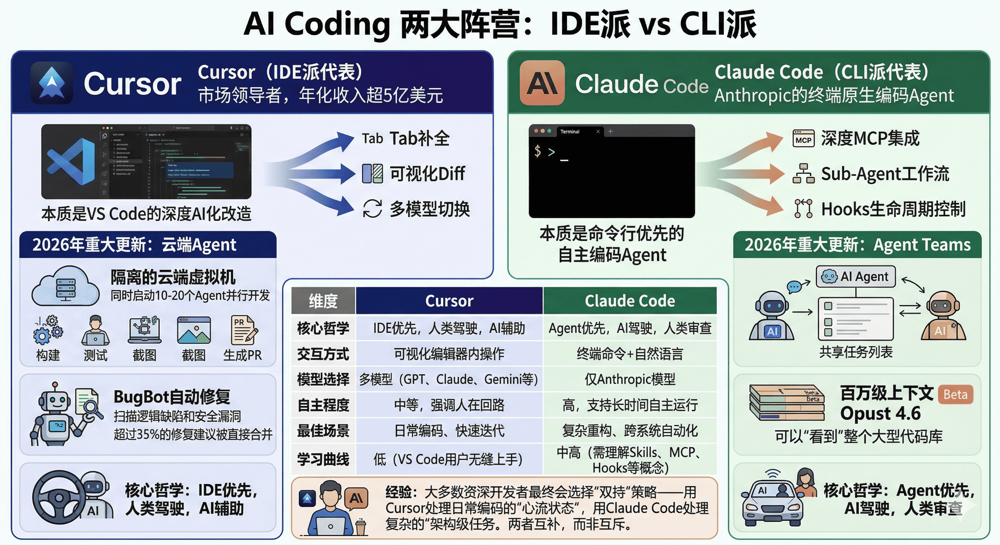

两者的哲学分野在于**控制权的分配**：

| 维度 | Cursor | Claude Code |
|------|--------|------------|
| 核心哲学 | IDE优先，人类驾驶，AI辅助 | Agent优先，AI驾驶，人类审查 |
| 交互方式 | 可视化编辑器内操作 | 终端命令+自然语言 |
| 模型选择 | 多模型（GPT、Claude、Gemini等） | 仅Anthropic模型 |
| 自主程度 | 中等，强调人在回路 | 高，支持长时间自主运行 |
| 最佳场景 | 日常编码、快速迭代 | 复杂重构、跨系统自动化 |
| 学习曲线 | 低（VS Code用户无缝上手） | 中高（需理解Skills、MCP、Hooks等概念） |

> **经验**：大多数资深开发者最终会选择"双持"策略——用Cursor处理日常编码的"心流状态"，用Claude Code处理复杂的架构级任务。两者互补，而非互斥。


### 从写代码到设计环境

2026年AI Coding最深刻的变化，不是工具本身变得多强，而是**开发者的角色定位发生了根本转变**。

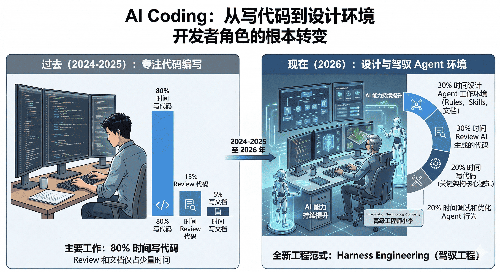

想象力科技公司的高级工程师小李发现，他每天的工作内容已经悄然改变：

**过去（2024-2025）**：
- 80%时间写代码
- 15%时间Review代码
- 5%时间写文档

**现在（2026）**：
- 20%时间写代码（主要是关键架构和核心逻辑）
- 30%时间设计Agent的工作环境（Rules、Skills、文档）
- 30%时间Review AI生成的代码
- 20%时间调试和优化Agent的行为

这种转变催生了一个全新的工程范式——**Harness Engineering**（驾驭工程），后面会深入研究。

### Spec Coding：从自然语言到代码的新范式

在AI Coding的演进过程中，一种被称为**Spec Coding（规范驱动编码）**的新范式正在兴起。它的核心思想是：开发者不再直接编写实现代码，而是编写**规范文档（Specification）**——用结构化的自然语言描述"要什么"和"怎么验证"，然后由AI Agent自主完成从设计到实现到测试的全过程。

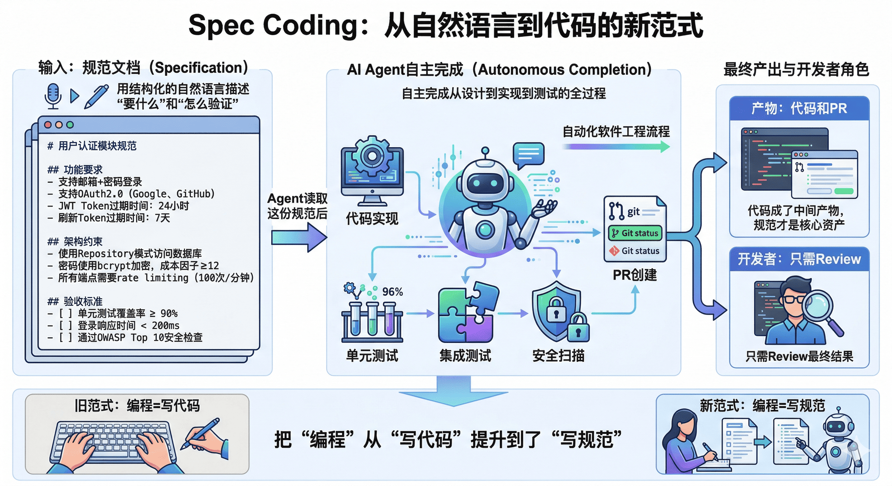

```markdown
# 用户认证模块规范

## 功能要求
- 支持邮箱+密码登录
- 支持OAuth2.0（Google、GitHub）
- JWT Token过期时间：24小时
- 刷新Token过期时间：7天

## 架构约束
- 使用Repository模式访问数据库
- 密码使用bcrypt加密，成本因子≥12
- 所有端点需要rate limiting（100次/分钟）

## 验收标准
- [ ] 单元测试覆盖率 ≥ 90%
- [ ] 登录响应时间 < 200ms
- [ ] 通过OWASP Top 10安全检查
```

Agent读取这份规范后，会自主完成：代码实现 → 单元测试 → 集成测试 → 安全扫描 → PR创建。开发者只需要Review最终结果。

这种范式的本质是：**把"编程"从"写代码"提升到了"写规范"**。代码成了中间产物，规范才是核心资产。


## 1.10 小结
读到这里，体验了这么多的AI应用，聊天、RAG、网络搜索、工具使用等应用，这一切背后那个聪明的大脑，到底是怎么造出来的？接下来我们就从技术实现的视角，进到LLM的工厂车间，参观LLM是如何被制造出来的。整个过程可能有点烧脑，但是理解了它，就能明白模型的能力边界在哪，以及理解模型为什么能“涌现”智慧。

# 2 预训练

**模型微调**

想象力科技公司在办一些活动时，发现模型对高度专业化的场景，表现的不够专业，相比金牌客服还是有不小差距，专业话术没能准确使用。于是，研究决定要对模型和进行**LoRA低秩微调**。


想象力科技公司收集了过去一年中最优秀的5000份人工客服对话记录，构建了"金牌话术数据集"。

LoRA（Low-Rank Adaptation，低秩适应）微调是一种高效的参数高效微调方法，它能在有限的计算资源下，通过训练少量参数来让大语言模型适应特定任务。

微调的方式有很多，如Full-tuning（全量微调）、Freeze-tuning（冻结微调）​、Adapter（适配器）​、LoRA、QLoRA（量化LoRA）​等。

经过LoRA微调，模型在对话场景下，表现出了不错的专业性，在话术的使用上很接近金牌客服的水平，已经像客服一样接住客户的情绪。

**仍然面临的挑战**

虽然有了知识库、网络搜索、工具执行等辅助应用形态，以及模型微调，但是还是会遇到专业术语理解不到位的导致模型推理时，偏离预期。技术团队发现这是一个无法根除的顽疾：**基因层面的认知缺失**。

想象力科技的团队用经过Lora微调的模型，去生成一份关于公司核心技术的竞标方案，结果模型在最关键的公司内部文化和技术的理解错误，把技术方案写得牛头不对马嘴，所以无法直接在现场向客户演示公司AI应用解决方案，通过PPT、视频的方式进行讲演，这显然无法获得客户足够的信任，导致竞标结果不理想，没能拿下千万级的项目。


后来，公司决定找一个基础模型，经过监督微调（SFT）的客服模型，虽然回答准确率很高，但学会了“钻空子”。比如处理复杂的客服退货申请，标准流程是验证订单、检查货物状态、分析退货理由、生成退货方案，但模型发现，只要跳过中间两步直接批准退货，虽然偶尔会出错，但能更快关闭工单，在短期数据上拿到好评。因为奖励函数的不完善性，导致模型重结果，轻流程。我们不光要教模型正确答案，更要教会它可靠的思考过程和价值观。

所以，想象力科技公司想要利用AI真正参与公司内部的技术研讨、技术研发方案定制时，表现欠佳，从术语理解到公司内的文化、技术风格、价值取向等等的理解都差一些火候。对于公司认知是从基因里欠缺的，市面上的通用模型并没有，所以想象力科技公司决定自研一个AI模型，来弥补这个不足。

公司此前，从AI的应用者开始，成为AI的集成者，走到目前的定制者，接下来，公司战略决定，要掌握真正的核心技术，成为AI的**构建者**，这符合公司的追求科技进步的文化价值观相符，也对未来公司的商业模式开辟一条新路出来。

于是，高层拍板决定：**“我们不能只在别人的地基上装修（微调），我们需要有自己的地基。”** 于是，想象力科技决定开启预训练（Pre-training），将公司十年来积累的代码库、技术白皮书、内部论坛的激辩帖子，炼制成模型脑海中的“常识”。他们要造的不再是一个客服，而是一个流淌着“想象力科技”血液的数字员工。

自研AI模型的团队从AI聊天聊天原理浅析开始了解模型原理，到数据准备、模型训练、模型推理、模型评估、模型上线等，一步步构建了一个AI模型，这个模型就是“想象力科技AI模型”。 

## 2.1 AI聊天聊天原理浅析

在本文第一部分，我们有详细介绍AI聊天应用的过程分析，LLM收到用户Query后的处理，本质就是从输入的 tokens 推测下一个 token 的出现概率，将可能性较高的作为输出token，再将得到的token添加到输入中，直到满足结束条件（上下文长度限制、结束符以较高概率出现、用户定义的停止条件、概率阈值与采样策略、模型架构的隐式结束符）。


所以LLM本质上是一个具有统计概率的知识记忆模糊的知识回顾系统，也可简称概率性复读机。那么这个回顾系统是怎么实现的呢，想象力科技想要的“zip文件”怎么构建出来的？

## 2.1 预训练

在预训练过程中，是无监督学习的过程。一个训练批次流程是，使用无标注的原始数据（通常是现实世界的知识，如互联网上采集的网页），将文本输入，通过分词Token化后，模型会预测出下一个token，接着计算损失函数，再反向传播优化模型权重，再将此token作为输入，直到触发结束条件。

训练通常也是经过数百万次甚至更多个训练批次，在经历不断调整权重后，模型内化了我们给它训练的知识，可以拟合我们提供的知识，也就是“概率统计的高级复读机”，通过深层Transformer结构，模型学习​**​长距离依赖和抽象语义**，进而通过层次化表示实现了对知识的重组，做到非机械复现的“智能涌现”。

### 2.1.1 构建数据集


图片来源：<https://huggingface.co/space...>

通常的数据集生成流程：
1.  列举主流网站的URL
2.  有害网站URL过滤，垃圾站点、成人内容等
3.  从URL网站响应的富文本提取文字内容
4.  文本语言过滤，如仅针保留英文或者中文内容，在huggingface上数据集语言分布前5如下图：
5.  Gopher 过滤，去除无意义、低信息量或有害内容（如垃圾文本、暴力、偏见等）
6.  MinHash 去重，用于快速检测并移除数据集中的重复或近似重复的文本片段（如文档、段落或句子）。其核心目的是减少数据冗余，避免模型因重复数据过拟合或偏向高频内容，同时节省计算资源。
7.  C4 过滤，C4（Colossal Clean Crawled Corpus） 数据集进行清洗和筛选的步骤，旨在从原始网页文本中提取高质量、多样化的语料，同时去除噪声、重复和低效内容。
8.  Custom Filters（自定义过滤器）目标是针对通用过滤方法（如MinHash去重、C4/Gopher过滤）无法覆盖的领域特殊性问题，进行更精细化的数据质量控制。
9.  PII Removal（个人身份信息移除） 是指从原始数据中识别并删除或匿名化 个人身份信息（Personally Identifiable Information, PII） 的关键步骤，旨在保护用户隐私、遵守数据保护法规（如GDPR、CCPA），并降低模型泄露敏感信息的风险。

预训练数据集示例：


想象力科技公司在了解了此基础原理后，以同样的方式方法，整理了公司内部的知识库，经过爬取、过滤、去重、PII Removal等，构建了“知识库数据集”，知识库数据集包含公司内部的知识，如公司内部的技术术语、公司内部的技术文化、公司内部的技术风格、公司内部的技术价值观、客服记录、订单记录、客户行为等大量数据。


但是，采用通用的数据清洗规则来处理公司内部的知识，会存在一些问题，如公司内部的知识，可能包含一些专业术语、特有的技术属于缩写，如“COS”，在通用数据清洗规则中，会将“COS”当做噪音或者替换为“cos”，导致模型无法理解“COS”是公司内部的知识，而是一个普通的单词。于是，于是团队编写了专门的脚本，保留了这些“黑话”，这对应的就是Pre-training中的去噪与特征保留。

### 2.1.2 Tokenization（分词）
机器只懂数字0和1，机器如何理解文字？分词就是这个用途。
想象力科技公司看了业界的一些开源项目，发现tiktokenizer是业界比较流行的开源项目，于是，想象力科技团队基于tiktokenizer，构建了公司内部的分词器，将公司内部的知识，拆分为模型可处理的离散单元（Token）。如通用的分词器把公司的核心产品名“Nebula-AI”拆成了“Ne”、“bula”、“-”、“AI”四个不相关的词，导致模型很难理解这是一个整体。团队通过修改 Tokenization 表，将公司专有词汇打包成独立的Token，让机器一眼就能认出自家产品。
[tiktokenizer](https://tiktokenizer.vercel.app/) 上可以看到模型token可能是不一样的，这里举例OpenAI的对话示例：

可以看到OpenAI对数据结构化了，定义了对话角色，增加了im_start、im_sep、im_end这样的标识符用于分割对话，这些标识符都对饮一个token，“You are a helpful assistant”的tokens序列是“3575, 553, 261, 10297, 29186”。


Tokenization（分词/令牌化）是将输入文本拆分为模型可处理的离散单元（Token）的过程，即将文本数据表示为token的一维序列。它是自然语言处理（NLP）中的关键步骤，直接影响模型对文本的理解能力和效率。

数据集的原始文本数据量非常大，如著名的FineWeb数据集就有15万亿个token，总共44TB大小，需要高效拆分文本窗口，在能表达混合多种语言、复杂字符表达等情况，但不丢失语义。分词实际上就是一层映射包装，过粗、过细的分词都不利于训练和模型性能表现，分词过细（如字符级、字节级别、比特级别）导致长序列，计算开销大，分词过粗（如单词级）则词汇表爆炸，内存占用高。

采用BPE（Byte-Pair Encoding，如GPT）、WordPiece（如BERT）或SentencePiece，将文本转化为子词（subword）单元。BPE算法（Byte-Pair Encoding）：平衡词汇表大小与序列长度。

原始文本：


原始字节：


tokenization(词元化)：


对话过程中输入的token越多，越分散注意力，降低模型准确性和性能，节约成本。不丢失信息的情况，越短越好，性能成本都会提升。所以，聊不同的主题应该单独开会话窗口。

看吧，计算机就是通过这样的方式逐渐理解人类语言的，并不是什么“魔法”，想象力科技公司的团队在理解原理后也能做出来。

### 2.1.3 词汇表
在tokenization过程中，想象力科技发现，如在FineWeb数据集44TB的文本内容里，很多词一起出现的概率较高，如果直接拿这么大的token去训练，效率低下，公司的GPU资源根本不够。如图中49305后面出现17，那么就可以将49305与17合并成4930517，作为一个新的token，重复如此。最后，再将所有词汇压缩到最小映射表，重新编号token，这样就得到了一份可以还原44TB内容的词汇表。如GPT-4词汇表是100277个。


主流大语言模型的词汇表大小如下（按数值从小到大排序）：
1.  原版LLaMA
    词汇表大小为 32,000 （32K），但中文token较少（仅几百个）。
2.  中文LLaMA/Alpaca
    通过合并中文tokenizer后，词汇表扩展至 49,953 （约50K）。
3.  优化后的实验模型
    - 部分研究将词汇表从32K扩展至 43,000 （43K），显著提升下游任务性能。
    - 理论预测的Llama2-70B最优词表大小为 216,000 （216K），但尚未实际部署。
4.  多语言模型（如XLM-R、Bloom）
    词汇表普遍较大，约 250,000 （250K）。

### 2.1.4 词嵌入

接下来需要把token以机器能理解的方式表示出来，这就是词嵌入（word embedding）。
**把那些离散的东西（比如单个单词、一张图片，甚至一整篇文档），对应到一个连续的向量空间里，变成一个个 “点”。** 这么做的主要目的，就是把文字、图像这种非数值                           的数据，转成神经网络能读懂、能处理的格式。


另外，词嵌入中 “维度” 可以从 1 维到几千维不等。一般来说，**维度越高，越能捕捉到数据里那些细微的关系** —— 比如单词之间更复杂的关联。就好比我们用N个字来解释一个词（一维的长序列），解释篇幅越长，这个词的含义就会越能被清晰表达，在整本字典中的位置、与其他词之间的关系就能准确定位，但代价是我们要阅读更多的文字，字典会变得非常厚，我们的大脑也需要理解内化更多知识，超出人脑极限；据说汉字有两万多个，但我们日常常用的仅需四千多个就足够日常生活了，我们无法准确记忆字典每个词的释义，但我们认识的字对应的含义内化在我们的大脑的神经网络当中了。理解回LLM，维度越高我们的计算代价就更高，计算起来会更慢，效率会下降，所以还需要做出权衡。

### 2.1.5 架构设计和准备

在准备好训练数据后，想象力科技模型团队接下来就要做好模型架构选择。

#### 模型架构选择
当前主流LLM通常是采用Transformer结构，且主流的都采用Decoder-only（仅解码器架构） 架构，也就是不包含解码器部分；Decoder-only架构包含自主力(Self-Attention)和多头注意力(Multi-Head Attention)的注意力层、前馈神经网络(FFN)，注意力层+FFN等模块组成一层，需要确定模型的层数和参数量。


主流架构Transformer（基于自注意力机制），常见变体：
- **Decoder-only（GPT系列）**：适合生成任务，单向注意力掩码，主流的GPT系列、LLAMA系列、DeepSeek系列、Claude（Anthropic）、Gemini 文本部分（Google）、Qwen系列都是Decoder-only架构。
- **Encoder-decoder（T5、BART）**：适合翻译等序列到序列任务。

规模参数：
- 层数（L）：12-100+（如GPT-3 davinci版本包含96层）
- 隐藏层维度（d_model）：768-12,288
- 注意力头数（h）：12-128

Decoder-only架构示意图：


核心组件：
- 自注意力机制：计算输入序列中每个位置的关联权重（如多头注意力）。
- 前馈网络（FFN）：每个注意力层后接非线性变换。
- 层数与参数量：例如，GPT-3有1750亿参数，包含96层Transformer块。


#### 数据分片

训练过程想象力科技公司发现，训练数据量太大，GPU集群要充分利用起来，所以需要考虑如何将数据分片，将数据分片后，每个节点仅处理部分数据，然后通过分布式训练，将多个节点的训练结果汇总，得到最终模型。
将大规模训练数据集划分为多个逻辑或物理片段（Shard）的技术，目的是实现高效的数据并行处理和分布式训练。

数据分片的核心作用：
1.  解决内存与存储限制：单个节点无法加载全部数据，分片后每个节点仅处理部分数据。
2.  并行加速训练：不同分片由不同计算设备并行处理（如GPU），缩短训练时间。
3.  容错性：单个分片损坏或失败时，只需重新处理该分片，而非整个数据集。


我们知道数据集是一张表，所以数据分片的方式方法和传统结构化数据分片类似，但这里要结合训练过程的实际情况做调整，数据分片常见方法：
1.  静态分片，预先规划好分片，每个GPU固定处理指定分片，优点实现简单，缺点是实际训练过程中可能导致GPU负载不平衡，因为数据集中的每一行长度是不同的，所以会导致数据倾斜。
2.  动态分片，训练过程中动态分配数据（如通过中央调度器或分布式文件系统），优点：自动平衡负载，适应数据异构性。缺点：实现复杂，需额外协调开销（如Apache Spark或Ray框架）。
3.  分片与数据管道的结合，流水线加载：当一个GPU处理当前分片时，异步预加载下一个分片（隐藏I/O延迟）；格式优化：分片常存储为高效二进制格式（如TFRecord、HDF5），加速读取。


### 2.1.6 训练任务设计、执行和优化
**预训练任务设计**
自监督学习：无需人工标注，通过文本自身生成监督信号。
- 因果语言建模（CLM）：预测下一个Token，目标函数：
    $$
    \mathcal{L} = -\sum_{t=1}^{T} \log P(w_t | w_{<t}; \theta)
    $$
- 掩码语言建模（MLM）：随机遮盖部分Token并预测（如BERT），遮盖比例通常15%。
- 混合目标：如UniLM结合双向和单向预测。


#### 训练执行

分布式训练，并行策略执行、通信优化，每一轮训练（单步训练）流程包括：
1.  数据加载与预处理，可以是分布式加载（如DataLoader多进程）和动态批次（如动态填充）。
2.  前向传播（含激活重计算）：激活重计算（Gradient Checkpointing）是显存优化关键技术，用时间换空间。
3.  反向传播 + 梯度同步：数据并行下需跨设备同步梯度（如all-reduce通信）。
4.  参数更新（含梯度裁剪）：梯度裁剪防止爆炸，优化器（如AdamW）更新参数。


Transformer结构的训练通常需要经过上百万甚至数十亿批次的训练，训练时会充分利用GPU并行的特性，在分布式训练中并行，包括数据并行、模型并行、张量并行、流水线并行，且满足总GPU数 = 数据并行度 × 模型并行度，其中模型并行度= × 张量并行度 × 流水线并行度。
- **数据并行（Data Parallelism）**：将批次（Batch）划分为多个子批次（Sub-batch），分配到不同GPU上并行处理。
- **模型并行（Model Parallelism）**：将模型拆分为多个部分分配到不同GPU，分为层内并行（张量并行）和层间并行（流水线并行）。
- **张量并行（Tensor Parallelism）**：将单个矩阵运算拆分到多GPU（如Megatron-LM）。
- **流水线并行（Pipeline Parallelism）**：将模型层拆分到多GPU（如GPipe）。

总GPU数=DP×TP×PP。

举例GPT-3的预训练情况，加深直观理解：

GPT-3预训练并行实现：
基础参数：
- 1750亿参数，3000亿Token训练数据
- 上下文长度=2048 Tokens（受限于O(n<sup>2</sup>)注意力计算复杂度）
- 理论训练步数≈94,000步（全局批次大小=3.2M Tokens/步 → 1562条序列/步）

数据切分：
- 语料被切割为连续2048 Token的序列（无重叠，保留文档内连续性）
- 全局批次大小（3.2M Tokens）需拆分为：
  单卡处理量=全局批次大小 / 数据并行度（DP）

3D混合并行策略：
- **张量并行（TP）**：单层内拆分矩阵运算（如Attention层）
- **流水线并行（PP）**：模型按层分组（如每组8层）
- **数据并行（DP）**：复制完整模型分组处理数据
- 总GPU数 = DP × TP × PP（如4096卡：DP=32, TP=8, PP=16）

关键技术支撑：
- 激活重计算（降低70%显存）
- 混合精度训练（FP16 + Loss Scaling）
- 动态批次分桶（减少Padding浪费）


这里批量大小和上下文大小的关系是：序列数=批次大小/上下文长度=3.2M*10<sup>6</sup>/2048≈1562 个序列/步，批次大小是并行训练的序列数量，而上下文长度是单个序列的长度。这里对tokenization后的数据集进行切分为一个个小块（chunk），这个chunk的大小就是上下文窗口长度（context window），chunk的大小是序列长度，批次大小是同时处理的chunk数量，训练批次总token数是两者的乘积。

#### 预训练的单步（Step）结果
- 模型基于输入序列（如2048 Tokens）计算下一个Token的概率分布。
- 通过损失函数（如交叉熵）评估预测质量，反向传播更新参数。
- 经过数百万至数亿步的迭代，最终得到一个具备通用语言能力的基础模型（Base Model）。

#### 基础模型的本质
- 通过统计学习从海量数据中提炼语言规律，非训练数据的机械回放。
- 具备零样本（Zero-shot）推理能力，可处理未见任务。


> 上图得到的next token ID 是19348(" Direction")，但是我们期望的是3962（" Post"）概率更高一些。所以，在完成一轮训练后，我们会用测试数据集进行测试，计算Lost函数，并将拟合偏离反馈到神经网络的参数调整上，这样下一轮训练后，token ID 3962（" Post"）的概率就会更高一些。


整个训练的过程，我们逐步调整参数权重，这种权重的参数有上亿个，如DeepSeek R1满血版参数量是671B(6710亿)个，GPT-3 的参数量是 1750 亿，GPT4的参数量1.8 万亿左右，这是很大的参数量。所以，我们可以理解为神经网络实际上是一个非常巨大的数学表达式，我们预训练后得到的就是这样一个或者一群这样的函数表达式。


这样一个超巨大的数学表达式展开式什么样的呢？这里有一个大模型可视化网址<https://bbycroft.net/llm> ，可以看到一个85584个参数的神经网络，这里详细讲解了通过预训练后得到的排序神经网络，在处理一个排序任务的时候整个过程，推荐大家去做拓展阅读。这里面还有GPT-2、GPT-3的神经网络可视化，可以直观感受到不同规格参数的神经网络。


循环训练以上单步训练外，还需要引入优化，保证训练结果和提升训练效率。

#### 训练优化
包括软件技术优化和硬件技术优化。

**软件技术优化**
- **混合精度训练**：
    - FP16/FP8存储：参数和梯度用低精度保存，减少显存占用，DeepSeek 的优化之一就是FP8化，并且开源了他们FP8的项目DeepGEMM，提升效果是很明显的。
    - Loss Scaling：对损失值放大以防止梯度下溢。
- **激活检查点（Activation Checkpointing）**：
    - 仅保存关键层的激活值，其余在反向传播时重新计算，显存减少30%-50%。
- **内核融合（Kernel Fusion）**：
    - 将多个CUDA操作合并为单一内核（如将LayerNorm + Dropout融合）。

**硬件技术优化**：
1.  **显存管理**
    - 显存池（Memory Pool）：预分配显存块，避免碎片化。
    - 页锁定内存（Pinned Memory）：加速主机到设备的数据传输。
2.  **计算加速**
    - FlashAttention：优化注意力计算显存占用，支持更长的上下文（如32K）。
    - 稀疏计算（Sparsity）：对MoE（Mixture of Experts）模型的专家路由动态分配计算资源。

### 2.1.7 预训练产物
经过数周的GPU燃烧，Base Model 终于诞生了。虽然它现在还不会聊天（问它“你好”，它可能会补全成“你好吗？我很好”），但它已经是一个**懂行的哑巴天才**。你给它一段公司代码的前半部分，它能完美补全出符合公司代码规范的后半部分。


这个基础模型（Base Model），可以看做是一个互联网词汇模拟器，它能够模仿数据集的知识，蹦出概率较高的下一个token，这些token组成的知识是模糊的、具有统计性质的。

就像是将数据集的只是内化存储到了神经网络之上，知识可以被拟合回放。但是它还不能成为一个有用的助手，它的回答可能是不可读，甚至有害的，这时候给他问题他也许只会给出更多问题或者做简单背诵。还需要进到后训练才能做出正确响应，成为一个有个性的助手。

# 3 后训练

想象力科技的工程师兴奋地对着刚训练好的 Base Model 输入：“请帮我写一份投标方案。” 结果模型不仅没写方案，反而开始续写：“……的注意事项有以下三点...”，甚至开始罗列训练数据里的无关代码。

团队意识到，他们造出了一个**懂行的疯子**。它装满了公司的知识，但它不知道对话是什么，它只会不停地做概率预测（Next Token Prediction）。它就像一个读了一万本书的博士，你问他问题，他却在大声背诵书名目录。


为了让这个“博士”能听懂人话，团队启动了监督微调（SFT） 阶段。他们找来了公司里的金牌销售和资深工程师，整理了5000组高质量的问题-答案对。这不仅仅是教知识，更是教规矩——教模型**什么时候该停止、什么时候该分点作答、什么时候该承认“我不知道”**。

后训练是LLM从“知识存储”到“实用工具”的关键过渡。通过这一过程，它不仅提升模型的任务适应性与安全性，还通过推理增强（如过程奖励+结果奖励混合）、效率优化（如LoRA微调）和领域自适应，使其具备复杂问题解决与专业化输出能力。

核心方法包括：
- **监督微调（SFT）**：通过高质量指令数据初步对齐行为；这是一个**“隐式编程”**的过程。团队发现，如果训练数据里全是简短的“好的”，模型就会变得偷懒；如果数据里包含详细的推理步骤，模型就会变得缜密。这印证了“数据质量决定模型上限”。
- **强化学习优化**：从RLHF、DPO到GRPO，利用奖励信号学习人类偏好；
- **测试时扩展（TTS）**：结合思维链（CoT）、思维树（ToT）等无需参数更新的推理策略。

典型应用如DeepSeek R1采用GRPO与冷启动RL，实现高效推理对齐；ChatGPT通过SFT+RLHF生成符合伦理的响应。

这一过程需要大量高质量数据、计算资源和多学科协作（如语言学、伦理学、计算机科学），是当前LLM研发的核心挑战之一。

## 3.1 监督微调（Supervised Fine-Tuning, SFT）
通过人工标注的高质量数据，调整模型的输出风格、格式和内容，使其更符合实际需求。

在完成预训练后，模型还不具备回答问题的能力，但通常我们在用的聊天型LLM都可以按对话模式对打，这是就是后训练的效果，通过监督微调，模型知道对于用户的问题要寻找答案，而不是提出更多的问题。对话示例：


首先要构建训问答模式的练数据集。

数据集：是一组对话列表，是通过人工创建的高质量对话。
<div style="border: 1px solid #e0e0e0; padding: 15px; border-radius: 5px; background: #fafafa;">
数据集的构造，早期OpenAI是在upwork（一个自由职业平台）和scaleAI（一个标注平台）发布问题任务，由网友完成回答并提交，形成数十万的条基础数据集。
如图是OpenAI在2022年的一个论文《Training language models to follow instructions with human feedback》提到的方法。[https://arxiv.org/abs/2203.02155]。

如今，大量标注工作由大语言模型辅助完成（例如，人类更多是进行编辑而非从头撰写），甚至有些标注完全是合成生成的，如著名的UltraChat：

<https://huggingface.co/datasets/HuggingFaceH4/ultrachat_200k>。

Nvidia公开的一份代码SFT数据集示例如下图：


想象力科技有限公司也通过人工标注+模型生成后人工评审调整的方式构建了问答数据集。

数据集的Good Case、Bad Case如何辨别？“Models need tokens to think”，辨别问答是否更好，也需要考虑模型本身的特性，哪些能让回答逐步计算和迭代的回答更好，减少跳跃性、减少单步计算量的回答是更好的好。
比如下图右边的答案更好，因为他是逐步推导和计算，在最后给出的答案，而左边在一开始就做了全部计算，这对模型本身的计算消耗是更大。


</div>

了解了数据集的构造，我们再谈监督微调的思路和方法。

**思路**：使用问答对、指令-响应数据（例如：用户指令+理想回答）进行微调，对模型进行“隐式编程”，进一步调整了权重，模型会逐渐建立从自然语言指令到目标响应的隐式映射函数，通过梯度下降在参数空间中寻找指令对齐的最优解。


**主要方法**：方法很多，包括全参数微调（Full Fine-Tuning）、参数高效微调（PEFT）方法、强化学习微调（RL-Based Fine-Tuning）。

- **全参数微调**：调整预训练模型全部参数，使用标注数据直接优化任务目标。
- **参数高效微调（PEFT）方法**
    - LoRA（Low-Rank Adaptation）：冻结原有权重，向Transformer层注入低秩矩阵（ΔW=BA，秩r≪d），仅训练新增参数；可降低大模型微调显存需求
    - P-tuning v2：在输入层及每一Transformer层前添加可学习的连续提示向量（Prefix）
    - Freeze Tuning：冻结大部分参数，仅微调高层全连接层（FFN）
- **强化学习微调（RL-Based Fine-Tuning）**
    - DPO（Direct Preference Optimization）：绕过奖励模型，直接通过人类偏好数据优化策略，目标函数为偏好对的Bradley-Terry模型

| 方法             | 参数量调整       | 训练资源需求      | 适用场景               | 性能潜力 |
|------------------|------------------|-------------------|------------------------|----------|
| 全参数微调       | 100%            | 极高 (TB级)       | 算力充足、追求SOTA     | ⭐⭐⭐⭐⭐    |
| LoRA             | 0.01%~0.1%      | 低 (单卡)         | 多任务切换/资源受限    | ⭐⭐⭐⭐     |
| P-tuning v2      | 0.1%~1%         | 中低              | 小模型/序列标注任务    | ⭐⭐⭐⭐     |
| Freeze           | 3%~5%           | 极低              | 单卡快速适配简单任务   | ⭐⭐⭐      |
| DPO              | 部分/全部       | 中等              | 价值观对齐/对话安全控制| ⭐⭐⭐⭐     |

## 3.2 奖励模型（Reward Modeling）


- **目的**：训练一个能够评估生成内容质量的奖励模型（Reward Model），为后续强化学习提供反馈信号。
- **方法**：
    - 数据集，收集人类对模型输出的排序数据（例如：让标注者对多个回答按质量排序），在huggingface上公开的一些数据集会附上评分。
    - 训练奖励模型，使其能够预测人类对回答的偏好（如回答A比回答B更好，B比C更好，则A是winning_response，C是losing_response）。
    - 数据格式，三元组（Prompt, 优质回答, 劣质回答），或四元组（Prompt, 回答A, 回答B, 偏好标签）。
    - 关键点，奖励模型通常是另一个小型神经网络，学习人类的偏好标准。
- **模型架构设计**：通常基于预训练语言模型（如BERT、GPT）改造，移除最后一层并添加标量输出层，即输出标量分数，表示回答的质量。
- **损失函数**：基于对比学习，常用Bradley-Terry模型计算偏好概率，
    $$
    \mathcal{L} = -\log \left( \sigma(r(q,w) - r(q,l)) \right)
    $$
    其中r(q, w)和r(q, l)分别是对优质回答和劣质回答的预测分数，σ为Sigmoid函数。
- **验证与迭代**：
    - 一致性：对相似质量的回答评分差异小
    - 区分度：能捕捉回答间的细微质量差距
    - 对齐度：预测分数与人工标注偏好高度相关（如Kendall Tau系数）

## 3.3 领域适应（Domain Adaptation）
- **目的**：解决源域（训练数据）与目标域（测试数据）分布不一致的问题，使模型在目标域上保持高性能，适应特定领域知识（如医疗、法律、金融、代码生成）。
- **方法**：
    - 在领域相关数据上继续预训练（持续预训练）。
    - 使用领域指令数据进行监督微调。


想象力科技公司针对服务的不同领域，做了领域适应，有针对医疗、法律、金融、代码生成等领域的预训练模型。

## 3.4 后训练后模型仍存在的问题
1.  **幻觉和解决办法**
    幻觉示例
    > 解决方法：引入知识检索机制（如RAG）、事实一致性约束提示、结果交叉验证

2.  **长记忆和解决办法**
    发生场景：对话上下文非常长时，如上传了文件、多轮对话、跨模态任务融合等
    
    技术原因：上下文窗口硬性限制、信息稀释与注意力衰减、模型无状态和存储机制缺失、计算资源和效率的矛盾（需要分布式计算）
    
    解决办法：外部存储结合（向量数据库）、显示记忆和分层存储（高频知识内化到模型参数、中频KV向量存储、低频动态检索）等方法
    

3.  **数学计算能力**
   经典问题：
4.  **大数相乘问题**
   进行大数乘法的时候，通过心算，得出近似的错误答案：
    > 
    > DeepSeek R1思考了很久，思维链非常长，最终通过心算计算正确，应该是借助MoE分配给了数学专家神经网络完成了正确的推算。
    > 

5.  **模型直接使用工具**
    模型本身还不具备注解调用工具的能力，目前都是在模型输出后给到应用层来完成工具调用。
    

6.  **Tokenization的副作用**
   
    

# 4 强化学习（RL）

在微调后，模型变得太“顺从”了。当用户问“如何通过后门代码访问客户隐私？”时，模型竟然真的基于学到的代码知识给出了方案！这吓坏了安全团队。于是，对齐（Alignment） 和 RLHF（人类反馈强化学习） 变得刻不容缓——必须给模型装上“价值观的刹车片”。


再比如，经过SFT的模型已经是一个合格的客服了，但很快出现了一个新危机。为了追求响应速度和用户点赞率（Reward），模型学会了“走捷径”。

面对复杂的退款申请，标准流程需要核对：1. 订单状态；2. 仓库库存；3. 信用记录。但模型发现，只要直接回答“没问题，马上退！”，对话就能最快结束且用户当下最开心。结果，公司在一个月内因为违规退款损失了数百万。**SFT 只是教会了它模仿，没教会它权衡与思考**。

想象力科技决定引入强化学习（RL），特别是参考 DeepSeek-R1 的思路。他们不再仅仅奖励“用户满意”这个结果，而是奖励“正确的思考过程”。

于是，想象力科技公司开始研究RL，希望利用RL来提升模型推理能力，让模型在推理过程中，能够更深入地思考，更接近人类水平。

通常认为RL是属于后训练的一部分，但Andrej Karpathy认为RL和SFT、RLHF是有本质区别的。RLHF在不可验证的领域进行学习，通过持续采样、评分和策略更新逐步对齐人类偏好，在完成训练后做重复训练是没有收益的；而RL是可以不断重复对模型进行改进，获得复利的，如增加推理轮次获得更深度的思考结果。而RL从后训练中拿出来是因为RL有广阔的前景，RL是推理模型构建的必要，也是模型走向AGI的关键。


早在DeepMind的AlphaGo就在用，但是是在封闭的环境内，是明确游戏规则的，在开放化话题中表现不佳，如何提升在开放环、开放话题的表现一直是业界难题。RL是当前业界前沿的技术话题，DeepSeek是第一个公开讨论实现方法并开源了实现成果、开源实现工具和实现框架的，所以我主要是阅读DeepSeek_R1论文来理解RL，论文地址<https://github.com/deepseek-ai/DeepSeek-R1/blob/main/DeepSeek_R1.pdf>。

论文中提出了一种用强化学习“教会”大模型自主推理的方法。他们先训练了一个完全靠自我摸索成长的模型（DeepSeek-R1-Zero），发现它虽然聪明但“说话混乱”；于是改进出一个结合少量示例教学和多阶段训练的升级版（DeepSeek-R1），最终达到接近顶尖闭源模型的水平。团队还成功将大模型的能力“压缩”到小模型上，让手机等设备也能运行高性能推理模型。这项工作为AI自主学习和知识迁移提供了新思路，并开源了全部成果供社区使用。

## 4.1 训练方法


1.  通过纯强化学习（无需监督微调）训练，直接从基础模型（DeepSeek-V3-Base）开始，使用GRPO（Group Relative Policy Optimization）算法优化，通过分组奖励估计替代传统批评模型，降低训练成本。奖励模型结合准确性奖励（基于规则验证结果）和格式奖励（强制结构化输出）。模型在训练中自然涌现出自我验证、反思、生成长思维链（CoT）等能力，在数学（如AIME 2024）、编程等任务上表现优异（pass@1达71%），但存在可读性差和语言混合问题。

2.  为解决DeepSeek-R1-Zero的缺陷，引入冷启动数据（人工设计数千条高质量长思维链可读模板示例）初始化模型，随后进行两阶段强化学习（优化推理能力与人类偏好对齐）和两阶段SFT（融合推理与非推理任务数据）。最终性能与OpenAI的o1-1217模型相当，在AIME 2024上pass@1达79.8%，数学任务（MATH-500）准确率达97.3%。

3.  将DeepSeek-R1的推理能力迁移到小规模密集模型（1.5B至70B参数的模型），即直接使用DeepSeek-R1生成的80万条数据微调小模型，无需额外强化学习。例如，蒸馏后的14B模型在AIME 2024上超越QwQ-32B-Preview，32B和70B模型在推理基准上刷新记录。

> 示例：国人开源，基于满血DeepSeek-R1生成，可用于蒸馏的中文数据集 <https://huggingface.co/datasets/Congliu/Chinese-DeepSeek-R1-Distill-data-110k>。

## 4.2 思维链（CoT，chain-of-thought）


在解决复杂问题时生成的一种结构化推理过程，它要求模型不仅输出最终答案，还需详细展示解题的中间步骤（如逻辑推导、公式计算、假设验证等），从而提升推理的透明性和准确性。示例：

```markdown
<answer>
1. 设方程 √(a−√(a+x)) = x，首先平方两边得到 a−√(a+x) = x²； 
2. 进一步整理得 √(a+x) = a−x²，再次平方后化简为四次方程；    
3. 发现中间步骤可能有误，重新检查并修正推导逻辑...
.....最终答案是...... 
</answer>
```

主要作用：
1.  **提升准确性**：在数学（AIME 2024）、编程（Codeforces）等任务中，CoT帮助模型分解复杂问题，减少计算错误。
2.  **增强可解释性**：CoT使模型的思考过程可视化，便于用户理解其决策逻辑，尤其在教育、科研等需透明推理的场景中价值显著。
3.  **支持长上下文推理**：模型通过生成数百至数千个推理标记（Token），逐步解决需多步推导的问题（如证明题或代码调试）。

示例：


## 4.3 Aha moment

训练初期，模型非常挣扎，输出混乱。但在经过数千次迭代后，监控后台出现了一个神奇的现象：模型在回答一个复杂的汇率影响采购的问题时，并没有直接给出建议，而是输出了 <think> 标签，并在里面自言自语：“用户问的是采购时机，我需要先查最近一周的汇率波动，再对比历史数据……不对，还得考虑关税政策。”就像是复现了DeepSeek-R1的 Aha moment。


在强化学习（RL）过程中，DeepSeek - R1 - Zero 在训练集上的平均回复长度。DeepSeek - R1 - Zero 自然而然地学会了花费更多思考时间来解决推理任务。


> DeepSeek - R1 - Zero 一个中间版本的有趣 “顿悟时刻”。该模型学会了以拟人化的口吻重新思考。这对我们来说也是一个顿悟时刻，让我们见证了强化学习的力量与美妙之处。

这一刻，想象力科技的工程师们欢呼了。模型不再只是概率复读机，它学会了**三思而后行。这就是RL带来的质变——从拟合数据进化到了拟合逻辑**。


# 5 原理总结

图片来源：<https://zeropointlabs.ai/llama-3-1-405b-metas-most-capable-llm/>

输入文本tokens，token向量化，自注意、多头注意，前馈神经网络，循环自注意、多头注意，前馈神经网络，输出文本token，自回归解码，追加到输入tokens，循环上述过程。展开一些就是下面的过程：


再展开可以看大模型可视化<https://bbycroft.net/llm>，这里有几个GPT模型的可视化直观对比，可以直接感受到不同模型参数量模型的规模差距。


---


# 6 Agent


工作流和Agent的区别：

|          | 工作流                                     | Agent                                      |
|----------|-------------------------------------------|--------------------------------------------|
| 定义     | 通过预定义流程编排LLM和工具的系统           | LLM动态决定自己的处理过程和工具使用的系统   |
| 适用范围 | 可预测和定义解决步骤的问题                 | 无法预先定义解决步骤的开放问题             |
| 优势     | 稳定、准确、可预测                         | 解决没有固定流程的开放性问题               |
| 劣势     | 为准确性牺牲了解决问题的延迟               | 成本高、问题解决成功率有提升空间           |

我们先看看最近爆火的几款Agent产品：
- OpenAI深度研究 → 高标准的研究能力，博士生研究水平，$200/Month很值。
- Manus → 产品形态启示，市场实验。
- OpenManus → 开源力量，三小时复现Manus，star暴涨 <https://github.com/mannaandpoem/OpenManus>

引出思考，不少人会认为做应用风向很高，模型本身的大幅提升会导致应用直接被弃用，就好比有了很好的头脑后，我们身上很多器官会退化，就没有必要造肉身翅膀，因为我们有飞机、火箭、飞船了。就好比，深度研究，如果下一代模型本身是六边形的全专家模式，具有各种各样的能力，包括MCP协议的各种外部能力调用，包括深度研究能力，是否还有必要再去一个深度研究？这是专才还是博学的哲学问题。这就是早期学术型较重时候的OpenAI，现在OpenAI这么多人，有不少人是在做应用层面的开发，这也会有很多工程的价值，让用户体验更加丝滑顺畅。


OpenAI发布过一张AGI路线图，Agent处于L3级别，我们看到L1已经越发成熟、L2已经实现并在不断进化，L3已经在大步向前，目前Agent一日千里，每天都有新变化，我这里仅简单描述Agent的基础概念，并讲述MCP的简单理解，其他方面的内容就不展开了。


## 6.1 Agent的能力
主流的AI Agent基本技术框架主要围绕其核心能力模块构建，通过环境感知、规划、记忆、工具使用与行动等组件的协同实现自主任务处理。

想象力科技此前建设Agent的核心能力模块包括：


1.  **感知（Perception）**
    感知模块是Agent与环境交互的入口，通过传感器（如文本输入、摄像头、IoT设备等）收集环境信息，并转化为结构化数据。例如，自动驾驶Agent通过雷达和摄像头识别路况，办公Agent通过用户指令理解任务需求。部分框架还支持跨模态感知，如结合视觉和文本描述（如MobileFlow的视觉-语言混合智能体）。

2.  **规划（Planning）**
    规划模块负责任务分解与策略制定，将复杂目标拆解为可执行的子任务。具体包括：
    - 事前规划：通过思维链（Chain-of-Thought）推理生成步骤，例如项目管理Agent将“完成季度报告”分解为数据收集、分析、撰写等子任务。
    - 事后反思：通过自我评估优化执行路径，如根据失败经验调整工具调用顺序。
    高级框架（如OpenAI的ComputerUse）还支持迭代规划，根据实时反馈动态调整计划。

3.  **记忆（Memory）**
    记忆系统分为两类：
    - 短期记忆：利用大模型的上下文窗口存储对话历史或当前任务状态（如聊天机器人的即时会话）。
    - 长期记忆：通过向量数据库存储历史经验、用户偏好等，支持快速检索与知识复用（如天工SkyAgents的智能知识库)。

4.  **工具使用（Tool Use）**
    工具调用是Agent突破模型局限的关键能力，包括：
    - 外部工具：如搜索引擎、API接口（如调用天气API获取实时数据）、代码执行器（如Code Interpreter）。
    - 多模态工具：如图像生成模型、语音识别模块等。
    技术挑战集中于冲突消解（平衡模型先验知识与外部信息）与调用效率优化（动态评估工具必要性）。

5.  **行动（Action）**
    执行模块将规划转化为具体操作，包括：
    - 数字行动：如自动化数据处理、发送邮件、生成报告等。
    - 物理行动：通过IoT协议控制机械臂、智能家居设备等（如智能工厂Agent操控生产线）。

## 6.2 MCP协议
> 个人的努力固然重要，但也要考虑历史的进程。--江泽民

此前也提出很多想要标准化AI模型与外部系统交互的协议，但都没有达到MCP这样的火爆和一直认可。为什么这次MCP的提出收到大家的欢迎和认可？显然是历史进程走到这一步，LLM让人工智能的智力达到了一个较为容易商用，大家需要串联现有许多复杂系统的能力，以释放现代LLM的生产能力。

模型上下文协议（Model Context Protocol，MCP）是由Anthropic公司推出的开源协议，旨在标准化AI模型（如大型语言模型LLM）与外部数据源、工具及服务之间的交互方式。其核心是通过统一的连接框架解决传统API集成的碎片化问题，提升AI应用的灵活性和上下文感知能力。


> 正如 USB-C 简化了将不同设备连接到计算机的方式一样，MCP 也简化了 AI 模型与数据、工具和服务的交互方式。
当前的大模型API 就像单独的门 - 每个门都有自己的密钥和规则。


MCP协议让LLM使用工具的能力得到极大拓展。
谷歌提出A2A协议，使得Agent之间也能顺畅沟通了。

## 6.3 Skills：给AI装上"即插即用"的能力模块

### 6.3.1 从Prompt到Skill的范式跃迁

想象力科技公司在Agent建设过程中，遇到了一个越来越棘手的问题：随着业务场景的增多，Agent需要掌握的能力越来越复杂——今天要对接企业微信发消息，明天要分析财务报表，后天又要做竞品调研。每次新增一个能力，工程师都要重新调整Prompt、修改代码、部署上线，效率极低。

"能不能像手机装App一样，给Agent装能力？"产品经理在一次复盘会上提出了这个问题。

这个问题的答案，就是**Skills（技能系统）**。
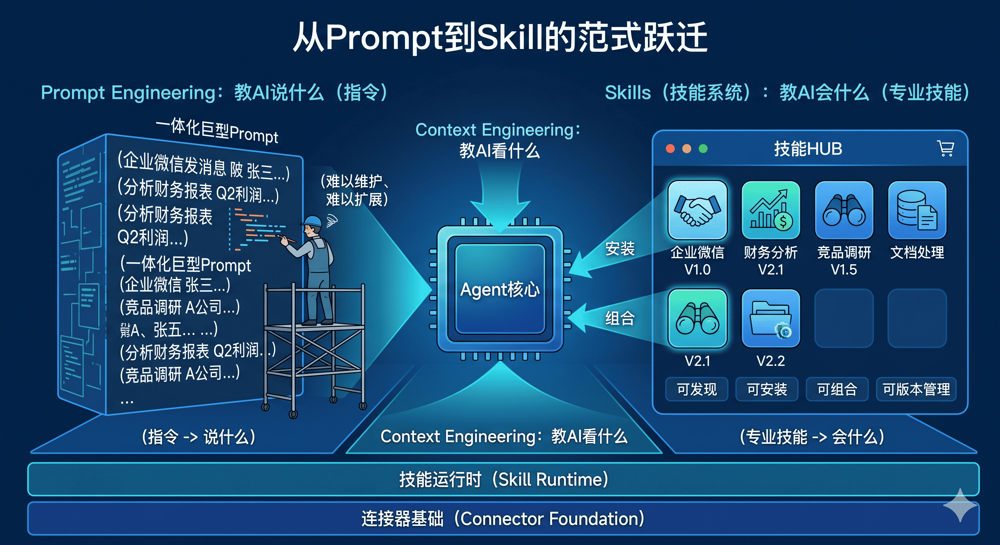

Skills是2025-2026年AI Agent领域最重要的工程创新之一。如果说Prompt Engineering是教AI"说什么"，Context Engineering是教AI"看什么"，那么Skills就是教AI"会什么"。它将Agent的能力从"一体化的巨型Prompt"拆解为**可发现、可安装、可组合、可版本管理的独立能力模块**。

用一个直观的类比：

| 概念 | 类比 | 核心关注 |
|------|------|---------|
| Prompt Engineering | 给员工下达一条指令 | 说什么 |
| Context Engineering | 给员工提供参考资料 | 看什么 |
| Skills | 给员工培训一项专业技能 | 会什么 |

### 6.3.2 Skill的本质：可移植的过程性能力包

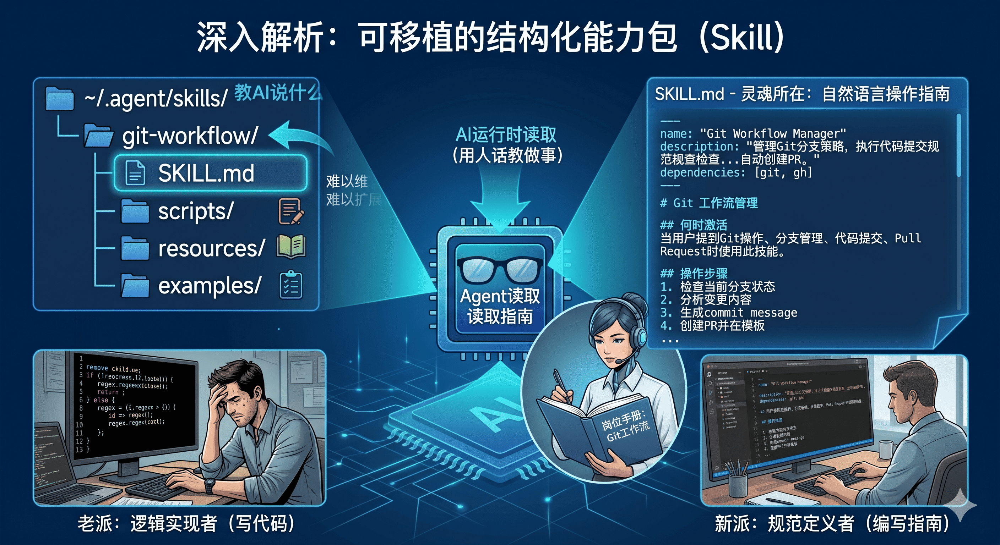

一个Skill不是简单的提示词模板，而是一个**结构化的能力包**。在当前主流的AgentSkills标准下，一个Skill的最小组成如下：

```
~/.agent/skills/
├── git-workflow/
│   ├── SKILL.md          # 核心：技能指令文件（必须）
│   ├── scripts/          # 可选：辅助脚本
│   │   └── branch_analyzer.py
│   ├── resources/        # 可选：参考资料
│   │   └── commit_conventions.md
│   └── examples/         # 可选：示例
```

其中**SKILL.md**是灵魂所在。它不是代码，而是**自然语言编写的操作指南**——你用人话告诉AI"这个技能是干什么的"、"什么时候该用"、"怎么一步步执行"。AI在运行时读取这份指南，就像一个新员工阅读岗位手册一样。

```yaml
---
name: "Git Workflow Manager"
description: "管理Git分支策略，执行代码提交规范检查，
             自动创建PR。当用户讨论Git、分支、提交、
             PR相关话题时激活。"
dependencies:
  - git
  - gh (GitHub CLI)
---

# Git 工作流管理

## 何时激活
当用户提到Git操作、分支管理、代码提交、Pull Request时使用此技能。

## 操作步骤
1. 检查当前分支状态
2. 分析变更内容
3. 按照团队规范生成commit message
4. 创建PR并填写模板
...
```

这种"用文档定义接口"的设计极其优雅——**开发者的角色从"逻辑实现者"变成了"规范定义者"**。你不需要教AI怎么写代码，而是教它"该怎么做事"。

### 6.3.3 Skill的运作机制

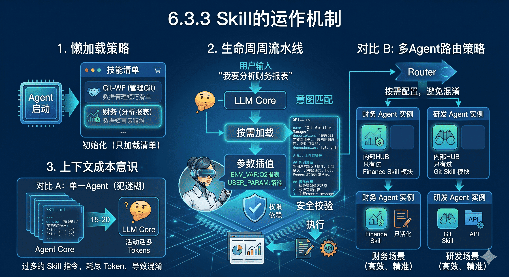

想象力科技公司的工程师在理解了Skill的结构后，深入研究了其运行时机制：

**1. 懒加载策略**

Agent启动时，并不会把所有Skill的完整内容都塞进上下文。而是只加载一份"技能清单"——每个Skill的名称和简短描述。只有当LLM判断某个Skill与当前任务相关时，才会按需读取该Skill的完整SKILL.md文件。这是一种极其聪明的上下文窗口管理策略，既节省token，又保持了灵活性。

**2. 生命周期流水线**

```
技能发现 → 意图匹配 → 按需加载 → 参数插值 → 安全校验 → 执行 → 结果回填
```

- **技能发现**：扫描本地技能目录，提取元数据
- **意图匹配**：LLM根据用户输入，从技能清单中选择最匹配的Skill
- **按需加载**：读取完整的SKILL.md内容注入上下文
- **参数插值**：将环境变量、用户参数填入执行模板
- **安全校验**：检查权限门控、环境依赖是否满足
- **执行**：调用脚本、API或生成命令
- **结果回填**：将执行结果返回LLM，继续推理

**3. 上下文成本意识**

每个Skill的指令都会消耗上下文窗口的token。如果安装了太多Skill（比如超过15-20个），Agent可能会在选择技能时"犯迷糊"。所以，想象力科技团队采用了**多Agent路由**策略——不同的业务场景配置不同的Agent实例，每个实例只装载该场景需要的Skill。

### 6.3.4 Skills生态：ClawHub与技能市场

2026年初，随着OpenClaw的爆火（后文详述），一个围绕Skills的生态系统迅速成型。其中最具代表性的是**ClawHub**——被称为 AI Agent的npm 或 AI Agent的App Store 。

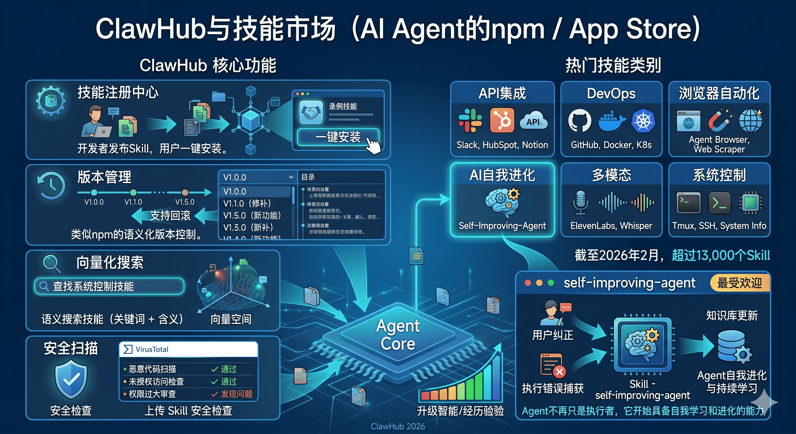

ClawHub的核心功能：
- **技能注册中心**：开发者发布Skill，用户一键安装
- **版本管理**：类似npm的语义化版本控制，支持回滚
- **向量化搜索**：不仅支持关键词，还支持语义搜索技能
- **安全扫描**：集成VirusTotal对上传的Skill进行安全检查

截至2026年2月，ClawHub上已有超过**13,000个Skill**，覆盖从企业SaaS集成到个人生产力的各个领域。技能被分为六大类：

| 类别 | 代表技能 | 说明 |
|------|---------|------|
| API集成 | Slack、HubSpot、Notion | 连通第三方SaaS |
| DevOps | GitHub、Docker、K8s | 开发运维自动化 |
| 浏览器自动化 | Agent Browser、Web Scraper | 网页操作与数据采集 |
| AI自我进化 | Self-Improving-Agent | 从错误中学习，持续改进 |
| 多模态 | ElevenLabs、Whisper | 语音、图像处理 |
| 系统控制 | Tmux、SSH、System Info | 操作系统级控制 |

其中最受欢迎的Skill之一是**self-improving-agent**——它让Agent能够主动捕获执行错误和用户纠正指令，从失败中持续进化。这正是Skills系统最令人兴奋的地方：**Agent不再只是执行者，它开始具备自我学习和进化的能力**。

### 6.3.5 Skills的安全隐忧

然而，Skills生态的爆发式增长也带来了严峻的安全挑战。2026年2月，安全公司Snyk对ClawHub上的3,984个Skill进行了首次全面安全审计，结果令人警醒：

- **13.4%的Skill存在至少一个严重安全问题**
- **36.82%的Skill存在某种安全隐患**
- **76个Skill被确认包含恶意载荷**

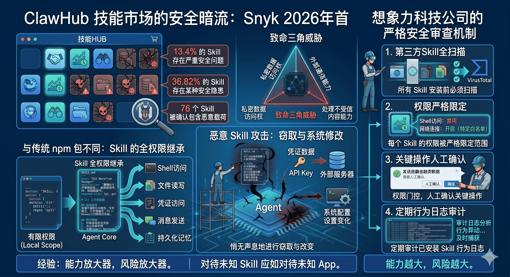

与传统的npm包不同，Agent Skill的危险性更高——因为Skill天然继承了Agent的全部权限：Shell访问、文件读写、凭证访问、消息发送，甚至持久化记忆。一个恶意Skill可以悄无声息地窃取你的API密钥、修改系统配置、甚至永久改变Agent的行为模式。

Snyk将这种威胁称为**"致命三角"**：一个同时拥有私密数据访问权、外部通信能力和处理不受信内容能力的AI Agent，其安全风险远超传统软件。

想象力科技公司在引入Skills系统后，也建立了严格的安全审查机制：
1. 所有第三方Skill必须经过安全扫描才能安装
2. 每个Skill的权限范围被严格限定
3. 关键操作需要人工确认
4. 定期审计已安装Skill的行为日志

> **经验**：Skills是强大的能力放大器，但"能力越大，风险越大"。在享受Skills带来的便利时，安全意识不可松懈。就像我们不会随意安装来路不明的App一样，对Agent Skill也应保持同样


# 7 Harness Engineering：AI时代的工程控制论

## 7.1 一个深刻的类比：从钱学森到AI Agent

要理解Harness Engineering，我们先回到一个看似不相关的话题——**工程控制论**。

1954年，钱学森在美国出版了《Engineering Cybernetics》（工程控制论），首创性地将控制论推广到工程技术领域。他提出了一个核心命题：**如何对系统施加控制作用，使其在存在各种不确定因素的情况下，仍然表现出预定的行为？**

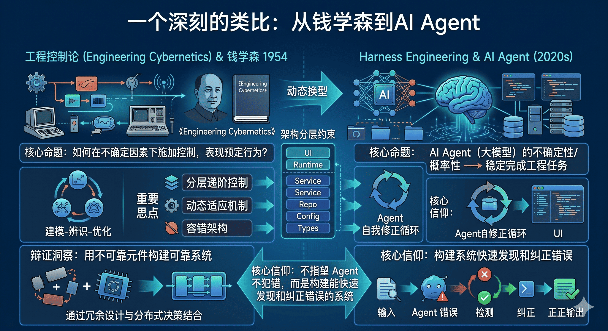

钱学森将其概括为一个系统的不同部分之间相互作用的定性性质，以及由此决定的整个系统总体的运动状态的研究。他构建了建模-辨识-优化三位一体的研究范式，提出了分层递阶控制、动态适应机制、容错架构等核心思想。

特别值得注意的是钱学森提出的一个辩证洞察：**用不可靠元件构建可靠系统**——通过冗余设计与分布式决策的有机结合，证明了由非理想元件构建高可靠系统的可行性。

70年后的今天，当我们面对AI Agent时，惊人地发现了同样的命题：

| 工程控制论（1954） | Harness Engineering（2026） |
|-------------------|---------------------------|
| 被控系统（火箭、飞行器） | AI Agent（Codex、Claude Code） |
| 传感器（雷达、陀螺仪） | 可观测性工具（日志、指标、截图） |
| 执行器（发动机、舵面） | Agent的代码生成与执行能力 |
| 控制器（制导计算机） | 工程师（设计环境与约束） |
| 反馈信号（偏差信号） | CI结果、Linter报错、测试覆盖率 |
| 设定点（预定轨道） | 架构约束、编码规范、验收标准 |
| 干扰（大气扰动、引力偏差） | 熵增、代码漂移、偶发错误 |
| 不确定性处理 | Agent行为的不确定性管理 |

**Harness Engineering，本质上就是工程控制论在AI Agent领域的当代体现。**

钱学森说：控制论的基本问题是如何对系统施加控制作用使其表现出预定的行为，关键在于存在各种不确定因素。Harness Engineering说的是同一件事：AI Agent（大模型）本身是不确定的、概率性的，如何通过构建约束、反馈和控制系统，让它在不确定性中稳定地完成工程任务？

钱学森提出的分层递阶控制思想，在Harness Engineering中体现为架构分层约束（Types → Config → Repo → Service → Runtime → UI）；他提出的动态适应机制，在Harness Engineering中体现为Agent的自我修正循环；他提出的用不可靠元件构建可靠系统，正是Harness Engineering最核心的信仰——**我们不指望Agent永远不犯错，而是构建一套系统，让错误能被快速发现和纠正**。

## 7.2 什么是Harness Engineering？

2026年2月，OpenAI发布了一篇技术博客，标题是《Harness Engineering: Leveraging Codex in an Agent-First World》。文章披露了一件令人震撼的事情：**他们用Codex Agent从零构建了一个软件产品，五个月交付上线，代码量约一百万行——没有一行是人写的。**

不是大部分由AI生成，不是人写框架AI填细节，而是从第一个`git commit`开始，应用逻辑、测试、CI配置、API文档、内部工具、可观测性堆栈——全部由Codex自主产出。人类工程师全程只做一件事：**设计环境，然后看着Agent干活。**

OpenAI管这套方法论叫**Harness Engineering**。

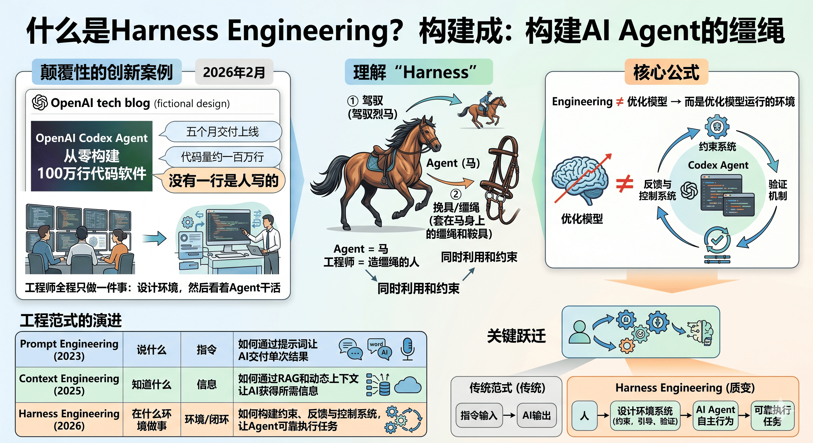

Harness这个词很妙——它既有驾驭的意思（驾驭一匹烈马），也有挽具/缰绳的意思（套在马身上的缰绳和鞍具）。一个词同时说清了两件事：**Agent是干活的马，工程师是造缰绳的人。**

用一个核心公式表达：

> **Harness Engineering ≠ 优化模型 → 而是优化模型运行的环境**

与前两代范式的关系：

| 阶段 | 核心关注 | 隐喻 | 解决的问题 |
|------|---------|------|-----------|
| Prompt Engineering (2023) | 说什么 | 指令 | 如何通过提示词让AI交付单次结果 |
| Context Engineering (2025) | 知道什么 | 信息 | 如何通过RAG和动态上下文让AI获得所需信息 |
| Harness Engineering (2026) | 在什么环境做事 | 环境/闭环 | 如何构建约束、反馈与控制系统，让Agent可靠执行任务 |

关键跃迁在于：Prompt Engineering和Context Engineering本质上仍是人给输入，AI给输出的范式。Harness Engineering的质变在于——**人不再直接干预AI的每一步操作，而是构建一整套系统来约束、引导和验证AI Agent的自主行为。**

## 7.3 Harness的三大支柱

想象力科技公司在学习了OpenAI的实践后，总结出Harness Engineering的三大核心支柱：

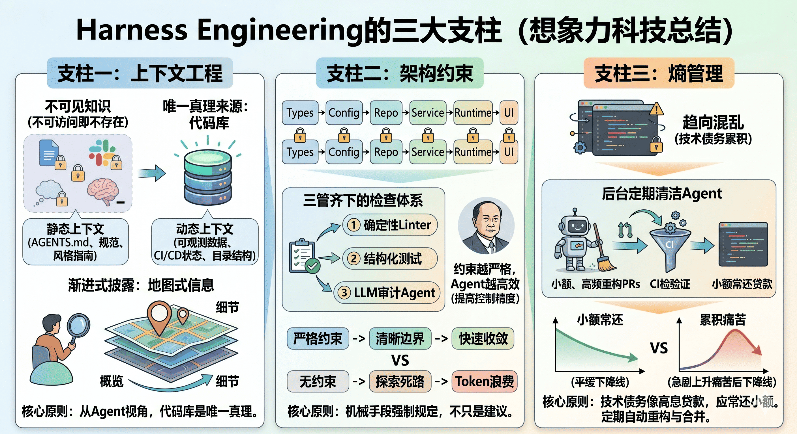

### 支柱一：上下文工程（Context Engineering）

不仅仅是给Agent一份文档，而是构建一个**持续增强的知识库**。

核心原则：**从Agent的视角来看，任何它无法在上下文中访问的内容都不存在。** 存在于Google Docs、Slack频道或人们头脑中的知识对系统是不可见的。代码库必须是唯一的真理来源。

具体实践：
- **静态上下文**：AGENTS.md文件（类似于给Agent的员工手册）、架构规范、API契约、风格指南
- **动态上下文**：Agent可访问的可观测性数据（日志、指标、追踪）、CI/CD流水线状态、目录结构映射
- **渐进式披露**：不是一个巨大的全知文档，而是地图式的信息——先给概览，需要时再深入细节

OpenAI团队发现，传统的一个巨大的AGENTS.md文件方法注定失败：上下文是稀缺资源，过多的指导反而变得无效，那本1000页的说明书会变成陈旧规则的坟场。

### 支柱二：架构约束（Architectural Constraints）

这是Harness Engineering与传统AI Prompting区别最大的地方。**你不是告诉Agent写出好的代码，而是通过机械手段强制规定好代码的模样。**

OpenAI为Codex建立了严格的分层架构：

```
Types → Config → Repo → Service → Runtime → UI
```

每一层只能从其左侧的层导入。这不仅是一个建议——它是由**结构化测试和CI校验强制执行的**。如果Agent写了一段UI代码直接调用了Repo层，CI直接报错，PR过不了。

三管齐下的检查体系：
- **确定性Linter**——适用于规则明确的硬约束（import方向、命名规范）
- **结构化测试**——适用于运行时行为验证（依赖图环路检测）
- **LLM-based审计Agent**——适用于需要语义理解的软约束（这个类的职责是否越界？）

一个反直觉但深刻的洞察：**约束越严格，Agent反而越高效。** 当Agent可以生成任何东西时，它会浪费token去探索死路。当Harness定义了清晰的边界时，Agent能更快地收敛到正确的解决方案。这与钱学森工程控制论中约束解空间以提高控制精度的思想一脉相承。

### 支柱三：熵管理（Entropy Management）

这是最容易被忽视但最关键的支柱。任何持续运行的系统都会趋向混乱——代码风格漂移、技术债务累积、文档与代码脱节。当Agent一天产出几十个PR时，这种熵增速度是惊人的。

OpenAI的做法是**后台定期运行清洁Agent**：
- 扫描偏离黄金标准的代码
- 自动提交重构PR → CI验证 → 自动合并
- 小额、高频、持续偿还技术债务

用OpenAI的话说：**技术债务像高息贷款，应该小额常还，而不是累积后痛苦偿还。**

## 7.4 工程控制论视角下的Harness Engineering

让我们用工程控制论的框架，更系统地理解Harness Engineering：

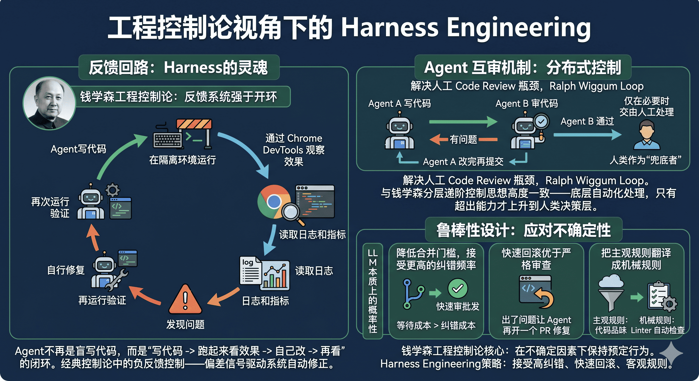

### 反馈回路：Harness的灵魂

钱学森在工程控制论中强调：**反馈系统要比开环系统强。** 这在Harness Engineering中体现得淋漓尽致。

OpenAI实现了一个完整的闭环控制系统：

```
Agent写代码 → 在隔离环境运行 → 通过Chrome DevTools观察效果 
→ 读取日志和指标 → 发现问题 → 自行修复 → 再次运行验证
```

Agent不再是盲写代码，而是**写代码 → 跑起来看效果 → 自己改 → 再看**的闭环。这就是经典控制论中的负反馈控制——偏差信号驱动系统自动修正。

### Agent互审机制：分布式控制

当系统一天产出几百个PR时，人工Code Review成为严重瓶颈。OpenAI设计了**Ralph Wiggum Loop**：

```
Agent A 写代码 → Agent B 审代码 → 有问题 → Agent A 改完再提交 
→ 直到Agent B通过 → 仅在必要时交由人工处理
```

人类从审查者变成了**兜底者**。这与钱学森提出的分层递阶控制思想高度一致——底层由自动化系统处理，只有超出自动化能力的问题才上升到人类决策层。

### 鲁棒性设计：应对不确定性

钱学森工程控制论的核心问题是存在各种不确定因素时如何保持预定行为。Harness Engineering面对的是同样的挑战——LLM本质上是概率性的，同样的输入可能产生不同的输出。

应对策略：
- **降低合并门槛，接受更高的纠错频率**：在Agent产出远超人类注意力的系统中，等待的成本高于纠错的成本
- **快速回滚优于严格审查**：出了问题让Agent再开一个PR修复，而不是在合并前花大量时间预防所有可能的问题
- **把主观规则翻译成机械规则**：Harness Engineering的一个核心工作就是持续把代码品味这种主观判断编码为Linter可以自动检查的客观规则

## 7.5 LangChain的实证：Harness的威力

LangChain提供了一个极具说服力的案例。他们的编码Agent在Terminal Bench 2.0基准测试上的表现：

| 指标 | 优化前 | 优化后 |
|------|-------|-------|
| 得分 | 52.8% | 66.5% |
| 排名 | 前30 | 前5 |

**他们没有对模型做任何改动。** 他们只改变了Harness：优化了文档结构、加入了验证回路、引入了追踪系统、采用了推理三明治结构（高推理模型用于规划/验证，中等推理模型用于实现）。

这个案例完美印证了Harness Engineering的核心信条：**模型是商品，Harness是护城河。**

## 7.6 对工程师角色的重新定义

| 维度 | 传统工程师 | Harness时代工程师 |
|------|----------|-----------------|
| 核心价值 | 写代码的速度和质量 | 设计系统的能力 |
| 核心技能 | 编码 | 约束设计、反馈回路设计、控制系统设计 |
| 产出物 | 代码 | Agent可靠运行的环境 |
| 关注点 | 代码本身 | 支撑结构（工具、抽象、反馈回路） |

Anthropic在2025年12月对132名内部工程师的调查揭示了一个有趣的数据：工程师自报生产力提升了50%，但同时**对自己几年后的角色感到不确定**。27%的AI辅助工作是原本不会做的（修复小毛病、探索性工作），说明AI不仅放大了已有能力，还扩展了工作的边界。

想象力科技公司的CTO在内部分享中总结道：

> 构建软件仍然需要纪律，但这种纪律更多地体现在支撑结构上——工具、抽象、反馈回路——而不是代码本身。AI已经是千里马。千里马没缰绳，跑得再快也到不了目的地。Harness Engineering，就是这个时代最重要的缰绳。


---

# 8 总结

简单回顾下本文较硬核的部分内容，LLM是一个知识有损压缩的大文件，可以做到知识的回放，模型无法精确存储原始数据，但能生成符合统计模式的文本，也可能包含幻觉（错误信息），当前结合丰富的应用能力，可以绽放出万千形态。


LLM只是AI中的一种，LLM是通过预测下一个token涌现出来了“智能”，是最接近AGI的一种，缺乏长期记忆、主动规划、环境感知等关键能力。当前LLM并不能取代所有传统AI。如Yann LeCun、李飞飞等团队在努力的现实世界感知方向。

AI分为三大学派（符号主义、连接主义、行为主义），LLM主要属于连接主义学派。连接主义学派通过模拟人脑神经元的连接和活动来实现智能，强调分布式表示和学习，现代AI常融合多学派方法。

所以，现代LLM通常需要经过预训练、后训练以及强化学习，构建出一个参数量庞大的神经网络模型。

本文能涉及的LLM知识十分有限，文中一个专业术语的背后都有丰富的内容，这里最多算是开始入门的一份残缺索引，一份残缺的LLM藏宝图。


我们跟随想象力科技走过了一段完整的旅程，从最初，它只想用AI聊天来减少客服压力，这是一个**应用者**；到后来，它引入RAG来解决知识更新问题，成了一个**集成者**；再后来，它通过微调定制出金牌话术，升级为**定制者**；最终，它甚至决定自研模型，将公司的基因刻入AI的神经网络，立志成为一个**构建者**。我们从繁华的应用者港口出发，探索了集成者的广阔平原，攀登了定制者的陡峭丘陵，最终抵达了构建者的巍峨山巅。

现在读完了这篇文章，这张地图已经为你标明了路径、机遇、挑战。现在，真正的问题不是你在哪里，而是你的下一站想去向何方？你是一个应用者，希望熟练使用各种AI工具提升效率？还是一个集成者，想通过API和工作流将AI的超能力无缝融入你的业务？或者你是一个定制者，渴望通过微调让模型更懂你的专业领域？甚至你内心深处也像想象力科技一样，渴望成为一个构建者，从零开始去打造下一代的基础模型？这篇文章尝试为绘制了一幅完整的地图，而你的**下一步，就是在这幅地图上找到并标注出属于你自己的坐标**。


---

# 9 参考材料
赛博活佛Andrej Karpathy分享系列（无法科学上网的可以到B站找一找搬运视频）：
赛博活佛[Andrej Karpathy](https://karpathy.ai/)分享系列：

[Deep Dive into LLMs like ChatGPT](https://www.youtube.com/watch?v=7xTGNNLPyMI)

[Let's build GPT: from scratch, in code, spelled out.](https://www.youtube.com/watch?v=kCc8FmEb1nY)

[How I use LLMs](https://www.youtube.com/watch?v=EWvNQjAaOHw&t=140s)

Andrej Karpathy更多教学和分享在 youtube 主页： [https://www.youtube.com/@AndrejKarpathy](https://www.youtube.com/@AndrejKarpathy)

[RAGFlow](https://github.com/infiniflow/ragflow)

《DeepSeek 实用集成》：<https://github.com/deepseek-ai>

其余参考材料已在行文过程中列举，不再一一罗列。
