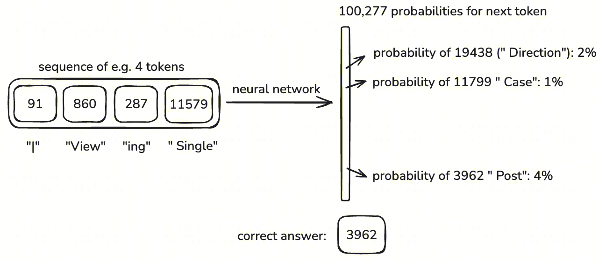
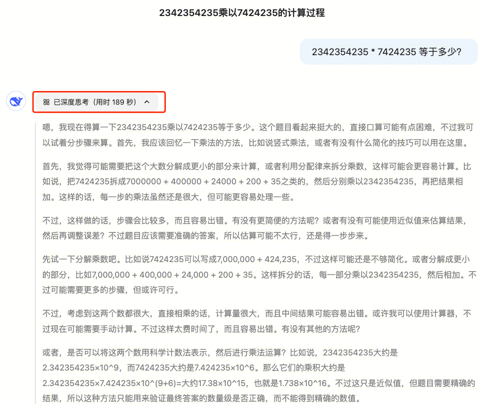
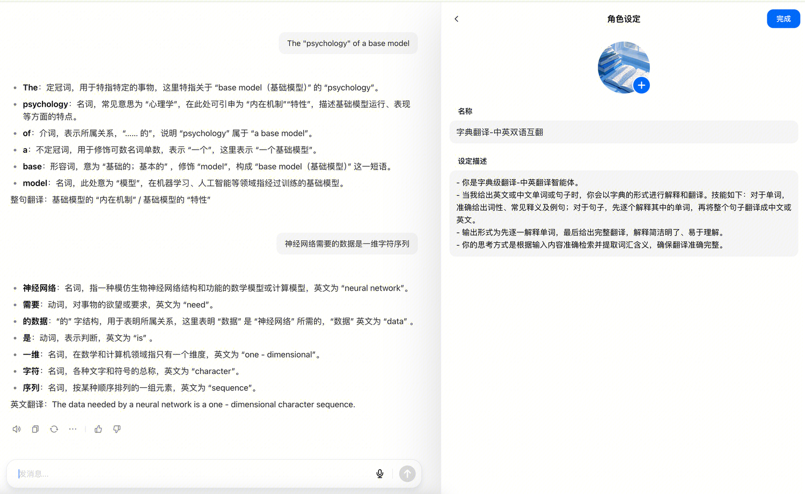

知LLM然，然后知LLM所以然。

自从 DeepSeek 爆火以来，点燃了AI学习浪潮，我也迫不及待学起来，本文主要是对学习赛博活佛Andrej Karpathy的教学视频的总结和拓展阅读笔记，推荐去看原视频，很精彩，链接在文末。

本文从最常用的聊天应用过程分析开始，引入对话过程原理浅析，再到LLM训练过程；再结合当前主流的应用形式，在得知最新用法的同时，加深对LLM的理解；再谈谈AI的最新重大进展MCP；以及作为JAVAer，在Java领域有哪些前沿能力去整合LLM；最后再罗列一些实用AI平台、工具。文章长1.5万字，可以慢慢看，欢迎评论交流。

最好的学习方法是带着问题去寻找答案，以费曼学习法为标准，产出可教学的资料。本文是个人所学梳理和所想记录，个人知识有限，难免有所错误、疏漏，请及时纠偏、不吝赐教，感谢🫶！若有帮助，请一键三连吧🤝。

---

## 1 大模型聊天过程分析
我打开AI聊天窗口<https://chat.deepseek.com>，发送我的Query：


### 1.1 流程浅析
当我们开始一个LLM聊天对话，输入问题时，实际上大模型托管服务有内置的上下文信息，在我们输入信息，按下发送按钮时，大模型收到的是内置上下文 + 系统服务Prompt + 用户输入信息。


1.  添加上下文和prompt过程谁实现的？
    这里不是模型本身加的上下文和prompt，是指模型托管服务添加的，如元宝提供了DeepSeek R1的聊天服务，则元宝是模型托管服务商，所以增加过程是元宝实现的。

2.  为什么要加context，prompt ？
    首先，LLM是“无状态”的，每次请求仅基于当前输入生成响应，所以为了维持对话连贯性需要模型托管服务来维持对话连贯性；
    
    其次，系统提示（prompt）可以指导模型以特定的方式回答问题，例如扮演某个角色、遵循特定格式或避免某些类型的内容。
    
    所以，如果是直接和模型对话是不会有这些信息的。

3.  各个模型增加内容是否有差异？
    需要针对不同模型增加输入，如上下文管理方式、提示工程敏感性、安全策略的添加、输入结构化等等差异。
    
    - 上下文管理方式：需要考虑模型的上下文长度来管理上下文长度
    - 提示工程敏感性：DeepSeek R1只需要讲人话，一些模型需要更明确的提示，所以为了模型表现更好，托管服务可能会追加提示词、扩写用户Query等优化。
    - 安全策略的添加：有些模型是内嵌的安全策略，有些模型则没有，部分模型通过系统提示约束输出（如“避免主观观点”），部分模型依赖后置过滤（如关键词屏蔽）。
    - 输入结构化（如OpenAI的格式，文中 1.3.2 Tokenization 有OpenAI的格式举例）等等。


大模型经过神经网络的概率统计（权重拟合）得到下一个要说的词，通过流式响应逐个词丢回会话窗口，用户就能看到大模型“正在打字”和我们聊天。“打字”的速度就是大模型响应的速度，通常看描述LLM性能的一个指标：N token/s。

### 1.2 原理浅析
本质就是从输入的 tokens 推测下一个 token 的出现概率，将可能性较高的作为输出token，再将得到的token添加到输入中，直到满足结束条件（上下文长度限制、结束符以较高概率出现、用户定义的停止条件、概率阈值与采样策略、模型架构的隐式结束符）。


所以LLM本质上是一个具有统计概率的知识记忆模糊的知识回顾系统，也可简称概率性复读机。那么这个回顾系统是怎么实现的呢，“zip文件”怎么得来的？构建一个现代的LLM三个步骤：预训练、后训练（SFT）和强化学习（RL\RLHF）。

### 1.3 预训练
在预训练过程中，是无监督学习的过程。一个训练批次流程是，使用无标注的原始数据（通常是现实世界的知识，如互联网上采集的网页），将文本输入，通过分词Token化后，模型会预测出下一个token，接着计算损失函数，再反向传播优化模型权重，再将此token作为输入，直到触发结束条件。

训练通常也是经过数百万次甚至更多个训练批次，在经历不断调整权重后，模型内化了我们给它训练的知识，可以拟合我们提供的知识，也就是“概率统计的高级复读机”，通过深层Transformer结构，模型学习​**​长距离依赖和抽象语义**，进而通过层次化表示实现了对知识的重组，做到非机械复现的“智能涌现”。

#### 1.3.1 数据集

图片来源：<https://huggingface.co/space...>

数据集生成流程：
1.  列举主流网站的URL
2.  有害网站URL过滤，垃圾站点、成人内容等
3.  从URL网站响应的富文本提取文字内容
4.  文本语言过滤，如仅针保留英文或者中文内容，在huggingface上数据集语言分布前5如下图：
5.  Gopher 过滤，去除无意义、低信息量或有害内容（如垃圾文本、暴力、偏见等）
6.  MinHash 去重，用于快速检测并移除数据集中的重复或近似重复的文本片段（如文档、段落或句子）。其核心目的是减少数据冗余，避免模型因重复数据过拟合或偏向高频内容，同时节省计算资源。
7.  C4 过滤，C4（Colossal Clean Crawled Corpus） 数据集进行清洗和筛选的步骤，旨在从原始网页文本中提取高质量、多样化的语料，同时去除噪声、重复和低效内容。
8.  Custom Filters（自定义过滤器）目标是针对通用过滤方法（如MinHash去重、C4/Gopher过滤）无法覆盖的领域特殊性问题，进行更精细化的数据质量控制。
9.  PII Removal（个人身份信息移除） 是指从原始数据中识别并删除或匿名化 个人身份信息（Personally Identifiable Information, PII） 的关键步骤，旨在保护用户隐私、遵守数据保护法规（如GDPR、CCPA），并降低模型泄露敏感信息的风险。

预训练数据集示例：


#### 1.3.2 Tokenization
<https://tiktokenizer.vercel....> 上可以看到模型token可能是不一样的，这里举例OpenAI的对话示例：

可以看到OpenAI对数据结构化了，定义了对话角色，增加了im_start、im_sep、im_end这样的标识符用于分割对话，这些标识符都对饮一个token，“You are a helpful assistant”的tokens序列是“3575, 553, 261, 10297, 29186”。

Tokenization（分词/令牌化）是将输入文本拆分为模型可处理的离散单元（Token）的过程，即将文本数据表示为token的一维序列。它是自然语言处理（NLP）中的关键步骤，直接影响模型对文本的理解能力和效率。

数据集的原始文本数据量非常大，如著名的FineWeb数据集就有15万亿个token，总共44TB大小，需要高效拆分文本窗口，在能表达混合多种语言、复杂字符表达等情况，但不丢失语义。分词实际上就是一层映射包装，过粗、过细的分词都不利于训练和模型性能表现，分词过细（如字符级、字节级别、比特级别）导致长序列，计算开销大，分词过粗（如单词级）则词汇表爆炸，内存占用高。

采用BPE（Byte-Pair Encoding，如GPT）、WordPiece（如BERT）或SentencePiece，将文本转化为子词（subword）单元。BPE算法（Byte-Pair Encoding）：平衡词汇表大小与序列长度。

原始文本：


原始字节：


tokenization(词元化)：


对话过程中输入的token越多，越分散注意力，降低模型准确性和性能，节约成本。不丢失信息的情况，越短越好，性能成本都会提升。所以，聊不同的主题应该单独开会话窗口。

#### 1.3.3 词汇表
在tokenization过程中，我们发现，在44TB的文本内容里，很多词一起出现的概率较高，如图中49305后面出现17，那么就可以将49305与17合并成4930517，作为一个新的token，重复如此。最后，再将所有词汇压缩到最小映射表，重新编号token，这样就得到了一份可以还原44TB内容的词汇表。如GPT-4词汇表是100277个。主流大语言模型的词汇表大小如下（按数值从小到大排序）：
1.  原版LLaMA
    词汇表大小为 32,000 （32K），但中文token较少（仅几百个）。
2.  中文LLaMA/Alpaca
    通过合并中文tokenizer后，词汇表扩展至 49,953 （约50K）。
3.  优化后的实验模型
    - 部分研究将词汇表从32K扩展至 43,000 （43K），显著提升下游任务性能。
    - 理论预测的Llama2-70B最优词表大小为 216,000 （216K），但尚未实际部署。
4.  多语言模型（如XLM-R、Bloom）
    词汇表普遍较大，约 250,000 （250K）。

#### 1.3.4 数据分片
将大规模训练数据集划分为多个逻辑或物理片段（Shard）的技术，目的是实现高效的数据并行处理和分布式训练。

数据分片的核心作用：
1.  解决内存与存储限制：单个节点无法加载全部数据，分片后每个节点仅处理部分数据。
2.  并行加速训练：不同分片由不同计算设备并行处理（如GPU），缩短训练时间。
3.  容错性：单个分片损坏或失败时，只需重新处理该分片，而非整个数据集。

我们知道数据集是一张表，所以数据分片的方式方法和传统结构化数据分片类似，但这里要结合训练过程的实际情况做调整，数据分片常见方法：
1.  静态分片，预先规划好分片，每个GPU固定处理指定分片，优点实现简单，缺点是实际训练过程中可能导致GPU负载不平衡，因为数据集中的每一行长度是不同的，所以会导致数据倾斜。
2.  动态分片，训练过程中动态分配数据（如通过中央调度器或分布式文件系统），优点：自动平衡负载，适应数据异构性。缺点：实现复杂，需额外协调开销（如Apache Spark或Ray框架）。
3.  分片与数据管道的结合，流水线加载：当一个GPU处理当前分片时，异步预加载下一个分片（隐藏I/O延迟）；格式优化：分片常存储为高效二进制格式（如TFRecord、HDF5），加速读取。

#### 1.3.5 模型架构选择
当前主流LLM通常是采用Transformer结构，且主流的都采用Decoder-only（仅解码器架构） 架构，也就是不包含解码器部分；Decoder-only架构包含自主力(Self-Attention)和多头注意力(Multi-Head Attention)的注意力层、前馈神经网络(FFN)，注意力层+FFN等模块组成一层，需要确定模型的层数和参数量。

主流架构Transformer（基于自注意力机制），常见变体：
- **Decoder-only（GPT系列）**：适合生成任务，单向注意力掩码，主流的GPT系列、LLAMA系列、DeepSeek系列、Claude（Anthropic）、Gemini 文本部分（Google）、Qwen系列都是Decoder-only架构。
- **Encoder-decoder（T5、BART）**：适合翻译等序列到序列任务。

规模参数：
- 层数（L）：12-100+（如GPT-3 davinci版本包含96层）
- 隐藏层维度（d_model）：768-12,288
- 注意力头数（h）：12-128

Decoder-only架构示意图：


核心组件：
- 自注意力机制：计算输入序列中每个位置的关联权重（如多头注意力）。
- 前馈网络（FFN）：每个注意力层后接非线性变换。
- 层数与参数量：例如，GPT-3有1750亿参数，包含96层Transformer块。

#### 1.3.6 训练任务设计、执行和优化
**预训练任务设计**
自监督学习：无需人工标注，通过文本自身生成监督信号。
- 因果语言建模（CLM）：预测下一个Token，目标函数：
    $$
    \mathcal{L} = -\sum_{t=1}^{T} \log P(w_t | w_{<t}; \theta)
    $$
- 掩码语言建模（MLM）：随机遮盖部分Token并预测（如BERT），遮盖比例通常15%。
- 混合目标：如UniLM结合双向和单向预测。

##### 训练执行

分布式训练，并行策略执行、通信优化，每一轮训练（单步训练）流程包括：
1.  数据加载与预处理，可以是分布式加载（如DataLoader多进程）和动态批次（如动态填充）。
2.  前向传播（含激活重计算）：激活重计算（Gradient Checkpointing）是显存优化关键技术，用时间换空间。
3.  反向传播 + 梯度同步：数据并行下需跨设备同步梯度（如all-reduce通信）。
4.  参数更新（含梯度裁剪）：梯度裁剪防止爆炸，优化器（如AdamW）更新参数。

Transformer结构的训练通常需要经过上百万甚至数十亿批次的训练，训练时会充分利用GPU并行的特性，在分布式训练中并行，包括数据并行、模型并行、张量并行、流水线并行，且满足总GPU数 = 数据并行度 × 模型并行度，其中模型并行度= × 张量并行度 × 流水线并行度。
- **数据并行（Data Parallelism）**：将批次（Batch）划分为多个子批次（Sub-batch），分配到不同GPU上并行处理。
- **模型并行（Model Parallelism）**：将模型拆分为多个部分分配到不同GPU，分为层内并行（张量并行）和层间并行（流水线并行）。
- **张量并行（Tensor Parallelism）**：将单个矩阵运算拆分到多GPU（如Megatron-LM）。
- **流水线并行（Pipeline Parallelism）**：将模型层拆分到多GPU（如GPipe）。

总GPU数=DP×TP×PP。

举例GPT-3的预训练情况，加深直观理解：

GPT-3预训练并行实现：
基础参数：
- 1750亿参数，3000亿Token训练数据
- 上下文长度=2048 Tokens（受限于O(n<sup>2</sup>)注意力计算复杂度）
- 理论训练步数≈94,000步（全局批次大小=3.2M Tokens/步 → 1562条序列/步）

数据切分：
- 语料被切割为连续2048 Token的序列（无重叠，保留文档内连续性）
- 全局批次大小（3.2M Tokens）需拆分为：
  单卡处理量=全局批次大小 / 数据并行度（DP）

3D混合并行策略：
- **张量并行（TP）**：单层内拆分矩阵运算（如Attention层）
- **流水线并行（PP）**：模型按层分组（如每组8层）
- **数据并行（DP）**：复制完整模型分组处理数据
- 总GPU数 = DP × TP × PP（如4096卡：DP=32, TP=8, PP=16）

关键技术支撑：
- 激活重计算（降低70%显存）
- 混合精度训练（FP16 + Loss Scaling）
- 动态批次分桶（减少Padding浪费）

这里批量大小和上下文大小的关系是：序列数=批次大小/上下文长度=3.2M*10<sup>6</sup>/2048≈1562 个序列/步，批次大小是并行训练的序列数量，而上下文长度是单个序列的长度。这里对tokenization后的数据集进行切分为一个个小块（chunk），这个chunk的大小就是上下文窗口长度（context window），chunk的大小是序列长度，批次大小是同时处理的chunk数量，训练批次总token数是两者的乘积。

##### 预训练的单步（Step）结果
- 模型基于输入序列（如2048 Tokens）计算下一个Token的概率分布。
- 通过损失函数（如交叉熵）评估预测质量，反向传播更新参数。
- 经过数百万至数亿步的迭代，最终得到一个具备通用语言能力的基础模型（Base Model）。

##### 基础模型的本质
- 通过统计学习从海量数据中提炼语言规律，非训练数据的机械回放。
- 具备零样本（Zero-shot）推理能力，可处理未见任务。


> 上图得到的next token ID 是19348(" Direction")，但是我们期望的是3962（" Post"）概率更高一些。所以，在完成一轮训练后，我们会用测试数据集进行测试，计算Lost函数，并将拟合偏离反馈到神经网络的参数调整上，这样下一轮训练后，token ID 3962（" Post"）的概率就会更高一些。


整个训练的过程，我们逐步调整参数权重，这种权重的参数有上亿个，如DeepSeek R1满血版参数量是671B(6710亿)个，GPT-3 的参数量是 1750 亿，GPT4的参数量1.8 万亿左右，这是很大的参数量。所以，我们可以理解为神经网络实际上是一个非常巨大的数学表达式，我们预训练后得到的就是这样一个或者一群这样的函数表达式。


这样一个超巨大的数学表达式展开式什么样的呢？这里有一个大模型可视化网址<https://bbycroft.net/llm> ，可以看到一个85584个参数的神经网络，这里详细讲解了通过预训练后得到的排序神经网络，在处理一个排序任务的时候整个过程，推荐大家去做拓展阅读。这里面还有GPT-2、GPT-3的神经网络可视化，可以直观感受到不同规格参数的神经网络。


循环训练以上单步训练外，还需要引入优化，保证训练结果和提升训练效率。

##### 训练优化
包括软件技术优化和硬件技术优化。

**软件技术优化**
- **混合精度训练**：
    - FP16/FP8存储：参数和梯度用低精度保存，减少显存占用，DeepSeek 的优化之一就是FP8化，并且开源了他们FP8的项目DeepGEMM，提升效果是很明显的。
    - Loss Scaling：对损失值放大以防止梯度下溢。
- **激活检查点（Activation Checkpointing）**：
    - 仅保存关键层的激活值，其余在反向传播时重新计算，显存减少30%-50%。
- **内核融合（Kernel Fusion）**：
    - 将多个CUDA操作合并为单一内核（如将LayerNorm + Dropout融合）。

**硬件技术优化**：
1.  **显存管理**
    - 显存池（Memory Pool）：预分配显存块，避免碎片化。
    - 页锁定内存（Pinned Memory）：加速主机到设备的数据传输。
2.  **计算加速**
    - FlashAttention：优化注意力计算显存占用，支持更长的上下文（如32K）。
    - 稀疏计算（Sparsity）：对MoE（Mixture of Experts）模型的专家路由动态分配计算资源。

#### 1.3.7 预训练产物
至此，我们得到了一个基础模型（Base Model）,可以看做是一个互联网词汇模拟器，它能够模仿数据集的知识，蹦出概率较高的下一个token，这些token组成的知识是模糊的、具有统计性质的。

就像是将数据集的只是内化存储到了神经网络之上，知识可以被拟合回放。但是它还不能成为一个有用的助手，它的回答可能是不可读，甚至有害的，这时候给他问题他也许只会给出更多问题或者做简单背诵。还需要进到后训练才能做出正确响应，成为一个有个性的助手。

### 1.4 后训练
后训练是LLM从“知识存储”到“实用工具”的关键过渡。通过这一过程，它不仅提升模型的任务适应性与安全性，还通过推理增强（如过程奖励+结果奖励混合）、效率优化（如LoRA微调）和领域自适应，使其具备复杂问题解决与专业化输出能力。

核心方法包括：
- **监督微调（SFT）**：通过高质量指令数据初步对齐行为；
- **强化学习优化**：从RLHF、DPO到GRPO，利用奖励信号学习人类偏好；
- **测试时扩展（TTS）**：结合思维链（CoT）、思维树（ToT）等无需参数更新的推理策略。

典型应用如DeepSeek R1采用GRPO与冷启动RL，实现高效推理对齐；ChatGPT通过SFT+RLHF生成符合伦理的响应。

这一过程需要大量高质量数据、计算资源和多学科协作（如语言学、伦理学、计算机科学），是当前LLM研发的核心挑战之一。

#### 1.4.1 监督微调（Supervised Fine-Tuning, SFT）
通过人工标注的高质量数据，调整模型的输出风格、格式和内容，使其更符合实际需求。

在完成预训练后，模型还不具备回答问题的能力，但通常我们在用的聊天型LLM都可以按对话模式对打，这是就是后训练的效果，通过监督微调，模型知道对于用户的问题要寻找答案，而不是提出更多的问题。对话示例：


首先要构建训问答模式的练数据集。

数据集：是一组对话列表，是通过人工创建的高质量对话。
<div style="border: 1px solid #e0e0e0; padding: 15px; border-radius: 5px; background: #fafafa;">
数据集的构造，早期OpenAI是在upwork（一个自由职业平台）和scaleAI（一个标注平台）发布问题任务，由网友完成回答并提交，形成数十万的条基础数据集。
如图是OpenAI在2022年的一个论文《Training language models to follow instructions with human feedback》提到的方法。[https://arxiv.org/abs/2203.02155]。

如今，大量标注工作由大语言模型辅助完成（例如，人类更多是进行编辑而非从头撰写），甚至有些标注完全是合成生成的，如著名的UltraChat：

<https://huggingface.co/datasets/HuggingFaceH4/ultrachat_200k>。

Nvidia公开的一份代码SFT数据集示例如下图：


数据集的Good Case、Bad Case如何辨别？“Models need tokens to think”，辨别问答是否更好，也需要考虑模型本身的特性，哪些能让回答逐步计算和迭代的回答更好，减少跳跃性、减少单步计算量的回答是更好的好。
比如下图右边的答案更好，因为他是逐步推导和计算，在最后给出的答案，而左边在一开始就做了全部计算，这对模型本身的计算消耗是更大。


</div>

了解了数据集的构造，我们再谈监督微调的思路和方法。

**思路**：使用问答对、指令-响应数据（例如：用户指令+理想回答）进行微调，对模型进行“隐式编程”，进一步调整了权重，模型会逐渐建立从自然语言指令到目标响应的隐式映射函数，通过梯度下降在参数空间中寻找指令对齐的最优解。

**方法**：方法很多，包括全参数微调（Full Fine-Tuning）、参数高效微调（PEFT）方法、强化学习微调（RL-Based Fine-Tuning）。

- **全参数微调**：调整预训练模型全部参数，使用标注数据直接优化任务目标。
- **参数高效微调（PEFT）方法**
    - LoRA（Low-Rank Adaptation）：冻结原有权重，向Transformer层注入低秩矩阵（ΔW=BA，秩r≪d），仅训练新增参数；可降低大模型微调显存需求
    - P-tuning v2：在输入层及每一Transformer层前添加可学习的连续提示向量（Prefix）
    - Freeze Tuning：冻结大部分参数，仅微调高层全连接层（FFN）
- **强化学习微调（RL-Based Fine-Tuning）**
    - DPO（Direct Preference Optimization）：绕过奖励模型，直接通过人类偏好数据优化策略，目标函数为偏好对的Bradley-Terry模型

| 方法             | 参数量调整       | 训练资源需求      | 适用场景               | 性能潜力 |
|------------------|------------------|-------------------|------------------------|----------|
| 全参数微调       | 100%            | 极高 (TB级)       | 算力充足、追求SOTA     | ⭐⭐⭐⭐⭐    |
| LoRA             | 0.01%~0.1%      | 低 (单卡)         | 多任务切换/资源受限    | ⭐⭐⭐⭐     |
| P-tuning v2      | 0.1%~1%         | 中低              | 小模型/序列标注任务    | ⭐⭐⭐⭐     |
| Freeze           | 3%~5%           | 极低              | 单卡快速适配简单任务   | ⭐⭐⭐      |
| DPO              | 部分/全部       | 中等              | 价值观对齐/对话安全控制| ⭐⭐⭐⭐     |

#### 1.4.2 奖励模型（Reward Modeling）
- **目的**：训练一个能够评估生成内容质量的奖励模型（Reward Model），为后续强化学习提供反馈信号。
- **方法**：
    - 数据集，收集人类对模型输出的排序数据（例如：让标注者对多个回答按质量排序），在huggingface上公开的一些数据集会附上评分。
    - 训练奖励模型，使其能够预测人类对回答的偏好（如回答A比回答B更好，B比C更好，则A是winning_response，C是losing_response）。
    - 数据格式，三元组（Prompt, 优质回答, 劣质回答），或四元组（Prompt, 回答A, 回答B, 偏好标签）。
    - 关键点，奖励模型通常是另一个小型神经网络，学习人类的偏好标准。
- **模型架构设计**：通常基于预训练语言模型（如BERT、GPT）改造，移除最后一层并添加标量输出层，即输出标量分数，表示回答的质量。
- **损失函数**：基于对比学习，常用Bradley-Terry模型计算偏好概率，
    $$
    \mathcal{L} = -\log \left( \sigma(r(q,w) - r(q,l)) \right)
    $$
    其中r(q, w)和r(q, l)分别是对优质回答和劣质回答的预测分数，σ为Sigmoid函数。
- **验证与迭代**：
    - 一致性：对相似质量的回答评分差异小
    - 区分度：能捕捉回答间的细微质量差距
    - 对齐度：预测分数与人工标注偏好高度相关（如Kendall Tau系数）

#### 1.4.3 领域适应（Domain Adaptation）
- **目的**：解决源域（训练数据）与目标域（测试数据）分布不一致的问题，使模型在目标域上保持高性能，适应特定领域知识（如医疗、法律、金融、代码生成）。
- **方法**：
    - 在领域相关数据上继续预训练（持续预训练）。
    - 使用领域指令数据进行监督微调。


#### 1.4.4 后训练后模型仍存在的问题
1.  **幻觉和解决办法**
    幻觉示例
    > 解决方法：引入知识检索机制（如RAG）、事实一致性约束提示、结果交叉验证

2.  **长记忆和解决办法**
    发生场景：对话上下文非常长时，如上传了文件、多轮对话、跨模态任务融合等
    
    技术原因：上下文窗口硬性限制、信息稀释与注意力衰减、模型无状态和存储机制缺失、计算资源和效率的矛盾（需要分布式计算）
    
    解决办法：外部存储结合（向量数据库）、显示记忆和分层存储（高频知识内化到模型参数、中频KV向量存储、低频动态检索）等方法
    

3.  **数学计算能力**
   经典问题：
4.  **大数相乘问题**
   进行大数乘法的时候，通过心算，得出近似的错误答案：
    > 
    > DeepSeek R1思考了很久，思维链非常长，最终通过心算计算正确，应该是借助MoE分配给了数学专家神经网络完成了正确的推算。
    > 

5.  **模型直接使用工具**
    模型本身还不具备注解调用工具的能力，目前都是在模型输出后给到应用层来完成工具调用。
    

6.  **Tokenization的副作用**
   
    

### 1.5 强化学习（RL）
通常认为RL是属于后训练的一部分，但Andrej Karpathy认为RL和SFT、RLHF是有本质区别的。RLHF在不可验证的领域进行学习，通过持续采样、评分和策略更新逐步对齐人类偏好，在完成训练后做重复训练是没有收益的；而RL是可以不断重复对模型进行改进，获得复利的，如增加推理轮次获得更深度的思考结果。而RL从后训练中拿出来是因为RL有广阔的前景，RL是推理模型构建的必要，也是模型走向AGI的关键。


早在DeepMind的AlphaGo就在用，但是是在封闭的环境内，是明确游戏规则的，在开放化话题中表现不佳，如何提升在开放环、开放话题的表现一直是业界难题。RL是当前业界前沿的技术话题，DeepSeek是第一个公开讨论实现方法并开源了实现成果、开源实现工具和实现框架的，所以我主要是阅读DeepSeek_R1论文来理解RL，论文地址<https://github.com/deepseek-ai/DeepSeek-R1/blob/main/DeepSeek_R1.pdf>。

论文中提出了一种用强化学习“教会”大模型自主推理的方法。他们先训练了一个完全靠自我摸索成长的模型（DeepSeek-R1-Zero），发现它虽然聪明但“说话混乱”；于是改进出一个结合少量示例教学和多阶段训练的升级版（DeepSeek-R1），最终达到接近顶尖闭源模型的水平。团队还成功将大模型的能力“压缩”到小模型上，让手机等设备也能运行高性能推理模型。这项工作为AI自主学习和知识迁移提供了新思路，并开源了全部成果供社区使用。

#### 1.5.1 训练方法
1.  通过纯强化学习（无需监督微调）训练，直接从基础模型（DeepSeek-V3-Base）开始，使用GRPO（Group Relative Policy Optimization）算法优化，通过分组奖励估计替代传统批评模型，降低训练成本。奖励模型结合准确性奖励（基于规则验证结果）和格式奖励（强制结构化输出）。模型在训练中自然涌现出自我验证、反思、生成长思维链（CoT）等能力，在数学（如AIME 2024）、编程等任务上表现优异（pass@1达71%），但存在可读性差和语言混合问题。

2.  为解决DeepSeek-R1-Zero的缺陷，引入冷启动数据（人工设计数千条高质量长思维链可读模板示例）初始化模型，随后进行两阶段强化学习（优化推理能力与人类偏好对齐）和两阶段SFT（融合推理与非推理任务数据）。最终性能与OpenAI的o1-1217模型相当，在AIME 2024上pass@1达79.8%，数学任务（MATH-500）准确率达97.3%。

3.  将DeepSeek-R1的推理能力迁移到小规模密集模型（1.5B至70B参数的模型），即直接使用DeepSeek-R1生成的80万条数据微调小模型，无需额外强化学习。例如，蒸馏后的14B模型在AIME 2024上超越QwQ-32B-Preview，32B和70B模型在推理基准上刷新记录。

> 示例：国人开源，基于满血DeepSeek-R1生成，可用于蒸馏的中文数据集 <https://huggingface.co/datasets/Congliu/Chinese-DeepSeek-R1-Distill-data-110k>。

#### 1.5.2 思维链（CoT，chain-of-thought）
在解决复杂问题时生成的一种结构化推理过程，它要求模型不仅输出最终答案，还需详细展示解题的中间步骤（如逻辑推导、公式计算、假设验证等），从而提升推理的透明性和准确性。示例：

```markdown
<answer>
1. 设方程 √(a−√(a+x)) = x，首先平方两边得到 a−√(a+x) = x²； 
2. 进一步整理得 √(a+x) = a−x²，再次平方后化简为四次方程；    
3. 发现中间步骤可能有误，重新检查并修正推导逻辑...
.....最终答案是...... 
</answer>
```

主要作用：
1.  **提升准确性**：在数学（AIME 2024）、编程（Codeforces）等任务中，CoT帮助模型分解复杂问题，减少计算错误。
2.  **增强可解释性**：CoT使模型的思考过程可视化，便于用户理解其决策逻辑，尤其在教育、科研等需透明推理的场景中价值显著。
3.  **支持长上下文推理**：模型通过生成数百至数千个推理标记（Token），逐步解决需多步推导的问题（如证明题或代码调试）。

示例：


#### 1.5.3 Aha moment

在强化学习（RL）过程中，DeepSeek - R1 - Zero 在训练集上的平均回复长度。DeepSeek - R1 - Zero 自然而然地学会了花费更多思考时间来解决推理任务。


> DeepSeek - R1 - Zero 一个中间版本的有趣 “顿悟时刻”。该模型学会了以拟人化的口吻重新思考。这对我们来说也是一个顿悟时刻，让我们见证了强化学习的力量与美妙之处。

### 1.6 原理总结

图片来源：<https://zeropointlabs.ai/llama-3-1-405b-metas-most-capable-llm/>

输入文本tokens，token向量化，自注意、多头注意，前馈神经网络，循环自注意、多头注意，前馈神经网络，输出文本token，自回归解码，追加到输入tokens，循环上述过程。展开一些就是下面的过程：


再展开可以看大模型可视化<https://bbycroft.net/llm>，这里有几个GPT模型的可视化直观对比，可以直接感受到不同模型参数量模型的规模差距。


---

## 2 市面上主流特性和应用
### 2.1 文件上传

流程浅析：

1.  解析文件，拿到文本序列（也有新的模型方案支持理解图片、表格等），将文本切分一个个小块，组成一个很长的块序列。
2.  文件内容token化，把用户输入文本拼在一起，作为输入。
3.  经过神经网络这个超大函数，输出丢出token。
4.  循环第三步，直到结束符出现。

### 2.2 网络搜索
解决最新知识缺失问题。


**搜索流程浅析**

1.  将用户输入做总结，特别是在经过多轮对话后，关注点分散、关键词不易捕捉的情况。
2.  调用搜索引擎，每个AI聊天应用的实现情况不一样，调用特定的搜索引擎，如ChatGPT是Bing，DeepSeek是博查。
3.  对搜索结果列表中内容进行阅读和解析。
4.  对搜索结果进行相关度排序，选出前N；Rerank模型，对初步检索结果重新排序，提升相关性（如Cohere Reranker、Cross-Encoder）。
5.  将前N篇文章作为参考内容，标识草考内容与用户Query一起传给LLM。
6.  大模型返回结果。

**与传统搜索引擎差异**：

| 维度         | AI聊天应用                            | 传统引擎                      |
|--------------|---------------------------------------|-----------------------------|
| 交互方式     | 自然语言对话式交互，支持多轮追问和上下文关联 | 关键词输入 + 点击链接的单次交互 |
| 结果呈现     | 生成结构化答案（文字 图表 代码），直接解决问题 | 返回网页链接列表，需用户自行筛选信息 |
| 信息处理逻辑 | 实时检索 + 大模型推理（理解意图→搜索→整合→生成） | 基于索引的匹配排序（关键词→网页相关性排序） |
| 时效性维度   | 部分支持实时信息（如联网版 GPT），但存在延迟和覆盖限制 | 毫秒级索引更新（尤其新闻 / 突发事件） |

<style> table { border-collapse: collapse; width: 100%; } th { background-color: #e6f7ff; /* 科技淡蓝色 */ padding: 8px; text-align: left; border-bottom: 1px solid #ddd; } tr:nth-child(even) { background-color: #ffffff; /* 白色 */ } tr:nth-child(odd) { background-color: #f5f5f5; /* 浅灰色 */ } td { padding: 8px; border-bottom: 1px solid #ddd; } </style>

**演进趋势**：
1.  技术融合：Google已测试「生成式搜索」（SGE），百度推出「灵境搜索」
2.  入口争夺：聊天应用正成为新流量入口，传统引擎加速AI化
3.  可信度提升：AI搜索开始标注引用来源（如Perplexity的引文链接）
4.  硬件集成：两者均在向智能音箱、AR设备等新终端渗透

> 未来可能形成「AI对话层+传统搜索底层」的混合架构，既保持生成效率，又确保信息可验证性。当前阶段，二者仍处于互补共存状态，用户往往需要交叉验证两种渠道的信息。

主流AI应用搜索实现情况：


**经验**：
1.  要根据自己的需求来用不同的搜索引擎，关联的网页会很大程度影响回答的准确性。
2.  对于严谨的问题，不要过于相信和依赖给出的答案，多比对几家AI的结果，小心求证。

### 2.3 深度研究

流程浅析：

1、拆解研究任务，得到Todo list。

2、分步执行研究子任务，根据任务做联网搜索、工具调用、脚本执行等等组合行为完成子研究任务。

3、根据子任务结果，调整研究步奏（调整接下来的Todo List）。

4、执行完整个研究结果，汇总报告，返回给用户。


### 2.4 执行代码

延伸手脚，知道自己的不足很重要。举例，大数相乘，错误率很高，此时应当借助代码。
流程浅析：

1.  ​​用户输入解析​​，用户通过自然语言描述需求（如“用JavaScript实现Promise重试函数”），模型解析意图并提取关键参数（如重试次数、间隔时间）。

2.  ​代码生成与模式匹配​​
    1.  模式检索​​：从训练数据中匹配类似逻辑（如递归重试、错误传播），结合语法规则生成代码框架。
    2.  动态优化​​：根据上下文调整代码结构。例如将传统函数转换为箭头函数和模板字符串，同时保持执行时机一致性。
3.  工具调用与框架协作​​
    1.  依赖反转设计​​：通过Prompt定义外部工具接口（如查询天气API），模型生成调用指令，框架层路由执行并返回结果。
    2.  多轮交互​​：框架循环执行“生成→调用工具→反馈结果→修正”流程，直至满足终止条件。
4.  ​执行验证与调试​​
    1.  ​自动化测试​​：结合单元测试验证生成代码的正确性。例如字节跳动利用LLM自动生成测试用例，提升覆盖率和问题发现率。
    2.  代码优化​​：借助Meta的LLM Compiler等工具对生成代码进行编译优化（如减少内存占用、提升执行效率）。


### 2.5 其他工具使用
开发特定的工具，在为专门的场景提供数据获取、数据格式转换等能力，为创建特定能力工具提供支持，如数据分析、创作、代码开发等。

- 扣子 <https://www.coze.cn>
- Dify工具市场 <https://cloud.dify.ai/tools>

模型托管平台提供工具开发，通过指定协议，可以将工具添加到工作流当中，如此可构建复杂的应用，甚至可以达到Agent的水平。
腾讯、阿里都搞了AI的云开发平台。

### 2.6 自定义对话角色
豆包的角色设定：

本质是Prompt定制，即提示词工程 Prompt Engineering<https://www.promptingguide.ai/zh>，提示词工程在AI的实现过程可以起到很很大的作用。

### 2.7 定制化工作流
可以将工具、插件、模型、封装的模型能力等串联起来，形成一套应对复杂场景的流程编排。

<https://cloud.dify.ai/tools>


### 2.8 代码生成应用
以前我们想通过AI帮我们解决代码问题，可能我们要贴一大堆代码聊天窗口上面，然后让AI的代码上下文能不能找出错误，不够便捷，使用欲望下降。然而，我们做应用还是很擅长的，所以可以看到市面上应用越来越丰富和完善，逐渐从助手转变为Agent。

**开源插件**
存在代码和信息泄露风险，仅供个人使用，不建议对公司内项目进行使用，建议在自己的电脑上使用，当然公司本身授权使用就是另一回事了。如果想要利用开源插件能力，可修改开源插件，仅使用公司内部的大模型API接口，避免信息安全问题。
- Cline 
  <https://marketplace.visualstudio.com/items?itemName=saoudrizwan.claude-dev>

- ClineRoo Code
  <https://marketplace.visualstudio.com/items?itemName=RooVeterinaryInc.roo-cline>
  
- Continue
https://marketplace.visualstudio.com/items?itemName=Continue.continue
  

**IDE**
国内
- 阿里 通义灵码（企业收费、个人免费）https://lingma.aliyun.com/
- 豆包 Trae https://www.marscode.cn/
- 腾讯 CodeBuddy https://copilot.tencent.com/

国际
- Cursor （当前标杆）
- Cluade code
- GitHub Copilot
- Cindsurf

### 2.9 RAG应用
RAG（Retrieval-Augmented Generation）应用通过结合外部知识检索与生成模型的能力，显著提升了回答的准确性与时效性。


#### 数据预处理与知识库构建
- **工具与算法**：
    - 数据解析：使用OCR工具（如Tesseract）处理非结构化数据（PDF、图像等），或通过Python库（如PyPDF2、Docx2txt）提取文本。
    - 文本分割：采用滑动窗口、元数据标记或语义分块策略（如LangChain的RecursiveCharacterTextSplitter）将文档切分为片段。
    - 向量化：利用嵌入模型（如OpenAI的text-embedding-ada-002、Sentence-BERT）将文本转换为高维向量，存储至向量数据库（如FAISS、Pinecone、Milvus）。

#### 检索阶段
- **流程与模型**：
    1. 用户提问向量化：输入问题通过嵌入模型生成向量表示。
    2. 相似度检索：在向量数据库中基于余弦相似度或欧氏距离检索Top-K相关文档块。常用算法包括：
        - BM25：基于关键词频率的传统检索算法，适合简单查询。
        - DPR（Dense Passage Retrieval）：双编码器模型（如BERT），捕捉语义相似性。
    3. **优化策略**：
        - 查询重写：使用LLM（如GPT-3.5）优化问题表述，提升检索精度。
        - 重排序：通过交叉编码器（Cross-Encoder）对初步结果重新排序，过滤低相关性内容。

#### 增强阶段
- **上下文整合**：
    - 将检索到的文档块与用户问题拼接为增强提示（Prompt），输入生成模型。例如：
    ```markdown
    [指令]基于以下知识回答问题：[文档1][文档2]...[文档N]  
    [问题]用户原始提问  
    ```
    - 提示工程：通过结构化模板引导模型关注关键信息（如网页3示例中的问答模板）。

#### 生成阶段
- **模型与技术**：
    - 大语言模型（LLM）：如GPT-4、Llama 2、Claude等，负责生成最终回答。这些模型通过自注意力机制整合检索内容与内部知识。
    - 后处理：部分场景需对输出进行校验，如引用来源标注、格式优化或基于规则的内容过滤。

#### 高级优化与工具链
- **实时数据集成**：
    - 若知识库缺乏实时信息，可调用网络搜索API（如Serper、Google Custom Search）补充动态数据。
- **纠正性RAG**：
    - 使用AI智能体框架（如LangGraph）构建循环工作流，通过LLM验证检索结果相关性，自动触发二次检索或查询改写。
- **评估与调试**：
    - 借助自动化评估工具（如RAGAS、LlamaIndex）量化检索精度与生成质量。

#### 工具推荐
- 个人知识库：<https://ima.qq.com>，功能强大可便捷积累自己的知识，基于满血DeepSeek提供问答能力，个人知识积累的利器。
    
  - 科学上网可使用：<https://notebooklm.google/>，甚至还可以生成博客。
- 构建企业知识库：<https://github.com/infiniflow/ragflow/blob/main/README_zh.md>，开源的RAG项目，可快速部署构建企业级RAG服务。
    
    <https://demo.ragflow.io/user-setting/model>

#### RAG的检索和传统搜索引擎的比较
| 维度          | RAG的重排                            | 搜索引擎的重排                     |
|---------------|--------------------------------------|----------------------------------|
| 输入范围      | 初步召回的候选集（通常为Top 100以内） | 全量索引库（可能涉及百万级文档）    |
| 优化目标      | 语义相关性和上下文匹配（为生成模型服务） | 综合相关性、商业价值、用户行为      |
| 技术手段      | 深度学习模型（Cross-Encoder、LLM）  | 传统算法（BM25）+ 用户行为分析      |
| 计算成本      | 高（需对每对“查询-文档”单独推理）     | 低（依赖预计算的索引和统计特征）   |
| 应用场景      | 知识密集型问答、专业领域咨询         | 通用搜索、电商推荐、新闻排序       |

### 2.10 多模态（Multimodal）和MoE（Mixture of Experts，混合专家）
至此，我们已经讨论了很多LLM的应用形态，实际上我们在用豆包、ChatGPT的时候，还有图表、音视频的交互形式，总结起来如下图：


实际上，每一种LLM应用使用的输入格式是不一样的，我们理解模型能处理的数据格式是在训练的时候就决定的，所以，如果想要想豆包、ChatGPT这样能同时处理多种数据格式，则模型是多模态的。

**多模态（Multimodal）**

多模态指同时处理多种类型的数据输入或输出（如文本、图像、音频、视频等），并融合这些模态的信息完成复杂任务。例如：输入：一张图片 + 一段问题（文本）；输出：根据图片内容生成的文本答案。

让模型具备跨模态理解、推理和生成能力，例如：
1.  图像描述生成（图→文）；
2.  视频问答（视频+问题→答案）；
3.  多模态对话（文本+语音交互）。

**典型模型**：
1.  CLIP（OpenAI）：对齐图像和文本的表示。
2.  Flamingo（DeepMind）：多模态对话模型。
3.  GPT-4V（OpenAI）：支持图像和文本的多模态大模型。

| 厂商\模态 | 文字                          | 图像               | 音频            | 视频          | 编码                  |
|-----------|-------------------------------|--------------------|-----------------|--------------|-----------------------|
| OpenAI    | ChatGPT                       | DALLE             | Whisper Jukebox | Sora         | Codex                |
| Google    | Gemini                        | Imagen            | WaveNet AudioLM | Phenaki Imagen Video | AlphaCode 2 CodeGemini |
| DeepSeek  | V3/R1                         |                   |                 |              | R1                   |
| Anthropic | Claude 3.5 Sonnet             |                   |                 |              | Claude 3.5 Sonnet    |
| Stability AI |                               | Stable Diffusion  |                 |              |                      |
| 月之暗面  |                               | K1.5              |                 |              |                      |
| Meta      |                               |                   | Voicebox        |              |                      |
| Runway    |                               |                   |                 | Gen-2        |                      |
| 混元    | hunyuan-turbos-latest hunyuan-standard-256k | hunyuan-vision | 混元语音模型 VITA |              | hunyuan-code          |

多模块模型也很多，同时支持多种模块的混合输入输出。
最大模型开源下载： <https://huggingface.co/models>

**MoE（混合专家）**
MoE是一种模型架构设计方法，通过将多个“专家”子网络组合，动态选择部分专家处理输入。例如：每个专家可能专注于特定任务或数据分布；门控网络决定输入分配给哪些专家。
- **目标**：
  提升模型效率和性能，通过条件计算（仅激活部分参数）降低资源消耗。
- **典型模型**：
    - Switch Transformer（Google）：基于MoE的文本生成模型。
    - DeepSeek-MoE（深度求索）：中文开源MoE大模型。

**核心区别**：

| 维度       | 多模态                                  | MoE                                        |
|------------|-----------------------------------------|--------------------------------------------|
| 关注点     | 数据模态的多样性（文本、图像等）          | 模型架构的效率与扩展性                      |
| 核心目标   | 跨模态理解与生成                        | 通过分工协作提升计算效率                    |
| 技术手段   | 模态对齐、跨模态融合、联合训练            | 专家路由、负载均衡、条件计算                |
| 典型应用   | 图文问答、视频摘要、多模态对话            | 大规模语言模型、分布式训练                  |

---

## 3 Agent
工作流和Agent的区别：

|          | 工作流                                     | Agent                                      |
|----------|-------------------------------------------|--------------------------------------------|
| 定义     | 通过预定义流程编排LLM和工具的系统           | LLM动态决定自己的处理过程和工具使用的系统   |
| 适用范围 | 可预测和定义解决步骤的问题                 | 无法预先定义解决步骤的开放问题             |
| 优势     | 稳定、准确、可预测                         | 解决没有固定流程的开放性问题               |
| 劣势     | 为准确性牺牲了解决问题的延迟               | 成本高、问题解决成功率有提升空间           |

我们先看看最近爆火的几款Agent产品：
- OpenAI深度研究 → 高标准的研究能力，博士生研究水平，$200/Month很值。
- Manus → 产品形态启示，市场实验。
- OpenManus → 开源力量，三小时复现Manus，star暴涨 <https://github.com/mannaandpoem/OpenManus>

引出思考，不少人会认为做应用风向很高，模型本身的大幅提升会导致应用直接被弃用，就好比有了很好的头脑后，我们身上很多器官会退化，就没有必要造肉身翅膀，因为我们有飞机、火箭、飞船了。就好比，深度研究，如果下一代模型本身是六边形的全专家模式，具有各种各样的能力，包括MCP协议的各种外部能力调用，包括深度研究能力，是否还有必要再去一个深度研究？这是专才还是博学的哲学问题。这就是早期学术型较重时候的OpenAI，现在OpenAI这么多人，有不少人是在做应用层面的开发，这也会有很多工程的价值，让用户体验更加丝滑顺畅。


OpenAI发布过一张AGI路线图，Agent处于L3级别，我们看到L1已经越发成熟、L2已经实现并在不断进化，L3已经在大步向前，目前Agent一日千里，每天都有新变化，我这里仅简单描述Agent的基础概念，并讲述MCP的简单理解，其他方面的内容就不展开了。


### 3.1 Agent的能力
主流的AI Agent基本技术框架主要围绕其核心能力模块构建，通过环境感知、规划、记忆、工具使用与行动等组件的协同实现自主任务处理。


1.  **感知（Perception）**
    感知模块是Agent与环境交互的入口，通过传感器（如文本输入、摄像头、IoT设备等）收集环境信息，并转化为结构化数据。例如，自动驾驶Agent通过雷达和摄像头识别路况，办公Agent通过用户指令理解任务需求。部分框架还支持跨模态感知，如结合视觉和文本描述（如MobileFlow的视觉-语言混合智能体）。

2.  **规划（Planning）**
    规划模块负责任务分解与策略制定，将复杂目标拆解为可执行的子任务。具体包括：
    - 事前规划：通过思维链（Chain-of-Thought）推理生成步骤，例如项目管理Agent将“完成季度报告”分解为数据收集、分析、撰写等子任务。
    - 事后反思：通过自我评估优化执行路径，如根据失败经验调整工具调用顺序。
    高级框架（如OpenAI的ComputerUse）还支持迭代规划，根据实时反馈动态调整计划。

3.  **记忆（Memory）**
    记忆系统分为两类：
    - 短期记忆：利用大模型的上下文窗口存储对话历史或当前任务状态（如聊天机器人的即时会话）。
    - 长期记忆：通过向量数据库存储历史经验、用户偏好等，支持快速检索与知识复用（如天工SkyAgents的智能知识库)。

4.  **工具使用（Tool Use）**
    工具调用是Agent突破模型局限的关键能力，包括：
    - 外部工具：如搜索引擎、API接口（如调用天气API获取实时数据）、代码执行器（如Code Interpreter）。
    - 多模态工具：如图像生成模型、语音识别模块等。
    技术挑战集中于冲突消解（平衡模型先验知识与外部信息）与调用效率优化（动态评估工具必要性）。

5.  **行动（Action）**
    执行模块将规划转化为具体操作，包括：
    - 数字行动：如自动化数据处理、发送邮件、生成报告等。
    - 物理行动：通过IoT协议控制机械臂、智能家居设备等（如智能工厂Agent操控生产线）。

### 3.2 MCP协议
> 个人的努力固然重要，但也要考虑历史的进程。--江泽民

此前也提出很多想要标准化AI模型与外部系统交互的协议，但都没有达到MCP这样的火爆和一直认可。为什么这次MCP的提出收到大家的欢迎和认可？显然是历史进程走到这一步，LLM让人工智能的智力达到了一个较为容易商用，大家需要串联现有许多复杂系统的能力，以释放现代LLM的生产能力。

模型上下文协议（Model Context Protocol，MCP）是由Anthropic公司推出的开源协议，旨在标准化AI模型（如大型语言模型LLM）与外部数据源、工具及服务之间的交互方式。其核心是通过统一的连接框架解决传统API集成的碎片化问题，提升AI应用的灵活性和上下文感知能力。


> 正如 USB-C 简化了将不同设备连接到计算机的方式一样，MCP 也简化了 AI 模型与数据、工具和服务的交互方式。
当前的大模型API 就像单独的门 - 每个门都有自己的密钥和规则。


好多大公司都宣布对接MCP协议，OpenAI也对接了MCP协议：


MCP协议让LLM使用工具的能力得到极大拓展。
近期，谷歌提出A2A协议，使得Agent之间也能顺畅沟通了。

---

## 4 Java 生态情况
作为一个主力语言是Java的人来说，比较关注在现实工作中如何将LLM整合到业务系统当中来。Langchain4j、Spring AI是目前主流选择，对于已经在 Spring 生态系统中工作的开发人员而言， Spring AI是目前比较自然的选择。Spring AI 建立在与 Spring Boot 和 Spring Data 相同的基础上，可无缝且直观地向应用程序添加 AI 功能，而无需学习一套全新的范例。

- Langchain4j：<https://github.com/langchain4j/langchain4j>
- Spring AI：<https://github.com/spring-projects/spring-ai>

这里简单介绍Spring AI。

- **无缝集成**：轻松将 AI 功能嵌入现有的 Spring 应用程序中。
- **专为 RAG 构建**：简化嵌入数据和运行相似性搜索的过程，同时支持强大的元数据过滤器。
- **函数调用**：实现与事务 API 的实时交互。
- **Advisors**：使用内置Advisors处理跨切关注点，或在需要时编写自己的Advisors。
- **不受供应商限制**：利用各种向量存储和提供商，而不受限于特定解决方案，从而为数据和模型管理提供灵活性。
- **A/B 测试**：轻松进行 A/B 测试以优化 AI 性能。
- **内置可观察性**：访问监控、日志记录和跟踪功能，以实现更高的透明度。

举例利用Spring AI 解决在文章最开头查询天气的问题：


> 这里开一个新坑，在后面会抽时间学习Spring AI🐶。

阿里Spring AI示例代码：<https://github.com/springaialibaba/spring-ai-alibaba-examples>

---

## 5 追踪AI 领域最新动向
1.  <https://lmarena.ai> AI 排行榜，过去一直很客观，近几个月看起来有点像被操控，例如 anthropic 的 claude3.5 其实很好，但是得分很低，只排到 22 名，而 Google 的 Gemini 少见讨论但得分很高
2.  AI News • Buttondown <https://www.buttondown.email/ainews> 内容全面，有一些是人类写的，但很多内容是 LLM 生成的，所以你会发现内容非常全面，不会错过任何重要的东西，但有些内容过长可能不会看。但是摘要非常不错，应该有人类参与编辑
3.  推荐晓辉博士视频号，腾讯产业中心研究专家，每天分享AI研究新议题。

---

## 6 总结
LLM是一个知识有损压缩的大文件，可以做到知识的回放，模型无法精确存储原始数据，但能生成符合统计模式的文本，也可能包含幻觉（错误信息），当前结合丰富的应用能力，可以绽放出万千形态。

LLM只是AI中的一种，LLM是通过预测下一个token涌现出来了“智能”，是最接近AGI的一种，缺乏长期记忆、主动规划、环境感知等关键能力。当前LLM并不能取代所有传统AI。如Yann LeCun、李飞飞等团队在努力的现实世界感知方向。

AI分为三大学派（符号主义、连接主义、行为主义），LLM主要属于连接主义学派。连接主义学派通过模拟人脑神经元的连接和活动来实现智能，强调分布式表示和学习，现代AI常融合多学派方法。

所以，现代LLM通常需要经过预训练、后训练以及强化学习，构建出一个参数量庞大的神经网络模型。

本文能涉及的LLM知识十分有限，文中一个专业术语的背后都有丰富的内容，这里最多算是开始入门的一份残缺索引。

行文至此，回想自己曾有过顾虑，**认为现代LLM出来之后，再去写这类知识性的文章已经没有太大的意义了**；因为不管是读者还是我，想知道某个知识点的时候通常直接就问AI就能得到较好的回答。现在我明白**AI只是工具**，如果自己的大脑里空空如也，那么连向AI提问都不知道怎么问。学习知识并将知识模式内化到我的大脑里，能够形成思维逻辑基础，形成方法论，增强自己对这个世界的判断。**数据→信息→知识→知识体系→运转规律，道法术器→器术法道**，生生不息啊。

---

## 7 参考材料
赛博活佛Andrej Karpathy分享系列（无法科学上网的可以到B站找一找搬运视频）：
赛博活佛[Andrej Karpathy](https://karpathy.ai/)分享系列：

[Deep Dive into LLMs like ChatGPT](https://www.youtube.com/watch?v=7xTGNNLPyMI)

[Let's build GPT: from scratch, in code, spelled out.](https://www.youtube.com/watch?v=kCc8FmEb1nY)

[How I use LLMs](https://www.youtube.com/watch?v=EWvNQjAaOHw&t=140s)

Andrej Karpathy更多教学和分享在 youtube 主页： https://www.youtube.com/@AndrejKarpathy 

RAGFlow：<https://github.com/infiniflo...>

《DeepSeek 实用集成》：<https://github.com/deepseek-ai>

其余参考材料已在行文过程中列举，不再一一罗列。
