# 深入浅出LLM：智能从何而来？

> 本系列的文章将从大模型的使用，到原理解析，再到LLM实战。
本文是LLM原理解析篇章。
结合近期阅读的基本大模型原理书籍、文章，整合起来的内容，希望能帮助大家理解大模型的原理，以及如何使用大模型。
[从零构建大模型](https://weread.qq.com/web/reader/52e320c0813ab9edeg01750f#outline?noScroll=1)
[图解大模型：生成式AI原理与实战](https://weread.qq.com/web/bookDetail/14032420813ab9f2bg0110b9)
[《Transformer自然语言处理实战:使用Hugging FaceTransformers库构建NLP应用》](https://weread.qq.com/web/reader/870328e0813ab8d17g018a99#outline?noScroll=1)


## 前文回顾
在[《深入浅出LLM：从使用到浅层原理》](https://km.woa.com/articles/show/625460)中，描述了LLM的实现过程，在预训练阶段，需要进行文本数据采集，对文本数据进行分词、文本嵌入，再选择合适的预训练模型，进行预训练，最后进行微调，得到一个可用的模型。

本文将从大模型的原理出发，结合大模型实现过程的架构、应用构建范式进行讲解。


## LLM 架构解析 
2017年发表的著名论文[《Actions is all you need》](https://arxiv.org/abs/1706.03762)提出的Transformer架构，是现代深度学习模型的基石，也是大模型架构的基石。Transformer架构的核心是Encoder-Decoder结构，如下图所示（看不懂没关系，往后看就能理解这张图了）：
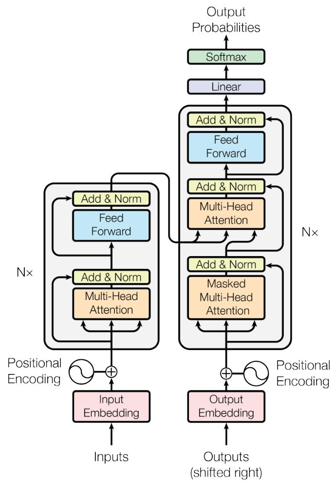

当然当前主流的LLM架构是只有解码器的模型（Decoder-only），如前文提到的:[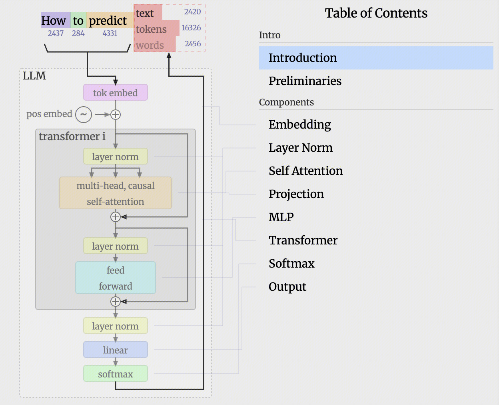](https://bbycroft.net/llm)
包含自主力(Self-Attention)和多头注意力(Multi-Head Attention)的注意力层、前馈神经网络(FFN)，注意力层+FFN等模块组成其中一层，多层堆叠，构成一个Decoder-only模型，层数通常根据任务复杂度而定，层数越多，模型越深，模型效果越好。

这里还有一篇详细比对LLM架构的文章[LLM架构比较（The Big LLM Architecture Comparison
From DeepSeek-V3 to Kimi K2: A Look At Modern LLM Architecture Design）](https://sebastianraschka.com/blog/2025/the-big-llm-architecture-comparison.html)，从中可以看出，当前头部的LLM架构都是在Decoder-only上不断做优化，使得训练出来的模型表现越来越好。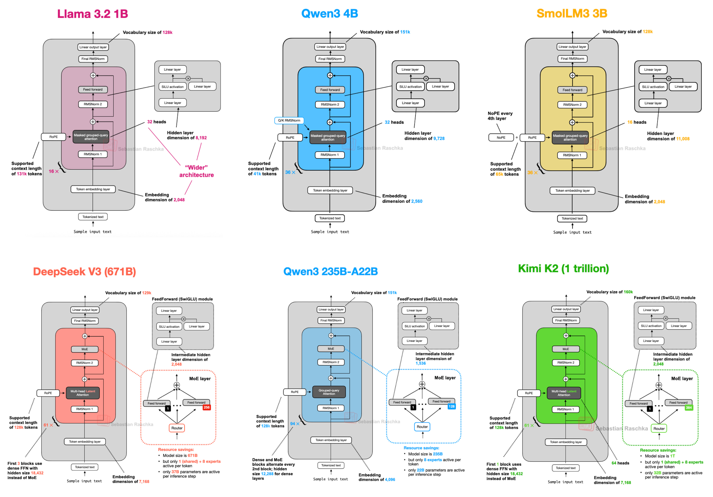
文章总结为脑图：
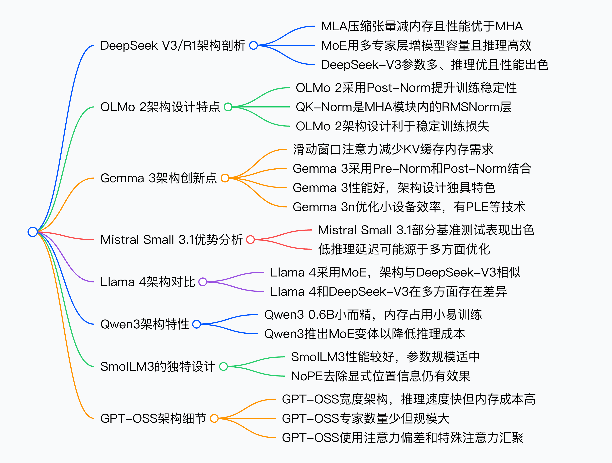

### 架构示例
我们来看一个LLM 的PyTorch 模块定义，让我们对LLM参数有一个直观的理解，为后面展开讲解做铺垫：
```
Phi3ForCausalLM(
  (model): Phi3Model(
    (embed_tokens): Embedding(32064, 3072, padding_idx=32000)
    (embed_dropout): Dropout(p=0.0, inplace=False)
    (layers): ModuleList(
      (0-31): 32 x Phi3DecoderLayer(
        (self_attn): Phi3Attention(
          (o_proj): Linear(in_features=3072, out_features=3072, bias=False)
          (qkv_proj): Linear(in_features=3072, out_features=9216, bias=False)
          (rotary_emb): Phi3RotaryEmbedding()
        )
        (mlp): Phi3MLP(
          (gate_up_proj): Linear(in_features=3072, out_features=16384, bias=False)
          (down_proj): Linear(in_features=8192, out_features=3072, bias=False)
          (activation_fn): SiLU()
        )
        (input_layernorm): Phi3RMSNorm()
        (resid_attn_dropout): Dropout(p=0.0, inplace=False)
        (resid_mlp_dropout): Dropout(p=0.0, inplace=False)
        (post_attention_layernorm): Phi3RMSNorm()
      )
    )
    (norm): Phi3RMSNorm()
  )
  (lm_head): Linear(in_features=3072, out_features=32064, bias=False)
)

```
关键参数与结构特点​​:
- ​​模型尺寸​​: 32 层解码器层 (layers: 32 )。

- ​​隐藏维度​​: 3072(hidden_size)。这是一个关键参数，决定了模型的容量， Q, K, V 各需要 3072 维，加总是9216。

- ​​词汇表大小​​: 32064(vocab_size)。

- ​​注意力机制​​: 使用 ​​Rotary Position Embedding (RoPE)​​。

- ​​MLP 结构​​: 使用 ​​门控机制 (Gated Linear Unit - GLU)​​，中间维度为 8192(intermediate_size)。gate_up_proj的输出维度 16384 = 8192 * 2体现了这一点。

- ​​归一化​​: 使用 ​​RMSNorm​​ (Phi3RMSNorm) 替代传统的 LayerNorm。

- ​​Dropout​​: 在当前的配置/状态下，所有 Dropout (embed_dropout, resid_attn_dropout, resid_mlp_dropout) 都被禁用 (p=0.0)。这通常意味着模型处于​​推理模式​​，或者这个特定的模型实例化没有启用 Dropout（例如在预训练好的模型权重中 Dropout 通常关闭）。

- ​​任务​​: 这是一个​​因果语言模型​​ (ForCausalLM)，设计用于生成连贯的文本序列（预测下一个词）。

在确认LLM架构后，我们就可以开始构建模型了，构建模型时，需要做三件事：数据、模型、训练。数据的处理包括：文本数据采集、文本数据预处理、文本数据嵌入。模型包括：模型架构、模型参数。训练包括：模型训练、模型评估、模型优化。

数据文本采集此前的文章已经讲过，本文我们重点讲一下文本数据预处理和文本数据嵌入。文本数据预处理包括：分词、词嵌入。


## 分词（token）
这一部分的实现原理在此前的文章中已经介绍过，这里不再赘述。可参阅[深入浅出LLM：从使用到浅层原理](https://km.woa.com/articles/show/625460)
这里想补充的是，我个人的一种理解方式，可以认为分词就是为了得到一本字典的索引（目录），在transformer预测下一个词时，根据当前用户的输入以及已有的预测输出，去匹配字典中的词，找到最匹配的词，然后输出。这是一种很直观的理解方式，省略了很多细节，比如词嵌入的实现方式，词嵌入的维度，词嵌入的优化方式等，但是这种理解方式，可以让我们对分词有一个直观的认识，有助于我们理解后续的词嵌入。


## 嵌入（embedding）
前面提到分词就是一本字典的目录，是很粗的，我们想要知道下一个词是什么，就需要去字典里找与上下文最相关的那个词，如果只有字典目录，没有词的释义，很难匹配出最相关的词。所以我们需要给每个词一个 “释义”，这个释义就是词嵌入，也就是把词转换为数学表示映射到高维空间中，这样就可以通过计算两个词的距离，来计算两个词的相关性。就好比我们给字典里的每个词都编一个页码，并通过N多个字把这个字的含义解释清楚，也就是通过高维空间来表示一个词，这样就可以通过计算两个词的距离，来计算两个词的相关性。

### 字典的类比
中字的索引和字的解析如下图：

包括大语言模型在内的深度神经网络模型，没法直接处理我们平时看到的原始文本。为什么呢？因为文本数据是 “离散” 的 —— 简单说就是一个字、一个词都是单独的个体，不像数字那样能直接算，所以没办法直接用它做神经网络训练时需要的数学运算。这时候就需要一个办法：把单词变成一种 “连续值向量” 的格式，这样才能让模型用起来。

### 词嵌入的过程

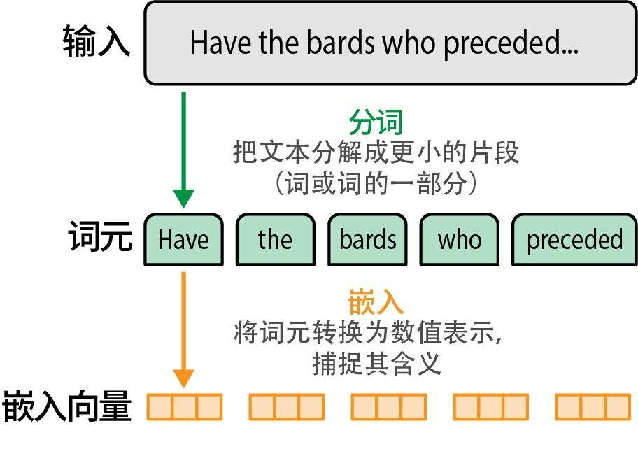
详细的过程以看下面的动图，是一个3个词元，48维度的词元嵌入过程：

可以看到

举个实际的例子，最小的 GPT-2 模型（它的参数量是 1.17 亿），用的嵌入维度是 768；而最大的 GPT-3 模型（参数量达到 1750 亿），嵌入维度就更高了，有 12288。
所以，按字典的方式理解分词和词嵌入，举例GPT-3的词汇表大小是50257个，词嵌入的维度是12288维，每个词用12288维度去解释，那么GPT-3的全部词汇嵌入矩阵就是50257*12288=617558016大小。


不光是文本，像视频、音频这些不同类型的数据，也能通过专门的神经网络层，或者借助另一个提前训练好的神经网络模型，转换成这种可用的格式，这个过程就叫 “嵌入”。
嵌入的分类：
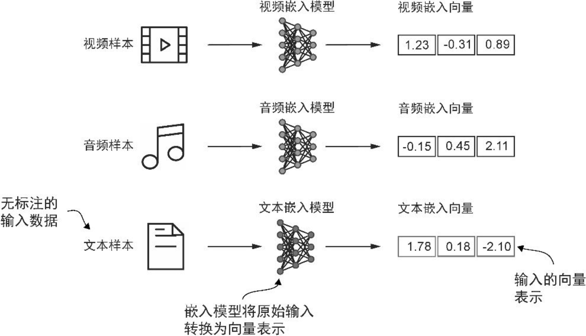


说到底，嵌入的本质其实很简单： **把那些离散的东西（比如单个单词、一张图片，甚至一整篇文档），对应到一个连续的向量空间里，变成一个个 “点”。** 这么做的主要目的，就是把文字、图像这种非数值的数据，转成神经网络能读懂、能处理的格式。

另外，词嵌入还有个 “维度” 的概念，维度可以从 1 维到几千维不等。一般来说，**维度越高，越能捕捉到数据里那些细微的关系** —— 比如单词之间更复杂的关联。就好比我们用N个字来解释一个词（一维的长序列），解释篇幅越长，这个词的含义就会月清晰，在正本字典中的位置、与其他词之间的关系就表达得越发清晰明了，但代价是我们要阅读更多的文字，字典会变得非常厚；理解回LLM，我们的计算代价就更高，计算起来会更慢，效率会下降。所以还需要做出权衡。

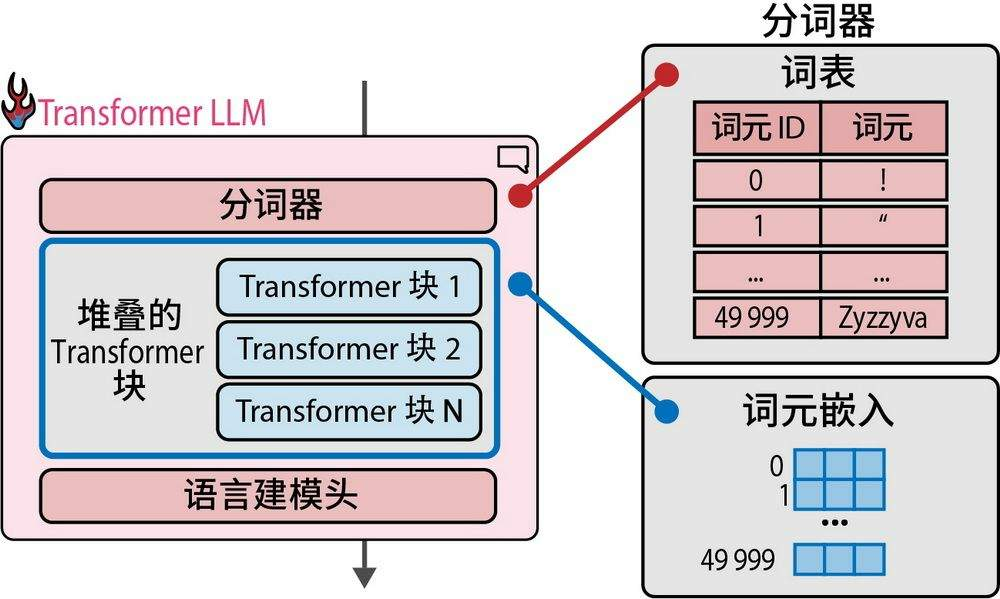


[rojector.tensorflow](https://projector.tensorflow.org/) 上Word2Vec词嵌入模型在200维度的情况对71291个词元的嵌入结果，再降维到3D，并可视化后的情况，可以直观的看到词元之间的空间情况。
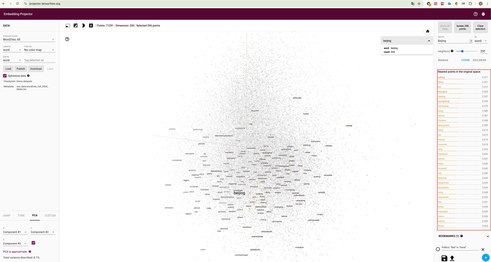

如果要实现多模态模态对齐 ，需要将不同模态的词元嵌入到同一个空间中，才能进行比较。详细可以参阅：[《CLIP: Connecting text and images》](https://openai.com/index/clip/)。 

我们讨论的是词嵌入，在AI常见应用中，还有句子嵌入、段落嵌入、文档嵌入等，如RAG应用；其他模态的嵌入还有图片嵌入、音频嵌入等，如CLIP[CLIP](https://openai.com/index/clip/)应用。


词嵌入的实现方式有很多种，如Word2Vec、GloVe、FastText、ELMo、BERT、GPT、GPT-2、GPT-3、GPT-4、GPT-5等，其中GPT-3参数量达到1750亿。


在LLM架构中，我们看到，在解码器中，有一个 “注意力机制” 的模块，这个模块的作用是，让模型能 “看” 到文本的上下文，从而理解文本的意思。在且为了更好的理解文本，还需要对词元进行 “位置嵌入”（positional embedding)，包括绝对位置嵌入和相对位置嵌入。
- 绝对位置嵌入：直接与序列中的特定位置相关联
- 绝对位置嵌入：关注的是词元之间的相对位置或距离，而非它们的绝对位置。

输入嵌入=词元嵌入矩阵+位置嵌入矩阵。
输入嵌入经过归一化后，可以传递到注意力层。

## 注意力机制
为什么需要注意力机制？解决的是在预测下一个词时，要理解上下文的关系，才能更好的预测下一个词，让模型表现更好。好比别人给我们丢了一个问题，我脑袋空空，手上只有一本几万个词的字典，我怎样才能更好的回答这个问题呢？我需要先看下问题，然后看下问题中的关键词，**再根据关键词去字典中找答案**，这样就能更好的回答这个问题了。那如何能找到与问题最关联的下一个词呢？

这就需要使用注意力机制捕捉数据依赖关系，是现代深度学习模型中非常常见的做法。比如，我们想让模型理解 “我” 和 “你” 之间的关系，就可以用注意力机制，让模型 “看” 到 “我” 和 “你” 之间的关联。举个类比就是就像我们拿SQL语句去关系型数据库查询我们想要的数据一样，我们拿查询条件去匹配库表中的值，从而拿到我们想要的数据记录。当然，远没有那么简单，我们也可以用SQL语句去关系型数据库查询我们想要的数据，但是SQL语句是 “静态” 的，而模型是 “动态” 的，模型可以不断的学习，不断优化，从而更好的回答我们的问题。

注意力机制包括：自注意力机制、多头注意力机制、位置编码、注意力机制的变体等。


### 自注意力机制
#### 原理
传统的注意力机制关注的是两个不同序列元素之间的关系。在自注意力机制中，​“自”指的是该机制通过关联单个输入序列中的不同位置来计算注意力权重的能力。它可以评估并学习输入本身各个部分之间的关系和依赖，比如句子中的单词或图像中的像素。
在自注意力机制中，我们的目标是为输入序列中的每个元素$x^{(i)}$计算上下文向量$z^{(i)}$。上下文向量(context vector)可以被理解为一种包含了序列中所有元素信息的嵌入向量。

- 一个输入序列，记为$x$，它由$T$个元素组成，分别表示为$x^{(1)}$到$x^{(t)}$。
- 嵌入化词元序列之间的注意力权重α= 注意力分数w的归一化
- 注意力分数$w$=词元$x^{(n)}$与其他词元的点积而得；点积值越大则这两个词元相似度越高（即对齐度越高）
- 注意力分数归一化softmax后得到每一个词元的注意力权重α，即获得总和为1的注意力权重
- 最后上下文向量$Z^{(n)}$=SUM(所有$X^{(i)}$与其注意力权重$α$ ✖️ 嵌入化词元本身的矩阵)，即注意力权重和词元嵌入矩阵相乘后，再求和。
- 位移词元下标i，循环以上步骤，将所有词元的注意力权重都计算出来。
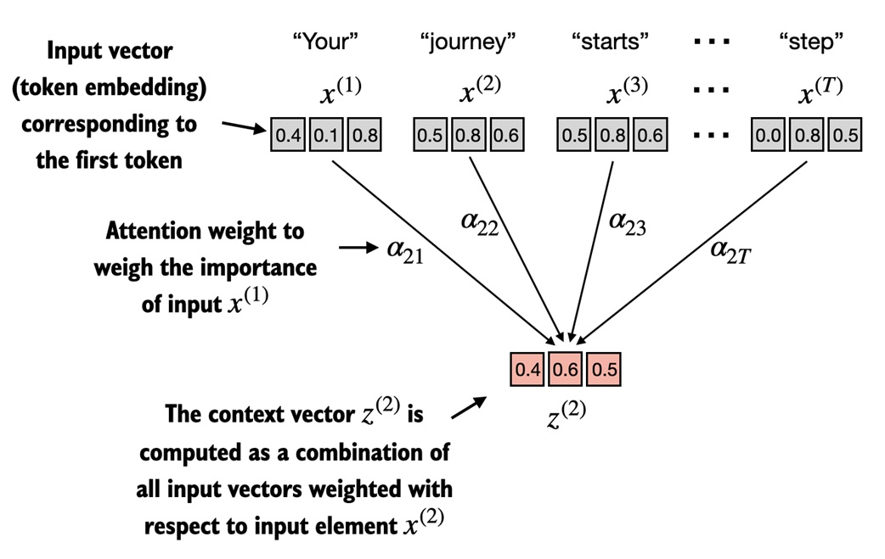
图中是列举i=2的此词元注意力上下文向量


#### 从RNN的缺陷到自注意力机制

想要表示整个输入序列的含义，RNN的解码器在生成输出时只能靠它来读取全部内容。而很难处理长序列，因为当序列过长时，在将所有内容压缩为单个固定表示的过程中可能会丢失序列开头的信息。
有一种方法可以摆脱这一瓶颈，就是允许解码器访问编码器的所有隐藏状态。这种通用机制称为注意力。

为每个表示都生成一个状态，即解码器可以访问编码器所有隐藏状态。但是，同时处理所有状态会给解码器带来巨大的输入数量，因此需要一些机制来按优先级使用状态。为每个表示都生成一个状态，即解码器可以访问编码器所有隐藏状态。但是，同时处理所有状态会给解码器带来巨大的输入数量，因此需要一些机制来按优先级使用状态。自注意力机制就是为了解决这个问题而诞生的。

自注意力机制也叫做点积缩放点积注意力（scaled dot-product attention），为什么这么叫呢？

理解点积：点积是一个简单直接的操作，它通过对两个向量的对应元素进行相乘然后求和来完成；点积不仅仅是一个数学工具，**它还能衡量两个向量的相似度**。点积越高，表示两个向量的对齐程度或相似度越高。在自注意力机制中，点积用于衡量序列中各元素之间的关注程度：**点积值越高，两个元素之间的相似性和注意力得分就越高。**

理解缩放：缩放的根本目的是​​为了控制点积结果的数值范围，从而确保Softmax函数能稳定工作，并拥有健康的梯度​​。这背后是一个深刻的​​数学和工程问题，点积的数值结果范围的方差会随着维度${d_{k}}$​​ 的增加而线性增大​​,点积计算出的分数可能会非常大（正数）或非常小（负数）。

理解归一化：进行归一化的主要目的是获取总和为 1 的注意力权重。在实际应用中，通常推荐使用 softmax 函数来进行归一化。这种方法在处理极端值时表现更佳，且在训练过程中提供了更优的梯度特性。但Softmax函数对输入数值的​​绝对大小​​极其敏感，指数函数（exp）会急剧放大数值间的差异​​。

这导致点积和归一化的结合带来梯度消失问题：

为了控制点积结果的数值范围，从而确保Softmax函数能稳定工作，并拥有健康的梯度​​。


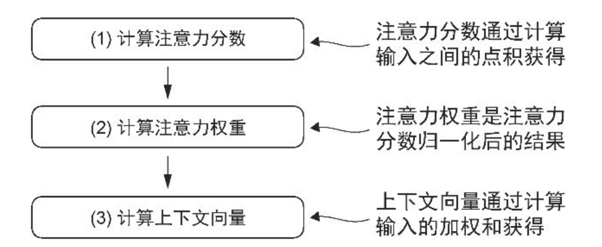

具有可训练权重的自注意力机制是引入了在模型训练期间会更新的权重矩阵（$Wq$、$Wk$、$Wv$），这三个矩阵用于将嵌入的输入词元$x^{(i)}$投影为查询向量、键向量和值向量，使得模型（特别是模型内部的注意力模块）能够学习产生“良好”的上下文向量。就好比我们的关系型数据库查询，我们有查询条件、查询索引、数据记录本身，我们通过查询条件（查询索引）去匹配数据记录（值），从而拿到我们想要的数据记录。而且为了查询效率，我们通常会使用B+树索引，而不是全表扫描。

与之类比的，自注意力机制也是通过查询、键和值来计算注意力权重，从而计算出上下文向量，且缓存了计算结果（K和V），在自回归模型中，可以避免重复计算，提高效率。缓存之前的计算结果（特别是注意力机制中的一些特定向量）​，就不需要重复计算之前的流，而只需要计算最后一条流了。这种优化技术被称为键-值(key-value，KV)缓存，它能显著加快生成过程。


#### 为什么是查询、键和值？
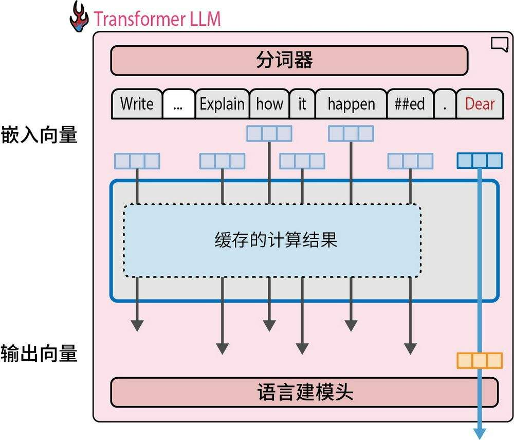
在注意力机制的上下文中，“键”、“查询”和“值”这些术语是从信息检索和数据库领域借鉴来的，在这些领域中，类似的概念被用于存储、搜索和检索信息。

“查询”（query）类似于数据库中的搜索查询。它代表模型当前关注或试图理解的项目（例如，句子中的一个词或 Token）。查询用于探查输入序列的其他部分，以确定应该给予它们多少注意力。

“键”（key）类似于数据库中用于索引和搜索的键。在注意力机制中，输入序列中的每个项目（例如，句子中的每个词）都有一个关联的键。这些键用于与查询匹配。

“值”（value）在这个上下文中类似于数据库中键值对的值。它代表输入项目的实际内容或表示。一旦模型确定哪些键（哪些输入部分）与查询（当前关注项目）最相关，它就检索相应的值。

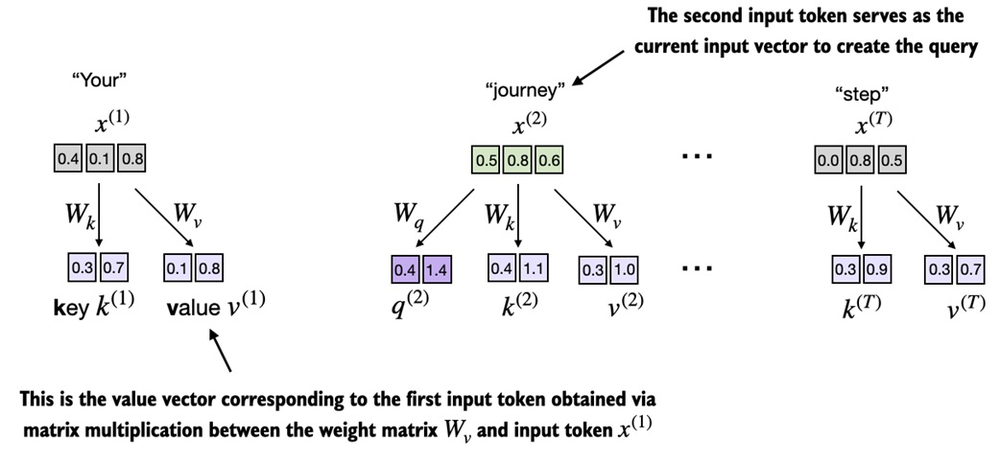

题外话，除了注意力权重$Wq$、$Wk$、$Wv$外，还有权重参数$W$，表示在训练过程中优化的神经网络参数，定义网络连接的基本学习系数，而注意力权重是动态且特定于上下文的值。

在计算得到注意力分数$w_{(21)}$-$w_{(2T)}$后，我们要进一步计算出注意力权重$α_{(21)}$-$α_{(2T)}$，再将注意力分数转换为注意力权重，通过缩放注意力分数并应用softmax函数来计算注意力权重。
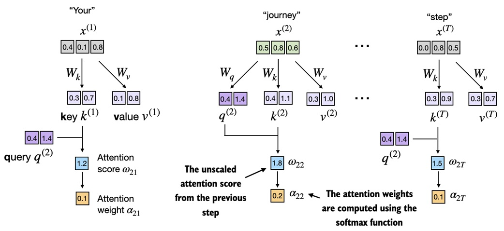

最后，我们将每个词元的值向量$v^{(1)}$-$v^{(T)}$-分别与权重矩阵$α_{(21)}$-$α_{(2T)}$相乘再求，得到上下文向量$z^{(2)}$。
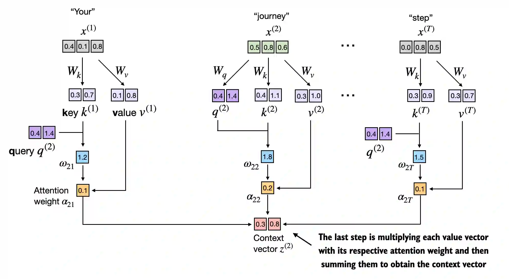

回顾整个计算过程，总结为一张图：
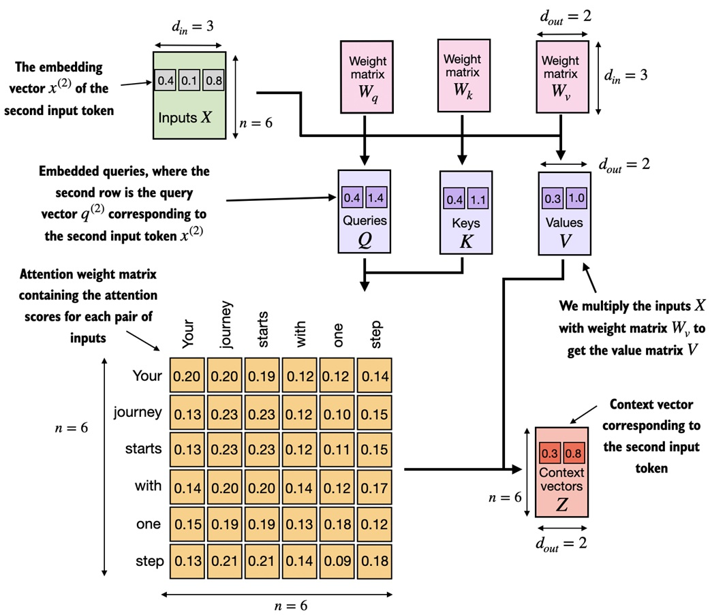

### 因果注意力机制
因果关系方面的改进涉及修改注意力机制，以防止模型访问序列中的未来信息，这对于语言建模等任务至关重要，在这些任务中，每个词的预测只能依赖于之前的词。

因果注意力，也称为遮蔽注意力（masked attention），是自注意力的一种特殊形式。它限制模型在处理任何给定 Token 时，只考虑序列中之前和当前的输入。这与标准的自注意力机制形成对比，后者允许一次访问整个输入序列。

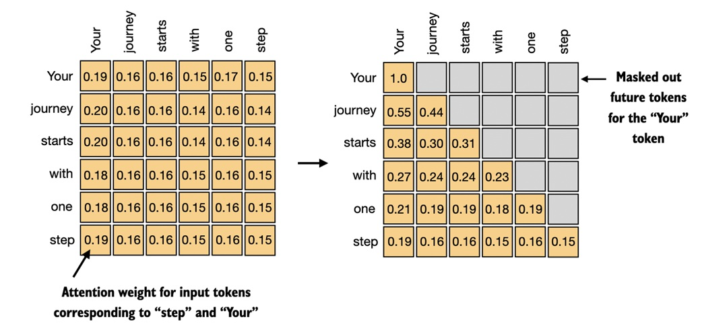
当然还存在利用dropout随机掩码的机制，来减少大语言模型中的过拟合问题。

### 多头注意力机制
接下来我们将多头注意力机制引入到模型中，以获得更强的表示能力。

多头注意力机制通过将自注意力机制的输出结果与多个不同的查询、键和值矩阵相乘，从而获得多个不同的上下文向量。然后，我们将这些上下文向量拼接在一起，再经过一个线性变换，最终得到一个表示能力更强的上下文向量。多头注意力使模型能够同时关注来自不同表示子空间的不同位置的信息。这提高了模型在复杂任务中的表现。

以下是两个注意力头的例子：
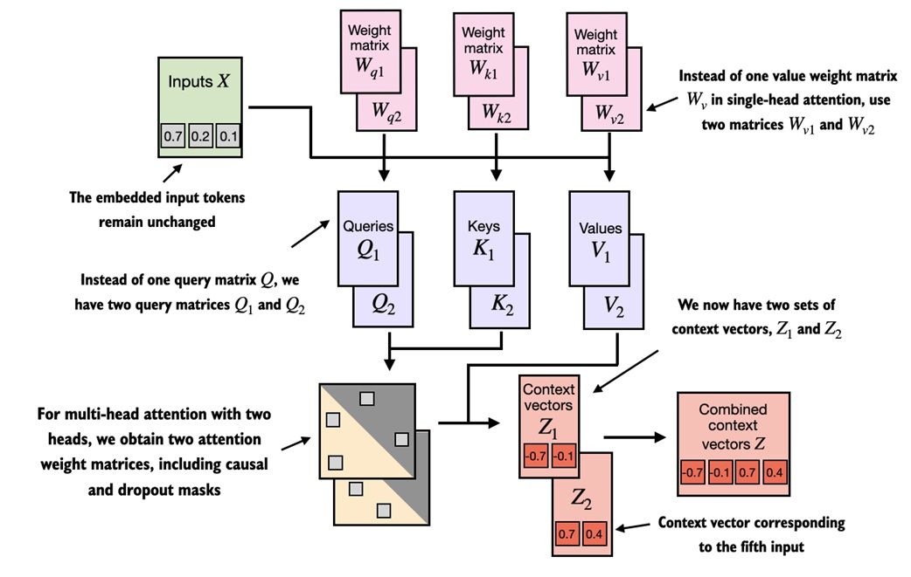

一个注意力头数为3，词元数量为3，嵌入维度为48的注意力计算过程：
1、注意力层是由N多个头组成的，举例GPT-2注意力头数是12，GPT-3注意力头数是96头，GPT-4​、GPT-5尚未公开，DeepSeek R1​也未公布，估计与GPT-3相当。我们为了方便，仅看其中一个注意力头，这里列出了列出注意力投的Q、K、V权重。

2、我们先只看其中一列的V向量计算过程；为了生成其中一个向量，我们执行矩阵向量乘法并添加偏差。每个输出单元都是输入向量的某种线性组合。例如，对于 Q 向量 ，这可以通过 Q 权重矩阵的一行与输入矩阵的列之间的点积来实现。

3、我们重复上一步，将Q、K、V与输入的点积度计算出来。
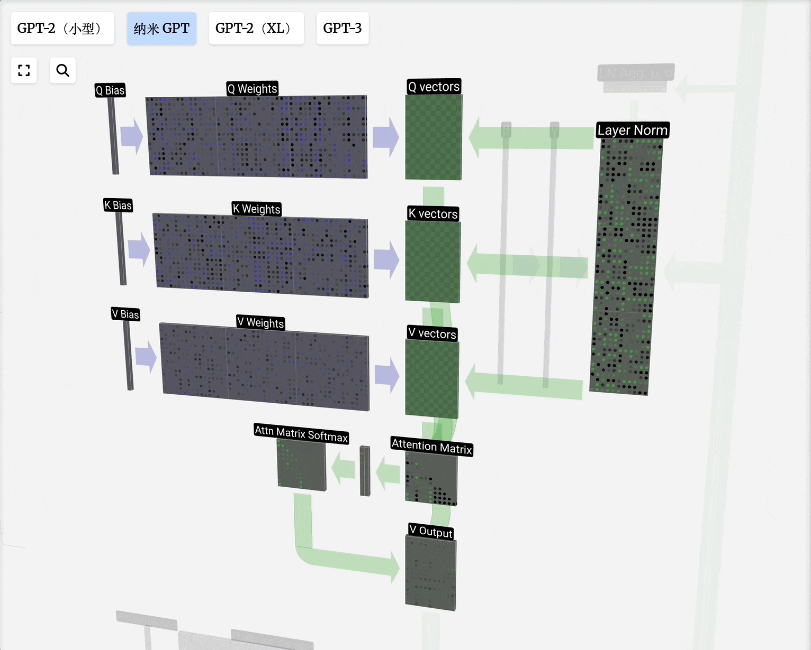
4、然后再将Q与K的向量求和，得到注意力权重矩阵，再将权重矩阵做softmax归一化，将归一化的注意力权重矩阵的每个元素与V向量矩阵对应的相乘，最终我们的到了这一列的V向量矩阵。
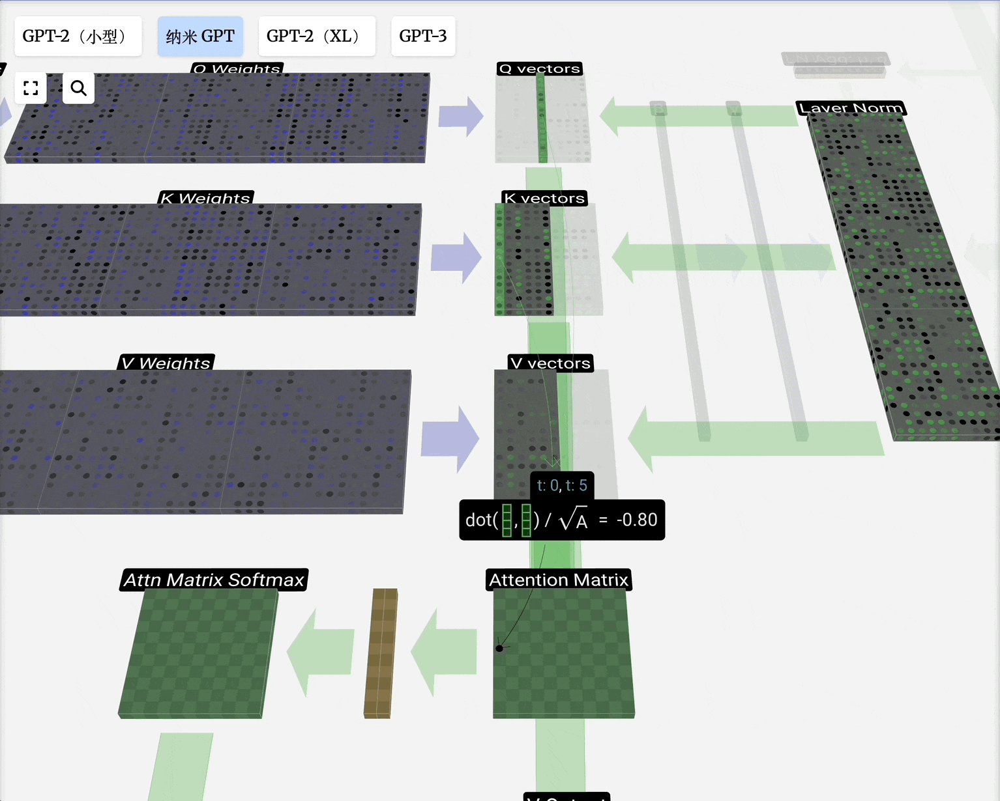
5、接着我们将其他列的向量也计算出来，如此一来，我们将其中一个注意力头的注意力分数算出来了。

6、我们要把每一个注意力头的注意力分数叠在一起，然后执行投影来获得该层的输出。这是一个简单的矩阵向量乘法，基于每列进行，并添加了一个偏差。现在我们得到了自注意力层的输出。我们不是将其直接传递到下一个阶段，而是将其逐个元素地添加到输入嵌入中。这个过程用绿色垂直箭头表示，称为残差连接或残差通路 。


往后还有一层MLP和归一化之后再输出本层输出。

### MLP(多层感知机)

MLP（多层感知机）是神经网络的一种，由多个神经元（或节点）组成，每个神经元接收输入信号，然后通过激活函数计算输出信号。MLP通常用于分类和回归任务，以及作为其他神经网络的组件。

举例一个两层神经网络的MLP，


在 MLP 中，我们将每个 C = 48 长度的列向量（独立地）放入：
1. 对长度为 4 * C 的向量进行添加了偏差的线性变换 。
2. GELU 激活函数（逐元素）
3. 添加偏差的线性变换 ，返回长度为 C 的向量
让我们跟踪其中一个向量：
我们首先进行矩阵向量乘法，并添加偏差，将向量扩展为长度 4 * C 。（请注意，此处输出矩阵进行了转置。这纯粹是为了可视化目的。）
接下来，我们将 GELU 激活函数应用于向量的每个元素。这是任何神经网络的关键部分，我们在模型中引入了一些非线性。我们使用的具体函数 GELU 看起来很像 ReLU 函数（计算为 max(0, x) ），但它的曲线是平滑的，而不是尖锐的拐角。
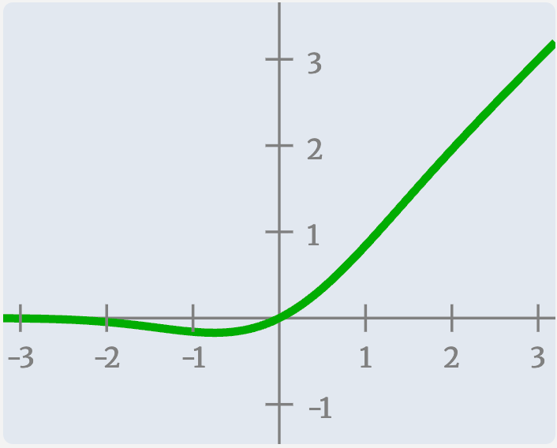

然后，我们通过另一个添加了偏差的矩阵向量乘法将向量投影回长度 C。
就像在自我注意力 + 投影部分一样，我们将 MLP 的结果逐个元素地添加到其输入中。

现在我们可以对输入中的所有列重复此过程。
至此，MLP 就完成了。我们现在有了 Transformer 模块的输出，可以将其传递给下一个模块了。

### 重复堆叠Transformer层
正如深度学习中常见的情况一样，很难确切地说出每一层的具体功能，但我们有一些大致的思路：较靠前的层往往专注于学习较低级别的特征和模式，而较靠后的层则学习识别和理解较高级别的抽象概念和关系。在自然语言处理的语境中，较低层可能学习语法、句法和简单的词语联想，而较高层可能捕捉更复杂的语义关系、篇章结构以及依赖于上下文的含义。

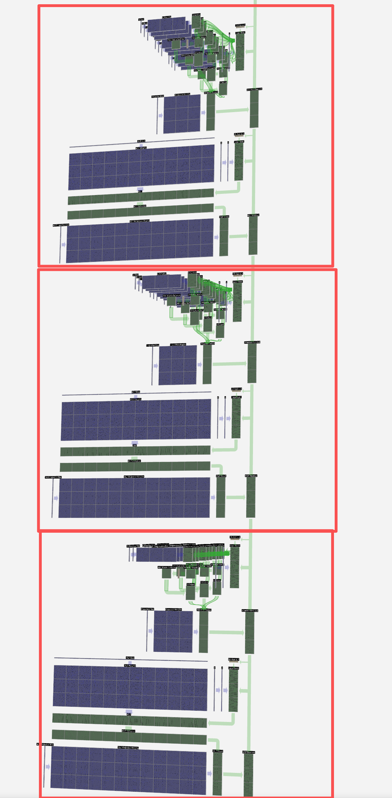
图中每一个红框是一层Transformer，每个Transformer包含N个头，每个头包含N个MLP。
在经过N多层Transformer层后，我们得到了一个向量表示，这是概率较高的一个向量，当然如果模型的温度调到0，则每次都选取概率最高的向量；这个向量对应一个词元，会被加入到输入序列中，作为下一个输入的上下文向量。如此，循环之后，我们得到了一个完整的句子，然后继续循环，直到生成了完整的文本。直到满足停止条件，模型停止生成文本，生成过程结束。

在理解了transformer最核心的知识注意力机制、多层感知机（MLP）、规范层(Layer Norm)、归一层（Softmax）。我们可以开始构建大语言模型架构了，之后就是预训练、微调、部署模型了。这些知识在前文《深入LLM结构解析》中都有粗略讲解，以后有机会可以再写一篇文章，展开讲一下这些知识。

有了这些原理知识后，对于我们构建LLM应用过程中做出决策很有帮助。接下来，我们聚焦于如何系统工程化完成LLM应用的构建，从提示词工程最佳实践讲起，直到如何与LLM联调后，再逐步深入聊天服务、ARG服务、Agent应用的原理，并讨论当前的实践范式。相信在理解了LLM的只会从何而来之后，我们更加迫切想知道如何构建一个LLM应用，如何让LLM应用发挥出最大的价值，也让自己学到的知识能真正落地实践。

所以在下一篇文章中，我会集中讲解如何构建一个LLM应用，如何让LLM应用发挥出最大的价值，也让自己学到的知识能真正落地实践。


[ 从零构建大模型 ](https://weread.qq.com/web/reader/52e320c0813ab9edeg01750f)